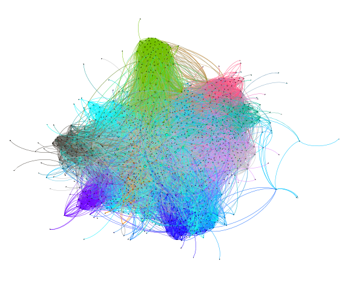
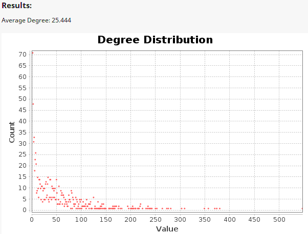

# Assignment 2: Detecting Communities
sophonias bekele

## Introduction
This Lab help me to visualize communities in larger networks like amazon,youtube etc.. 
  

## Part 1: Email-EU-core network
### Methods
1. download email-Eu-core.txt and email-Eu-core-department-labels.txt
2. edit .txt format to csv and Add headers like NODEID,DEPARTMENt,Source and target
3. I import spreadsheet email-Eu-core-department-labels.csv as Node Table and email-Eu-core.csv as Edge Table into Gephi
4. After importing i run Avgerage weighted degree and do size ranking using weighted-in-degree value
5. then i run Fruchterman-Reingold layout and Force Atlas2 layout 
6. finaly i did partition based on department

### Results

ground truth is based on heavily corelation and algorthm is based on internal connectivity

* Ground truth-communities
 :-Average degree, Modularity, Average weighted degree etc..
* algorithm-communities
:-Modularity, graph Density, connected components etc..

### Discussion

## Part 2: YouTube social network
### Methods
1. Download com-youtube.ungraph.txt and com-youtube.top5000.txt
2. Edit .txt format to csv and Add headers like Source and target
3. I import spreadsheet om-youtube.ungraph.csv as Node Table and com-youtube.top5000.csv as Edge Table into Gephi
4. After importing i run Avgerage weighted degree and do size ranking using weighted-in-degree value
5. Then I run Fruchterman-Reingold layout and Force Atlas2 layout 
6. Finaly I did partition based on department

### Results
ground truth is based on heavily corelation and algorthm is based on internal connectivity

* Ground truth-communities
 :-Average degree, Modularity, Average weighted degree etc..
* algorithm-communities
:-Modularity, graph Density, connected components etc..

### Discussion
In this case i have an performance issue when runing this many nodes and edges 

