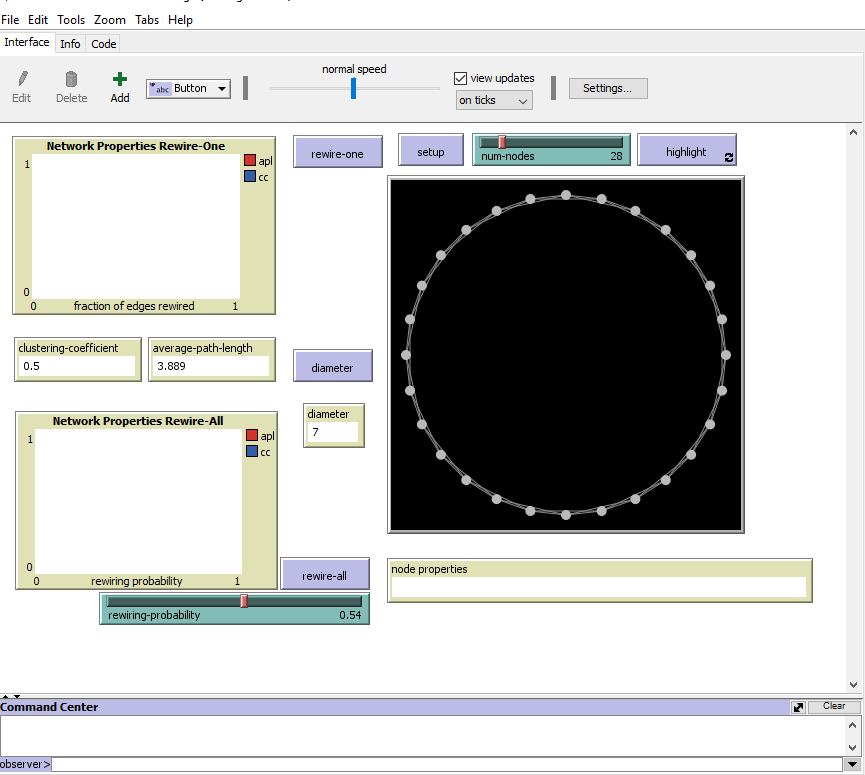
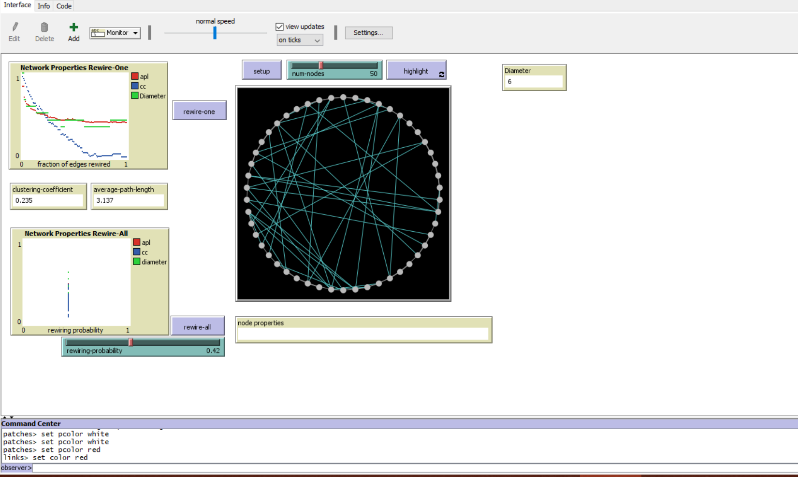

# Assignment 3: Detecting Communities
<Leul> <Solomon>


## Introduction
This writing will be on the concept of random graph, the probability of how the edges wired, the process and all of this will be done on the netlogo on the small world, Segregation and Giant component.
We will see the methods how i approach to answer the question, the result and at last the discussion part.


## Part 1: Small Worlds

### Methods
I did everything in netlogo program.
First i set the diameter on the default code. But to calculate the diameter there is some algorithm that is,it have to choose the maximum of the maximum from the list of the "distance from other turtles". max of max(distance from other turtles). the list in the bracket is already defined on the code.
Next on the global part of the code we have to give the name of the value we use as the diameter, in my case i write leuldiameter on the global to define it.
Then we give the algorithm for the parameter i define , to do that: 
to diameter
  set leuldiameter max[max[distance from other turtles]]of turtles
end
after this we click the check button, then if there is no error we go back to the interface tab. Then right click choose monitor then on reporter i wrote leuldiameter then click setup.
on the code tab inside the to 
setup section i mention the diameter 
end
Rewiring means cutting off one link or destroy it and then link that node with other random node.
on the rewire-one, set rewire-one ? True
		   set rewire-all ? False this chooseswhich one is installed on the interface and will work
if count turtles != num - node this means if bothe are equal it will jump if not it will setup again.
potential edges: are so far not connected edges but that can be a link which is going to be rewired.. To rewire a node first it must not be rewired.

```
 to diameter
  set leuldiameter [max distance-from-other-turtles] of turtles
end
```

### Results
With 50 nodes it has a clustering coefficient of 0.5, an average path length of 6.63 and a diameter of 13 at the begining.
The following screenshot of netlogo shows the setup of the nodes with 28 in number, the rewire-one many times with the rewiring probability of range 0.44-0.54 , and the rewire-all many times.







on rewire-one: the x axis represents the fraction of edges thats is edges that are so far rewired. and the y-axis represents the apl(average path length) and the cc(clustering coefficient).
the plot of this axis shows:- apl is becomeing constant and cc is decreasing (Get low)
on the rewire-all: the x-axis is representing the rewirng probability and the y-axis is  representing apl and cc.
It plot randomly,the reason that it become constant is that i used a single value.
 
### Discussion
The clustering coefficient change as nodes are rewired because cc is the probability that how much the neighbors of a given node know eachother, so cc is changing because when rewiring one link is disconnected and other link is formed, 
this makes the cc to recalculate whenever rewiring is done.
The  average path length after some numbers of rewiring it becomes constant because, apl means average number of steps alongest the shortest path, so as i srcumbled it more it's coming to regular. 
But CC is decreasing because the more it scrumbled, the less the value it will be.

## Part 2: Segregation

### Methods
I start by altering the grid values of pycor and also pxcor until the grid is 150 x 150.then i use the density 88 percent with %-similar-wanted 30 then click setup. 
Then i observe that an agent become less tolerance  when unhappiness percentage increase. I can use the intollerance similar wanted to manage the agent's percentage of having a neighbor. 

### Results
when i set with the above paramters and then click go-once, the number of agents become 2433, %similar become 59.373, and the num-unhappy and %unhappy becomes 234 and 9.61 respectively.
when i click the go button, with the same number of agents, %similar becomes 74.327 and both the num-unhappy and %unhappy becomes 0.

### Discussion
In segregation i noticed that the more the cgo button clicked, the more they have a chance to get clustered, so after that the result on num-happy and %unhappy becomes zero, 
because all will be grouped in one giant component or clustered to one, so there is no one left alone and be unhappy or feel unwanted. 

## Part 3: Giant Component

### Methods
here also i used the netlogo online version, then i setup the nodes by moving the slider to 20 , then i click the setup button. then the copmonents starts to appear in a circular shape, then i click the go-once and go button and got the below results.

### Results
the result i got after setting up the nodes to 20  first the giant component is 1, Then when i click the go once button, the giant component becomes 2,
i also play with it and check the giant component result by clicking the go once button many time and i have got 3. At last when i click 

### Discussion
In this scenario i observe that a giant component eresult can not exceed the number of nodes we set up at the first place, so whenever all are get connected in one giant component
the number of giant component and number of nodes in that graph will be equal.

## Conclusion
In this assignment i have got some new concepts and learned new terms, play with a new program application called netlogo. i have found netlogo good and we can work with it online and offline, 
grasp good knowledge on small world, giant component and make my blur observation clean on segregation too.
