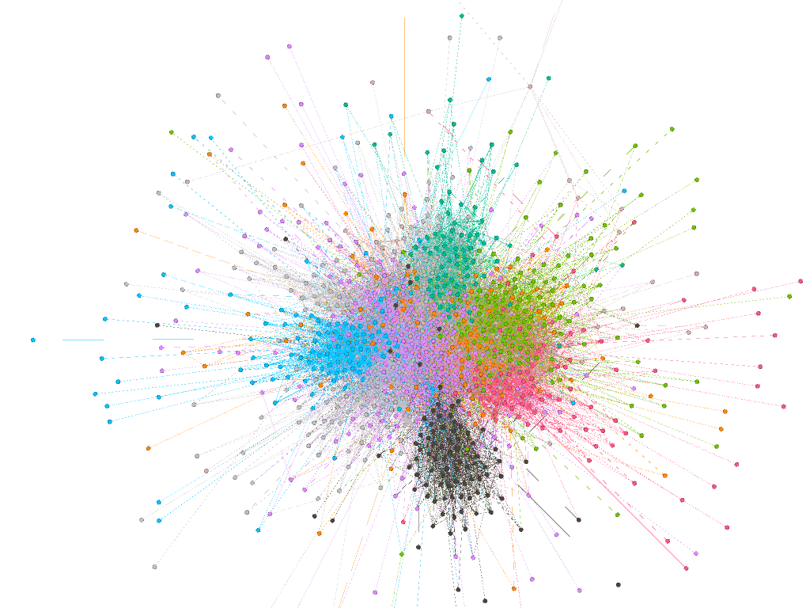
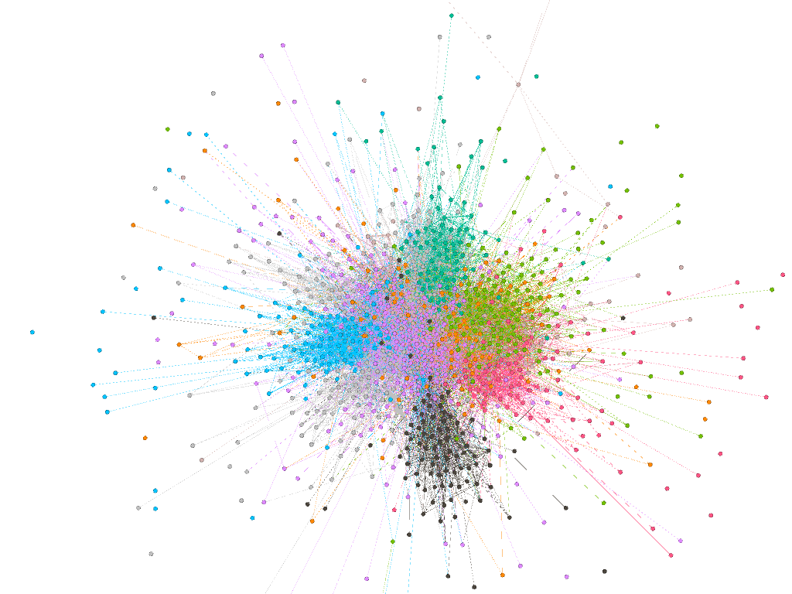
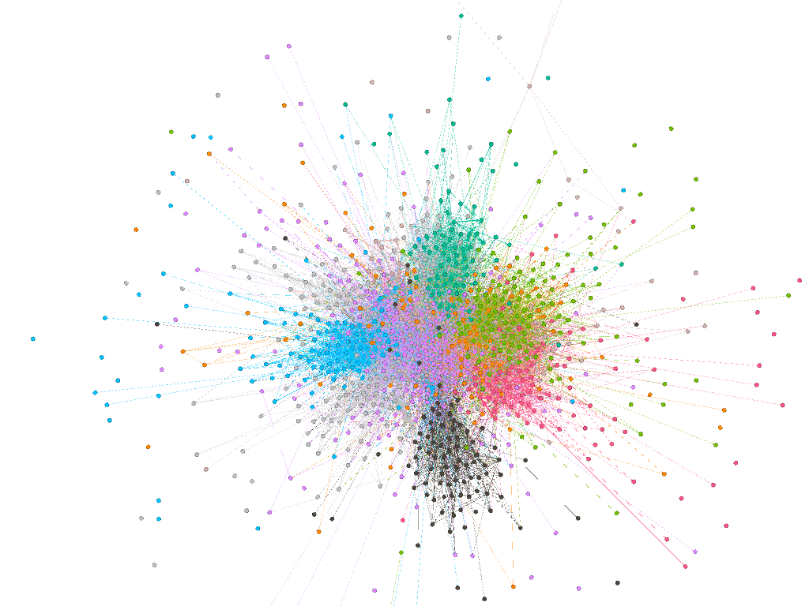

# Assignment 4: Networks over time
Beytula Kedir


## Introduction
In previous assignments we have been working with static networks. In this assignment of networks overtime we deal with dynamic growing networks. We are using the same EU E-Mail we used in assignment 2 but with a time variable included.

## Methods
Of the three available tools provided I wanted to use Gephi because that is what i have used before. Gephi has different features to arrange the view of the graph and an easy way of showing the graph over time with a time slider. plus when i try to use snappy i was unable to install it properly.
## Results
The graph has 986 nodes and 24929 edges. For the graph at the final time, with all the nodes, the results of Weakly Connected Components: 1, Strongly Connected Components: 185, Diameter: 7, Modularity: 0.661, Number of Communities: 15.
The clustering coefficient of different communities are 
* 0=0.480
* 1=0.701
* 2=0.631
* 3=0.351
* 4=?
* 5=0.447
* 6=0.484
* 7=0.643
* 8=0.417
* 9=0.458
* 10=0.482
* 11=0.494
* 12=0.570
* 13=0.137
* 14 = 0.433

the original image

```
apl and size of components for 20 weeks = 2.799, 251

```

```
apl and size of components for 30 weeks = 2.783, 246

```

```
apl and size of components for 40 weeks = 2.752, 227

```



## Discussion
The graph grows over time but in a fixed time interval it can sometimes shrink in size if there aren't that many transactions during that time. It also has weight which indicate the number of E-Mails sent. Note that the number of E-Mail sent can vary from time to time for one node. The degree show how much nodes (people) a node connects to. It is a directed graph so it has in degree (E-Mail received) and out degree (E-Mail sent). 

The question of whether bridge people are more efficient at transferring data is debatable. Common sense tells us since it is E-Mail that is being sent there is no need for a "middle man" you can send the email directly as long as you know the destination address. But from the data we see that the size of components drop slowly which suggests that more bridges are being formed. The data also shows that the apl is also slowly decreasing meaning the data transfer between nodes is made easier. So my answer is yes, bridge people make it more efficient to transfer data.

## Conclusion
Thank you for your understanding. I really enjoyed your course, it was comprehensible, and applicable in real life. The part about the small world’s model was especially interesting. Also the different tools we used like netlogo were inspiring. Thank you again for such an exciting semester.
