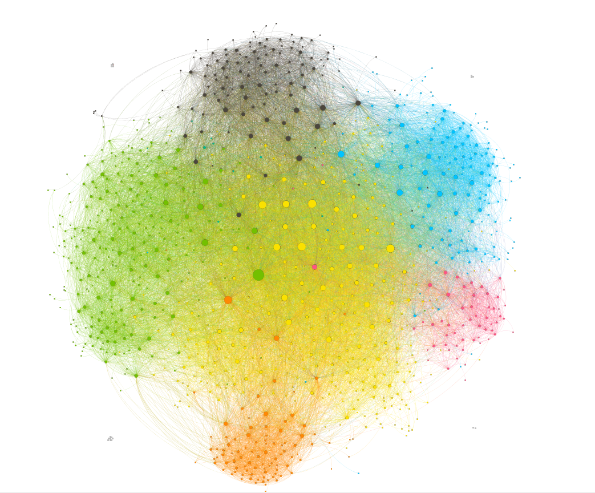
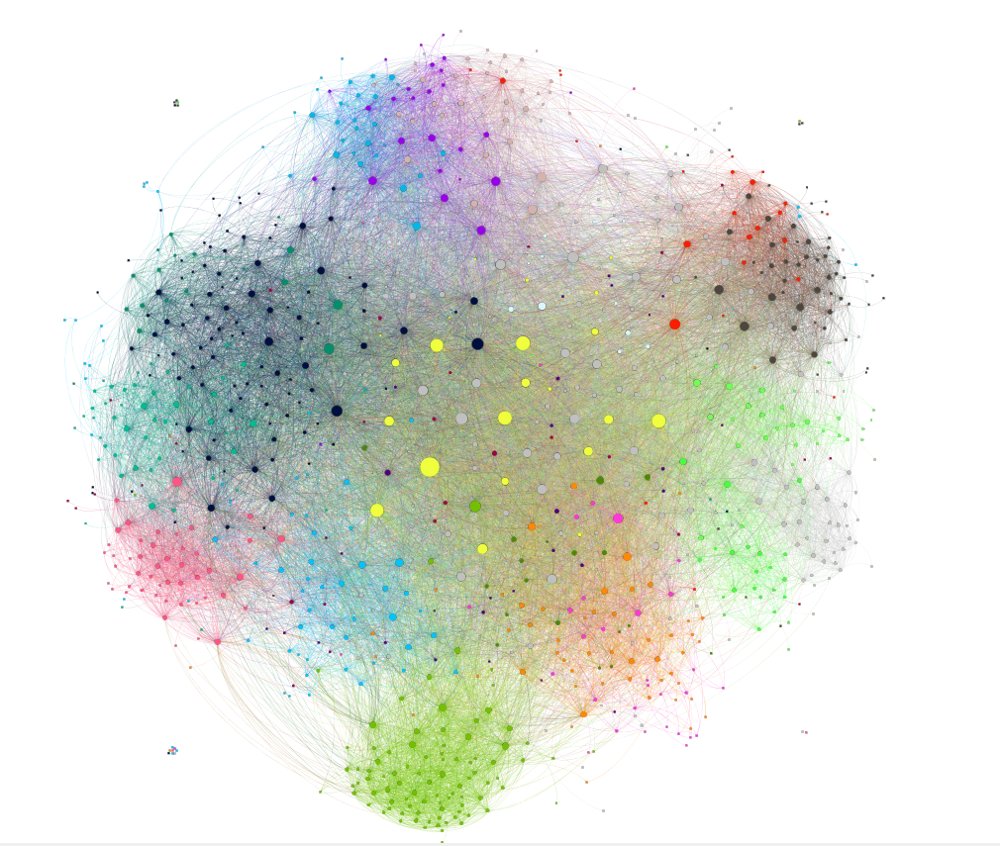

# Assignment 2: Detecting Communities
Yidnekachew Wondmeneh

## Introduction
In this assignment we are given two parts to do.The first is commumnity detection and comparison of the EU e-mail network. We analyse the information about different communities formed by the different algorithms. The second is comarision of the youtube network.

## Part 1: Email-EU-core network

### Methods
I this assignment i used gephi graph analysis tool. I used it because we have used it before. To see the graph i first edited it using text editor and then saved it as a csv file. I used different layout tools to adjust the data. The algorithm I used for community is modularity.

### Results
Network diameter= 7
Number of nodes= 1005
Number of edges= 25571
Number of communities by modularity= 26

Number of communities by departement= 43
 

### Discussion
The differen algorthms used for grouping have yielded differen communities. As you can see form the pictures they have different colors which shows the communities. The graph has 1005 nodes which is the number of employees. The communities made by modularity is 26 and the community made by departement is 43.

## Conclusion
Because i use it more now this assignment has helped me better understand the gephi tool and the different features it has. I have also understood how the different community algorithms work.

For the second assignment i was not able to finish in time. I was using computers from the laboratory and i didn't have enought time or resource. Sorry.
