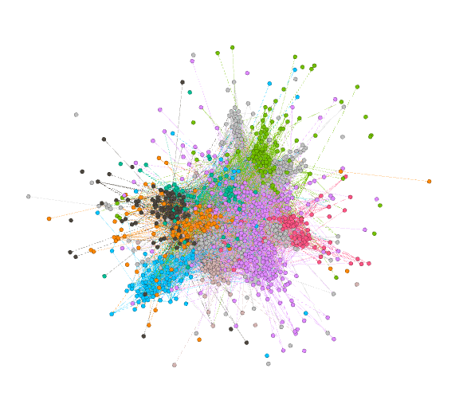

# Assignment 4: Networks over time
Endalkachew Ayalew

## Introduction

This assignment deals with the growing effect of networks over time. which we have been learning that networks do not change over time it was static, but now on this assignment we will demonstrate that they are dynamic and they will grow over time.

## Methods

First, In order to visualize and analyze the network, I used a gephi tool.and to find the mean and standard deviation i used the Microsoft Excel.
Using Gephi, the statistics and filter table helped me in determining the clustering coefficients, connecetd components.

## Results
when calculating the connected components i got the following result:-

Number of Weakly Connected Components: 1

Number of Strongly Connected Components: 184

when calculating the Average clustering coefficient of the graph i got the following result:-

0.352

when calculating the Modularity of the graph i got the following result:-

0.669 with Number of communities = 14

when calculating the Average clustering coefficient with in community i got the following result:-

 Average Clustering Coefficient of community 0 is 0.035
 Average Clustering Coefficient of community 1 is 0.044
 Average Clustering Coefficient of community 2 is 0.026
 Average Clustering Coefficient of community 3 is 0.057
 Average Clustering Coefficient of community 4 is 0
 Average Clustering Coefficient of community 5 is 0.023
 Average Clustering Coefficient of community 6 is 0.025
 Average Clustering Coefficient of community 7 is 0.001
 Average Clustering Coefficient of community 8 is 0.038
 Average Clustering Coefficient of community 9 is 0.02
 Average Clustering Coefficient of community 10 is 0.026
 Average Clustering Coefficient of community 11 is 0.092
 Average Clustering Coefficient of community 12 is 0.043
 Average Clustering Coefficient of community 13 is 0.019
 Average Clustering Coefficient of community 14 is 0.029
 Average Clustering Coefficient of community 15 is 0.007

As calculated by excel the mean and the standard deviation value of the graph is 

Mean = 209.005

Standard devaition = 40756.87

At starting time 12,096,000 i got the value of the Average clustering cofficient = 0.332 and Modularity of 0.301

At starting time 18,144,000 i got the value of the Average clustering cofficient = 0.322 and Modularity of 0.311

At starting time 24,192,000 i got the value of the Average clustering cofficient = 0.299 and Modularity of 0.317

## Discussion

Yes they are more likely efficient to communicate on email. because a "bridge" person can effiectively communicate and respond with other communities and person.

## Conclusion

In general i was able to analyze and demonstrate growing networks and how they change over time.