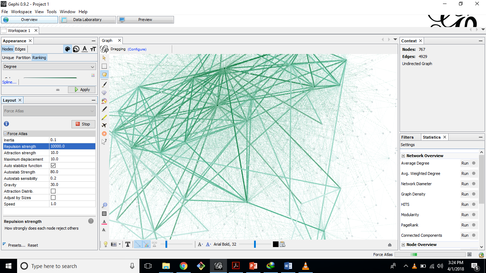

# Introduction

### This lab was focused on showing the metrics we have discussed in class. These metrics are used to understand complex network graphs. As an extension to understanding the concepts I can fathom these metrics in a more profound way while visualizing it in the tool I used, Gephi. Gephi is a tool that extracts all the information that is needed from a graph we load into it. From node degree to connectance all the valuable information about a network can be extracted which makes it a perfect suit for this lab.

# Methods
### This was a long process. It started by collecting our Facebook data in a graph form to be from Lost Circles. After collecting the graph we can analyze it by a software tool called Gephi. This tool is used to calculate the metrics and provide network analysis for our graph.Once I successfully got the graph downloaded and loaded into Gephi, the steps for retrieving the values for the metrics specified in the assignment were pretty straight forward.   
### The first metric deals about connectance. I was able to reduce the number options to connectance because the question was relating friends with number of connections. And the number of connections a node has is connectance. We can get the value by first evaluating the formula for average node degree and dividing that for the number of vertices minus 1.
### The second metric deals with node degree. Node degree is the number of neighbors a node has and since all those in there are friends of me we just have to look for the quantitative value. So the friend or in this term, the node that has the highest number of neighbors from my perspective will have the highest node degree.
### The third metric deals with average node degree. Average node degree is the value of the total number of neighbors nodes have divided by the total number of nodes. The question asks, “On average how many friends do your friends have”, which is an indication of nodes and their neighbors. Therefore by calculating the average node degree we can get the correct value for this question.
### The fourth metric is clustering coefficient. I was able to come to this conclusion because the question asks “how well connected are your friends” in other words it’s about the connections. Now if it was asking about just one node it would have been connectance, but this is about all the friends, in other words nodes. Clustering coefficient deals with the number of connections nodes have compared with the potential amount of connections.

# Results

### From the image we can see edges that are denser than others. When edges between two nodes get denser it could be the weight is increasing or it could be a the distance for other nodes to reach other nodes in the network.

# Discussion
### I decided to choose this way of depicting the graph because it shows all the edges very clearly. I Believe I have adequately worded all statistics in the methods section.   
