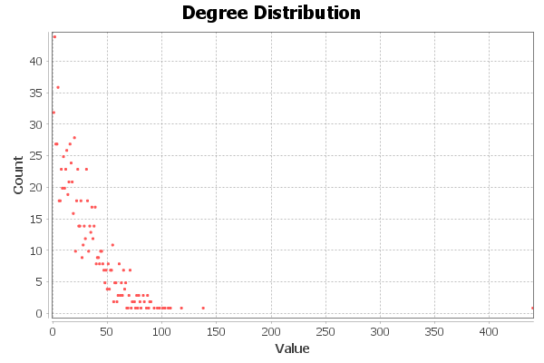
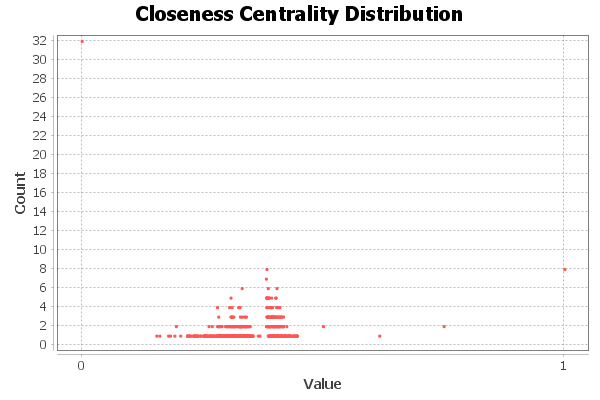

# Introduction

* As seen facebook account statistics as a graph. And all friends that we dont know in a better way. For the question we will be using some algothims to find answers.
# Methods

* I have,cluster coefficient to find how close or far my friends are,to calculate  how many Facebook friends my  friends have,i used node value to calculate the number of friend i use avarage node degree, and to find the most friend that i have in common i used degree value,to find what percent of my friends are are connected i used this formula: edges * 2/ nodes then take the outcome of that and divided it by node -1
# Results

1. The first one is 0.02581 which is the percent of my friends that are connected
2. the second one is to find the a friend that has the most common friends with me which is 439 and th name is FLW
3. the third question is about on avarge  how many friends my friends have, the value is 25.84

4. the forth one how well connected my friends are and the answer is 0.556
5. the fivth the answer is 2.93. The next question is about  how close or far are my friends  since i have not much friends and my answer show a small number and close to one so they are more connected each other. 

# Discussion

* The assignment was very interesting  to see all my friends in such a simple graph was amazing.But saving my facebook data was very time taking and annoying anyways thanks.

