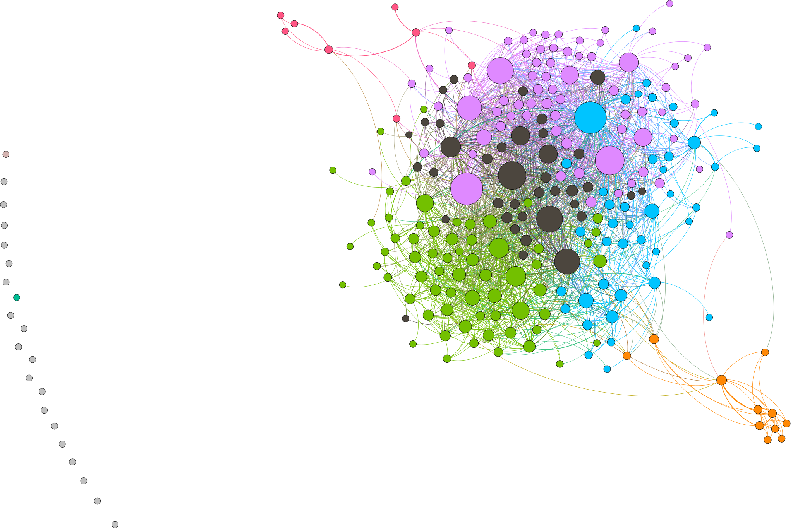
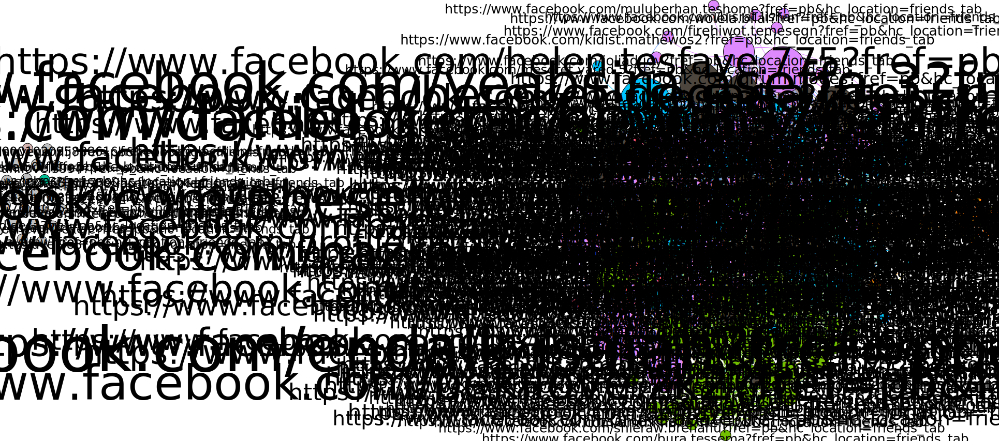

# Introduction
I did this lab to get real world expreiance and practice on lecture class concepts

# Methods
 I used lost circle extension to data from our facebook Account and used Gephi which is visualization and exploration software for all kinds of graphs and networks and used it to analyse the Data we get from lostcircircle's graphml data and I have run statistics in gephi, does filtering etc.. 

# Results
Average Degree =13.672,
Average Weighted Degree =14.812,
Graph Density = 0.054,
modularity =0.244,
network Diameter = 6, 
connected components = 22

The above statistics results and more help me in calculating the answers i give in google form 

## Without Label

## with label

# Discussion

* The Average Degree of my data is 13.672 means average of all the degree 

* The network Diameter is 6 and means that shortest path to any node in the network is six

* Connectance how my friends are connected

* Node Degree help me find mutual friends

* Nodes help me to find my friends number

* connected component of an undirected graph is a subgraph in which any two vertices are connected to  each other by paths, and which is connected to no additional vertices in the supergraph.

* Image without label is the svg format without any url and other data

* Image with label is the svg format with every data
