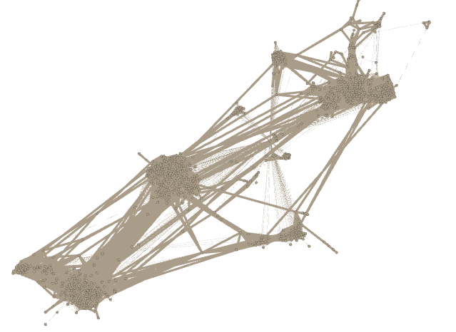

# Assignment 1: Your facebook network
Habteab Yohannes

## Introduction
In this submission I describe about facebook data graph.  

## Methods

To start with how I arrange the graph. I took the file from a friend since the google chrome plug in currently is not available. The file has extension of graphml. GraphML is a data set which can be imported by gephi as stream.

## Results
The graph has the following attributes and results
Columns d0,d1,d2,d3 and d4
id, name, userName, profile, dataUrl
Nodes:1002
Edges:23610
Average degree 25.84
Modularity 0.733
Average clustering coefficient 0.55
this is the screenshot for my graph

## Discussion
The only data I got from the graph is name. The facebook graph does not show the rest attribute like username, profile and id. 
I gain interesting view from my experment about terms like degree, modularity, clustering coefficient etc especially while I fill the google form.

When I tried to do the youtube data I find it complex to solve and few reference available. But I find it interesting to do this lab.