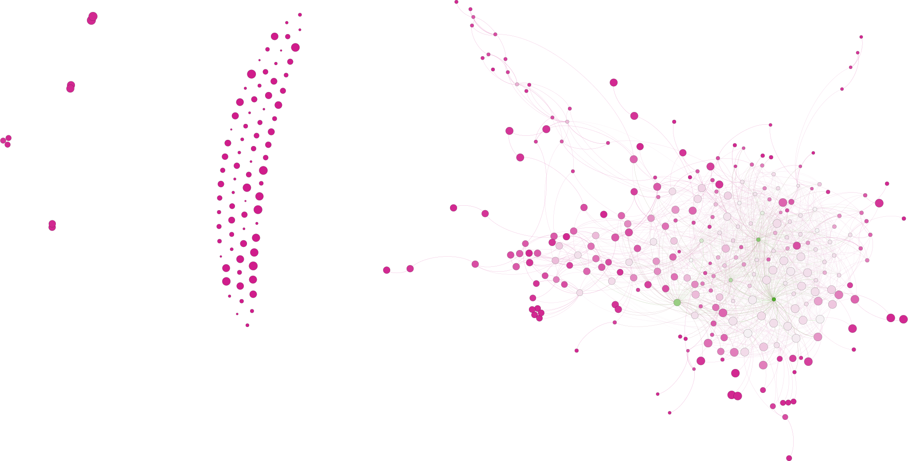

-- Introduction --
In this lab we have been able to see, observe and practice what we learned in class
about graph theory by analyzing our relationship with our friends and their friends
on facebook. This lab have helped us to gain more insight on graph theory and social
network analysis. It not only helped us to explore and playwith many tools but it also
helped us in gaining a very vital and robust knowledge from the analysis we made on own
account, it helped in understanding how the statstics of graph theory really reflects on 
the relationships between nodes in any graph.

-- Methods --

I have tried to understand what was going on each step of the way when in this lab I 
have also read the tutorial on the gephi tool. Therefore, I haven't run to any serious problem.
But in some cases the version difference between the gephi tool used by the tutorial 
and mine had caused me few problems on locating some functions.But to summarize what I did.
I imported the data to the gephi to after analyzing my facebook data by a tool called circles.After
making changes on the graph to make it more readable. I was able to run statstics data from
the gephi tool such as average path.

-- Stastistics --

One of the intersting datas that I have found is the network diameter which in this case
shows me my least related friends. In my case its 9. My guess is one of this guys is a person
which I accepted his/her friendship without knowing them at all. 

  
  
-- Discussion --
Average degree, since the graph is about the connection between my friends. It tells me how many
friends that each of my friends have in average. Network distance represents the longest path in the 
graph as I mentioned in the "statstics". Graph density, shows how well the nodes are connected to 
each other if all nodes is connected to all the other nodes graph density is 1. Hits, have two values
authority and hub. Authority measures how important one node is in connecting the whole
graph. Hub measures the quality of each edge.  Modularity, helps us detect communities. Pagerank
is the principle behind google search. It tell us what how often we would reach the node if
we follow the link non randomly from the node. Connected components, tells us the number of connected 
components in the network. Avg. clustering coefficient, It tells us how well the nodes are clustered
i.e. if how well each node is enbembeded by its neigbors. Average path, it tells us how far 
apart each node is to each other in average. I chose to present my network the way I did
because I thought it was aestaticly pleasing and it cleary showed the nodes and their relationship
better than the default.