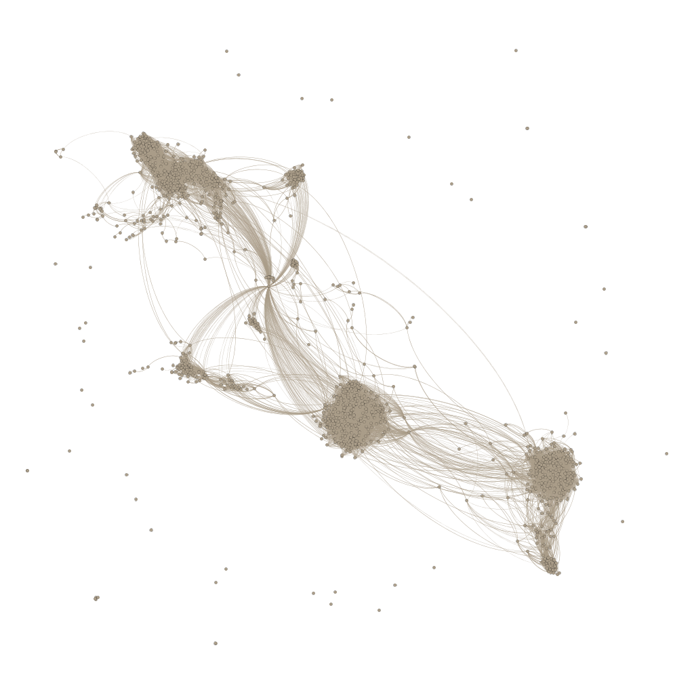

# Assignment 1: Your facebook network
Biruk Gebrekidan

## Introduction
This assignment is to analyze social networks practically on individual facebook data. 

## Methods

First I downloaded the graphml file and imported it into gephi. After that I selected on the node and partitioned according to names. I used forced atlas to display the graph.
After that I downloaded the image in png form. Th graph tutorial shows how to render and calculate the metrics.
My assignment starts from the second step, using a gephi graphml file which was created in step 1.
I partitioned the graph by names so that it shows names and different color specification for the names in the plot. 

After analyzing the graph and metrics I anwered the quesions through google form.

## Results

The following statistics is what I collected from a community of 46

Number of edges 23610
Clustering coefficient 0.556
Dynamic: no
Multi graph:no
Type:undirected
Avg Weighted Degree: 47.126
Diameter 10

## Discussion

There are 46 communities in the graph. The average node degree represents the average friends on facebook that is connected to this user. Clustering coefficient shows how connected friend are to each other. 
I choose to use this display of graph because it shows clearly the nodes and edges.