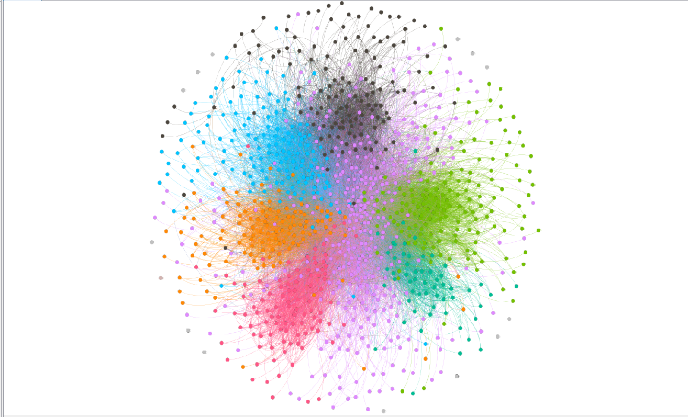
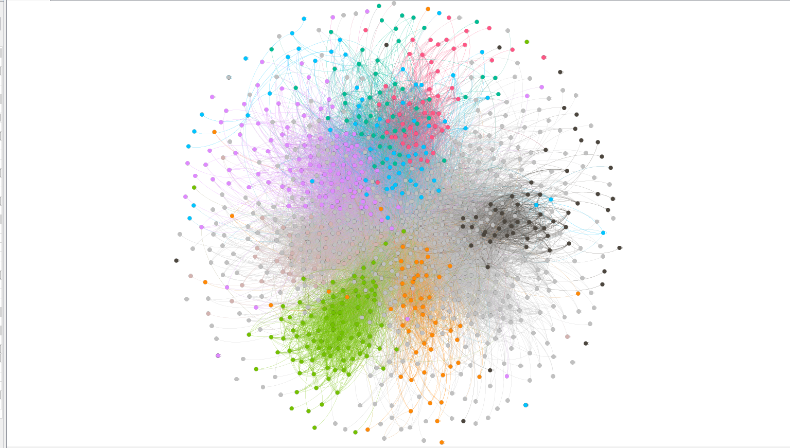
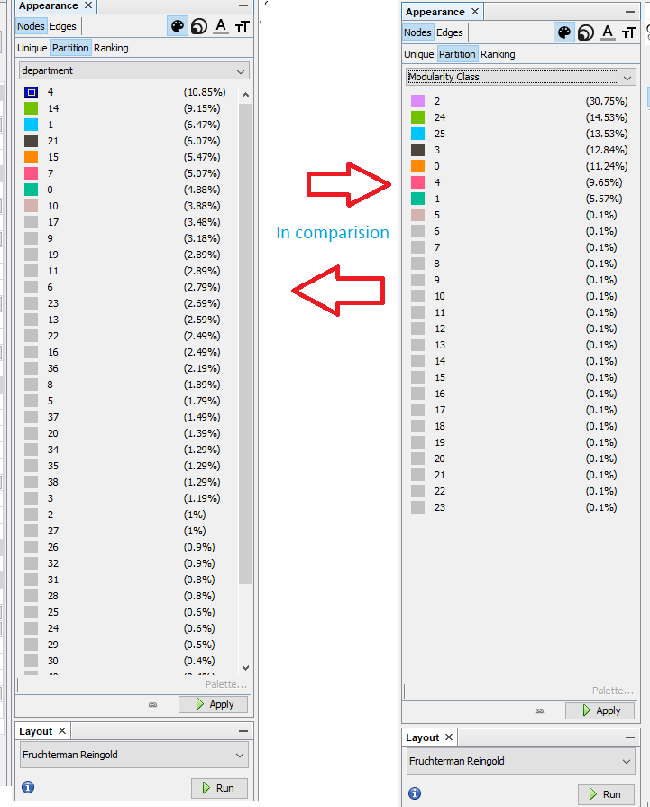

# Assignment 2: Detecting Communities
<HENOK> <SOLOMON>
## Introduction
This lab deals with detecting communities on email core network and YouTube social network.
In this lab we learn on community detection and partitioning as well as how to use gephi and Tools that are used to partitions the communities and algorithms’ that we use 
Furthermore the method, result, the discussion and the conclusion part are listed below. 

## Part 1: Email-EU-core network

### Methods
In this section i download the prepare data from github and use gephi to partition the graphs based on their department.i use gephi becouse it is familer and easy to use .i use Louvain algorithm to do this lab by using gephi because gephi use this Louvain algorithm to its task. Besides this i use Fruchterman Reingold layout to arrange the graphs. 
### Results
In The resulting portion the distribution is good in both communities and ground-truth-communities.
For more information all the results are list below:-
 > Number of node =1005
 > Number of edge =25571
 > Average Degree =25,444
 > Average Weighted Degree =25,444
 > Graph Density = 0.025
 > Modularity =0.416
 > Network Diameter = 7 
 > Connected components = 20
 > Avg.clustering coefficient t = 0.372

### Discussion
To finalize my report as Compare and contrast the community detection and the ground-truth communities, 
Community detection is very important task in vast networks analysis. 
And also community detection is used to identify the large-scale of network by dividing its nodes into communities.
Were as ground-truth communities contain larger -degree hub nodes that consist in community flap and connect to most of the component of the community, in another word the flap community is highly densely connected or more comparatively connected than the non-flap community.

### Conclusion

I have done this assignment part one well and I get bigger knowledge on community detection and ground truth and, Also I know well how to write up what I had thought. 
When I was doing this assignment I face some difficulty on understanding the resulting part and on part to how to do YouTube social network. But I understand the resulting part and all the assignments finally. 
          
## Part 2: YouTube social network
On this part of lab I completely download the two data class data and the edge data. But I can’t do on gephi I face a problem because the data is much bigger and the computer is unable to load and open on the bigger data on gephi and also importing the data wasn't working properly. That is why I couldn’t do part two.
