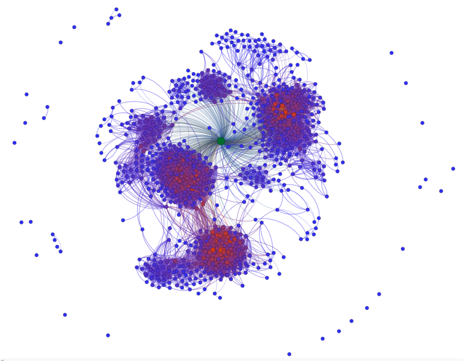

# Assignment 2: Detecting Communities
Feysel Meftuh

## Introduction
For assignmet two we must use community detection to analyse the data and e-mail form the European research institute. I will use gephi to see and study the emails being sent and recieved. I will try and answer all the questions.
## Part 1: Email-EU-core network
### Methods
To use gephi i had to use the user manual and see the different features wiht in the software. I first downloaded the data from the link provided then i extracted it and changed it to .csv format so gephi can read the file. After loading the file i used different tools like layout adjustment to change apperance and comunity detection tools to find the different comunities.
### Results
The number of comunities from the comunity detection algorithm is Number of Communities: 27. The number of comunities from the departement is 42 because there are 42 departements.
- The diameter is 7
- Number of components is 203

### Discussion
The difference between the ground-truth comunity and the comunity found from the comunity detecting algorithm is clear. There are different number of comunities and a different pattern. The data from the EU institution was partitioned using the Modularity comunity detection. The value of the diameter being seven tells us there is a seven hop(distance) gap between two nodes.
## Part 2: YouTube social network
### Methods
...
### Results
...
### Discussion
...

## Conclusion
Althoug this assignment was interesting i was not able to finish all of it due to the capability of my laptop computer. The EU part was very nice to work on and gephi was an easy tool to use.