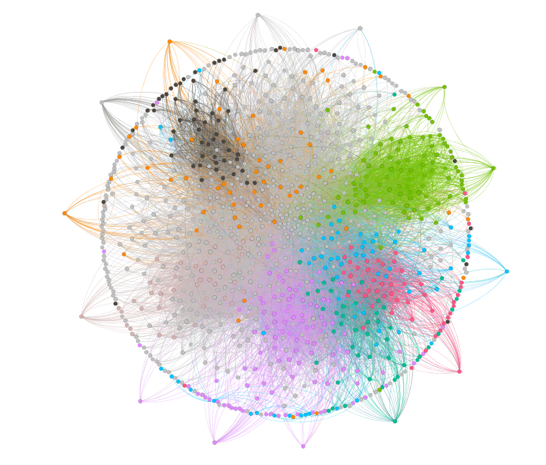
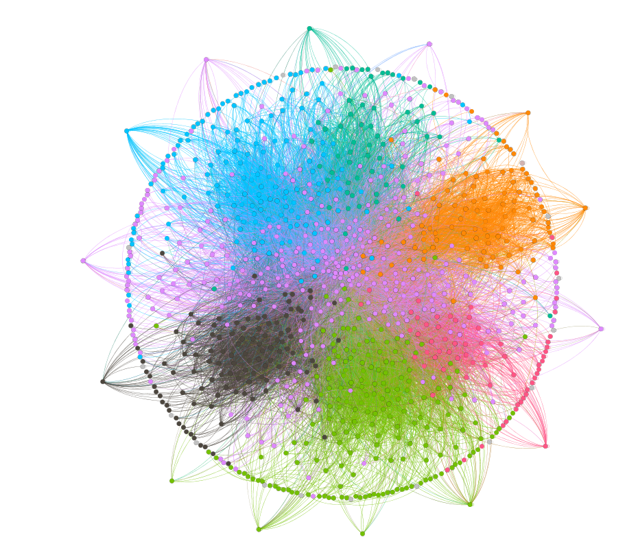

# Assignment 2: Detecting Communities
Alexander Teklemariam

## Introduction
ForThis assignment or write up we are going to focus on  two main parts.
Thefirst part of the assignment will be Detecting Communities,that we have the snapshot information from european research instutition
and analyse  who-emails-whom in Email-EU-core network.
In the second part of the assignment we are going to see YouTube social network users.

## Part 1: Email-EU-core network
### Methods
i used Gephi to partition the graph and its a good tool for visualization.
first i opened the graph that we get from  European research institution then i downloded the file and open the file in gephi using cvs format. 
after opeing the file i used many layouts and tools to adjust the given graph.
In this cenario i used  Louvain Method for community detection  

### Results

Density: 0.025
Diameter: 7
The community detection  26
the ground-truth community detecting   20 

### Discussion
in the community detection they have different department and groups
considering the algorithm uses a differnt metric you can excpect a different result.
we get the data from european research instutition,i used Louvain Method for community detection.
th diameter is 7 because the longest distance between any random pair of nodes is seven. 

## Conclusion
In the first part we used gephi and now i understand how to use gephi,the diffence between community detection and ground-truth community,
And also its fun learning how to use gephi .
But for the second part of the assignment it was hard to open the file because the size was too large, that is the reason for not doing the assignment.