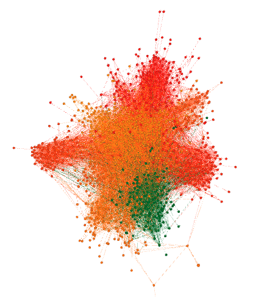

# Assignment 2: Detecting Communities
Nathan Tibebe

## Introduction
From the statistics analysis of this lab I was able to grasp the concepts of ground truth communities and algorithm communities.

## Part 1: Email-EU-core network
### Methods
I used sublime text editor to edit the edges and nodes of email-Eu-core datas and saved the file as csv file.
I imported the csv files on gephi as nodes and edges and got the graph shown below on the results section.

### Results

Average Degree = 25.444

Average Weighted Degree = 25.444

Network Diameter = 7

Graph Density = 0.025

Modularity = 0.417

Connected Components = 20

Average Clustering Coefficient = 0.372

Average Path Length = 2.653

### Discussion
The connected component, average degree and average clustering coefficient are the ground-truth communities and the modularity, average clustering coefficient and average path length are the algorithm-communities of the above graph

## Part 2: YouTube social network
I couldn't open the file with my laptop because it's very huge and way more than my laptop processing power.

## Conclusion
It's a pity that I couldn't do the YouTube social network part but from the first part which is Email-EU-core network I have got a better understanding of detecting communities by analysing ground truth communities and algorithm communities.