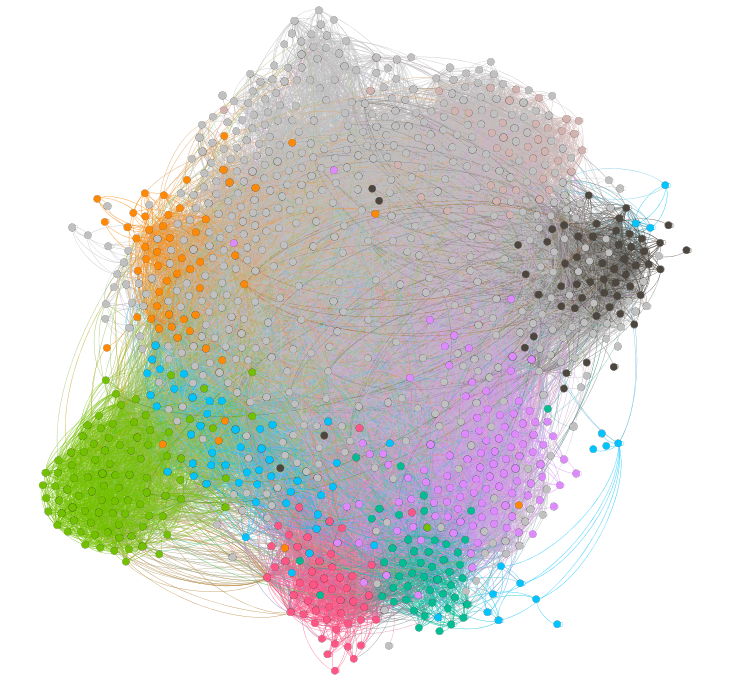
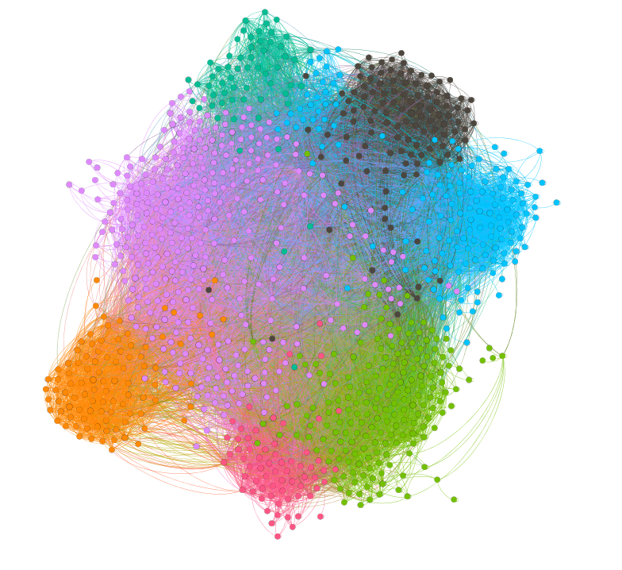

# Assignment 2: Detecting Communities 
Bekalu Ersubalew

## Introduction 
In assignment 2 we are going to detect and analyze community detection from European research 
institute network data we downloaded and use the appropriate tool we chose and do 
different methods and find answers regarding the questions.

## Part 1: Email-EU-core network 
## Methods 
Since gephi is the tool i am familiar with, i will be using it to partion the graph 
that i downloaded using feathers that i learned from the gephi tituorial. the first 
thing i did was downloading the data and import it to gephi.Then i used gephi feathers 
such as color, layout and changed its apperance to make it cool and  then i  used 
alogorithm  to find community detection. this alogrithm is modularity. the reason is that 
it suits the criteria.

### Result 
In this section we will be finding results using algorithms. based on the calculations i got is
 ground = 20 and there are 26 community, there is found to be 1005 nodes(which implies number of employees),
25571 edeges that connects the nodes.

### Discussion 
In this part we are going to compare the data and results of the ground truth and 
community detection.first i noticed a color difference this shows that they are in 
a different  communites,and the also have diferent outputs which implies they use 
diferent algorithms,hence the ground truth vs community detection are not the same.

## Part 2: YouTube social network
### Methods
...
### Results
...
### Discussion
...

## Conclusion
this assignment was very challenging due to its size and poor internet connection.
so that's why i was not able to finish my assignment on time.