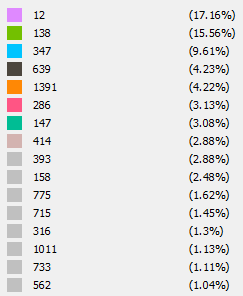

# Assignment 2:Detecting Communities

    Misle Amha

## Introduction

 The Description below on the write up is the answers for the second assignment which was requested for us to work on. It is about Detecting Communities and it has two parts.
 The first pan deals with the Email Network. In the idea of who an email to whom basically. The second part is about the YOUTUBE social Network Communities.

## Part 1: Email-EU-core network

### Methods

I have used the gephi software to work on the partition of the data given. There were to sets of data given for us to work on. The first with the nodes and department of pepole. and the other is the source and target data, by which it is the concept of who sent the email(The Source) and who recived the email(The Taregt.)
So, after downloading the files, which were in txt file, they needed to be changed csv files to be imported to the  gephi software and analyize the graph. The data was given to us with the assignment questions so there was preparation that was made by me.
The Louvain Method for community detection is used for the algorithm to detect the Communities.

### Results

After Running up the data in the gephi software, an image is attached in the assignments directory. was produced with the following data captured, their community ID and the amount of nodes found in the community.
the community ID with 2, has the 30.15% of the total nodes.
the community ID with 3, has the 14.63% of the total nodes.
the community ID with 1, has the 13.03% of the total nodes.
the community ID with 4, has the 12.74% of the total nodes.
the community ID with 8, has the 11.14% of the total nodes.
the community ID with 5, has the 9.35% of the total nodes.
the community ID with 0, has the 5.87% of the total nodes.
the community ID with 6, has the 1.19% of the total nodes.
the community ID with 7,9,10,11,12,13,14,15,16,17,18,19,20,21,22,23,24 has the 0.1% of the total nodes each of them.
From this codes of numbers, it shows that the distribution is fair on one part of the graph, in which the communites have a percentage classification from 14.63-1.19%
on the other side the majority of the communities has a perecentage of nodes given to them being 0.01. among those communites it is distributed fairly but among with the communites stated above, the distribution is despresed.

### Discussion

Community detection is key to understanding the structure of complex networks, and ultimately extracting useful information from them. Applications are diverse: from healthcare to regional geography, from human interactions and mobility to economics.And, both algorithms consider to get a node into a community is different and show different statistics.

## Part 2: YouTube social network
### Methods
I have used the gephi software to work on the partition of the data given. There were to sets of data given for us to work on. Class data. Each line contains the node IDs of members of the top 5000 communities. Again, these community IDs may be thought of as ground-truth communities.Edge data. These are undirected edges between YouTube user IDs. It only contains edges between nodes in the largest connected component in the YouTube social network.
The Louvain Method for community detection is used for the algorithm to detect the Communities.
### Results
The distribution of the nodes is stated below in the image. And comapred to the first part of the assignment, this one is disrtibuted more fairly.

### Discussion

Community detection is key to understanding the structure of complex networks, and ultimately extracting useful information from them. Applications are diverse: from healthcare to regional geography, from human interactions and mobility to economics.And, both algorithms consider to get a node into a community is different and show different statistics.
