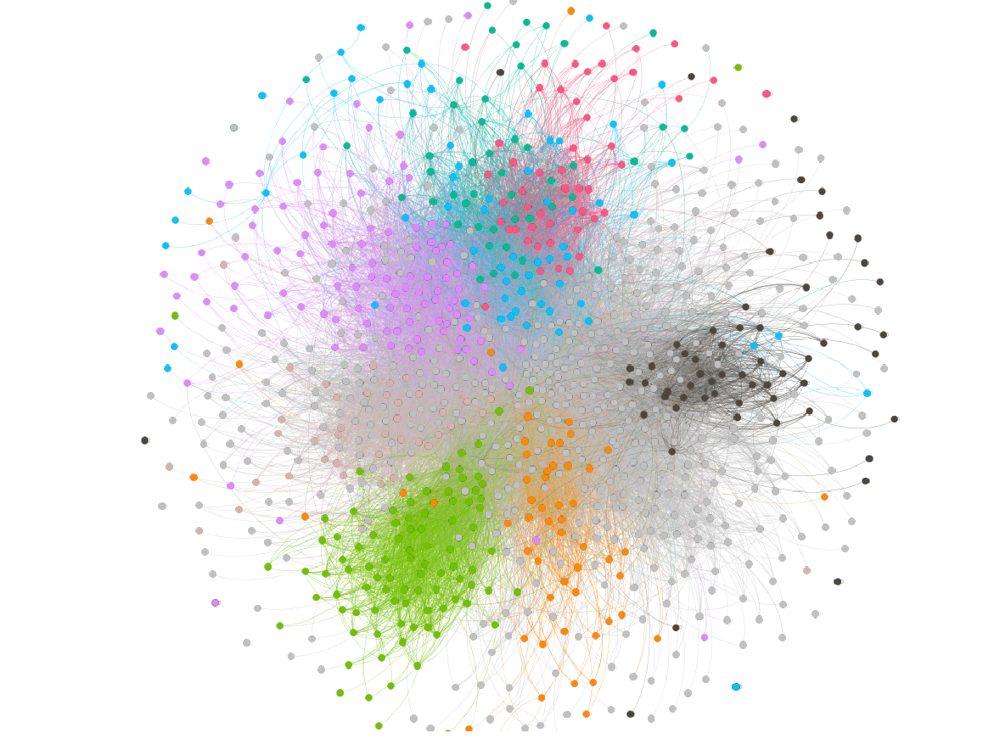
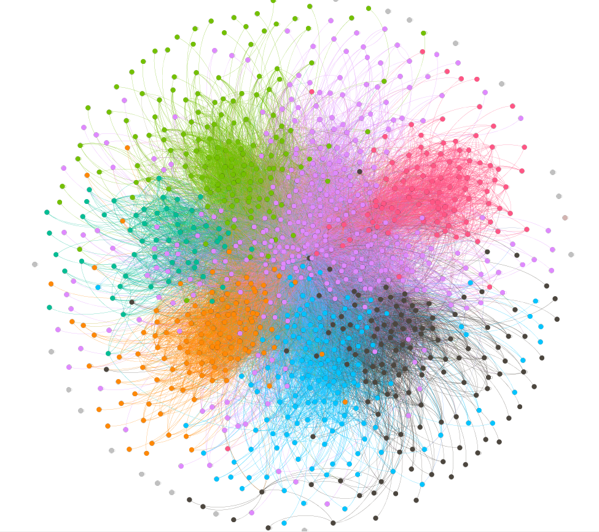

# Assignment 2: Detecting Communities 
Leul Solomon 

## Introduction 
In this lab write-up, i am going to analyze a social network and methods i used and the community detection result.
The network is from european research institution and emails of the peoples in the organization are only included in the set and the youtube social network for the next part.
I am going to do a community detection on Email-EU-core network.

## Part 1: Email-EU-core network 
## Methods 
Here before begining the analayzation, the node(which it represents the users or peoples) and 
edge( which it represents the connection between them) data should be downloaded and coverted into a format that is suitable for the tool.
Community detection algorithm can be done using others tool but i choose to use gephi.
Hence i used gephi to represent the network data in graph, the data set should be changed in a format of 'csv', then import it to gephi.
The algorithm that best suit to detect the community and clearly give the network set is modularity, so i used that algorithm as well.

### Result 
The community detection result, using the modularity algorithm is detecting 26 and 
the ground-truth community result detecting weakly connected of 20 in the department.

### Discussion 
The Email-EU community detected and the density of the links between the communities is measured by the modularity that i used in community detection algorithm,
while the nodes are arranged or grouped together are done by the ground-truth. So the difference came here, which is the communities that has been formed.

## Part 2: YouTube Social network

## Methods 
The tool i used for this is also gephi, which i get it easier compare to others in doing large files.
Here as we all know youtube network is a very big data set, the algorithm i used to analyze it is the modularity as the same as the algorithm i used for the above email task,
but here i additionally used node degree algorithm to make it easier as the data is very large and calculations can be a bit complex 
so that it can show how the graph is distributed and can minimize those numebers of calculations.

## Result

## Discussion
This part of the assignment was a bit hard. Analyzing Youtube's Data was challenging and as you can see in the write up there is no result to discuss about. 
The main reason that i did not get the result is because the processor of my PC is no adequate to analyze the large, complex data set of the Youtube.

## Conclussion
The assignmnet in general was a bit challenging from the previous one but i have gained some new ideas as usual,
But infact the days where around in holidays, it makes it more challenging to concentrate on the assignment and done it well.