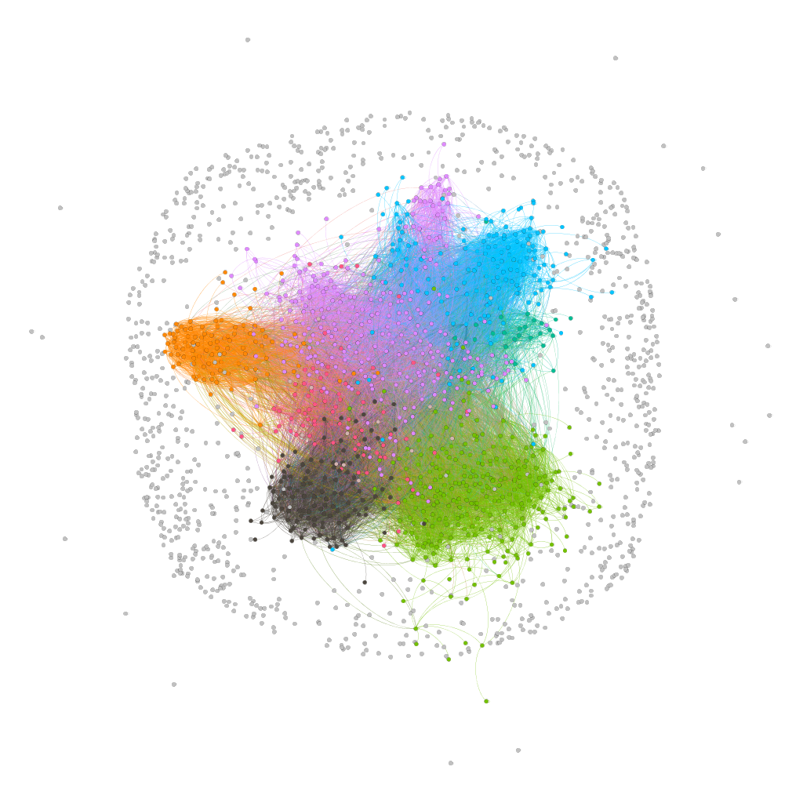

# Assignment 2: Detecting Communities
Tinsae Getachew

## Part 1: Email-EU-core network
### Methods

In This Assignment we already have the data to analyze and look so i just start by using gephi to analyze graphs. The data I have is a text file so before i import the data i change the format to csv in order to import the data into gephi.
For the community detection gephi uses "Louvain Method" so i use what gephi uses and it creates modularity value and it uses to partition the nodes which are in diffrent community.

### Results

As I say in the Method i Have used "Louvain Method" to analyze the community detection. As a result I have found the largest Algorithm-community is 13.93% and second largest is 11.94%. The 3rd largest Algorithm-community is 7.56%. These are the 3 largest community that the algorithm detect. 
The algorithm-community shows the above while the largest ground-truth community is 5.42%, the second largest community is 4.58% and the 3rd largest ground truth community is 3.23. these are the 3 largest ground truth community.

### Discussion

The diffrence I see is on the ground-truth Community parttition the community based on the department of each node while the community detection is analyze using each nodes modularity class. Since there is a diffrence in analyzing community they each have diffrent output.

## Part 2: YouTube social network
### Remark
In this part i have faced some problems in loading datas and analyze in gephi. My device or PC can not load this type of data and with this reason in placed i didn't do the assignment Part 2.
### Methods
...
### Results
...
### Discussion
...

## Conclusion