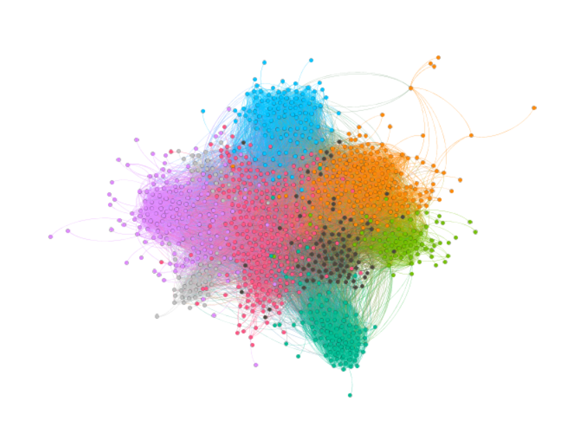

# Assignment 2: Detecting Communities
Yared Abebayehu

## Introduction
This lab helped me to understand how a directed graph works and distribution of community sizes in the algorithm-communities vs. ground-truth-communities. I also learned how to Compare and contrast the community detection and the ground-truth communities.

## Part 1: Email-EU-core network
### Methods
I used gephi for partitioning the graph. I used Modularity as a community detection algorithm.
Modularity is one of the most popular and widely used metrics to evaluate the quality of network’s
partition into communities.It deals with a directed graph data based on the observation
that the existence of a directed edge (i, j) between node i and j, and it depends on the out-degree and in-degree.
### Results

### Discussion
Results of ground-truth-communities
 1. Average degree = 0
 2. Connected components = 1005
 3. Average clustering coefficient = 0

Results of algorithm-communities
 1. Modularity = 0.399
 2. Average clustering coefficient = 0.372
 3. Average path length = 2.653

Dynamic statics can not be run since the graph is not dynamic. 

## Part 2: YouTube social network
I couldn't get the competitional resource for this part.

## Conclusion
Directed graphs shows us a more clear view of the graph theory and I learned a lot about it.
as i said above I couldn't get the competitional resource for part 2.