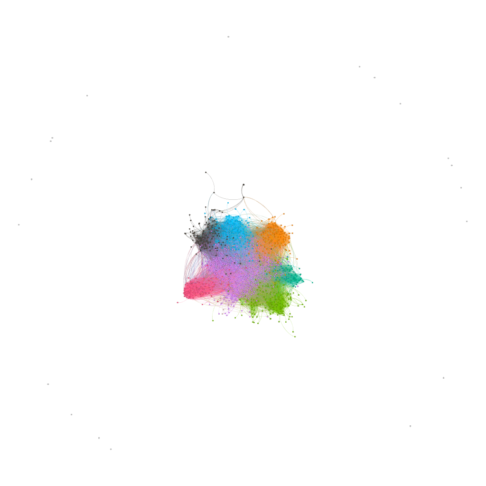

# Assignment 2: Detecting Communities
Natnael Getachew

## Introduction
As it has been said before social networks is all about studying and analyzing the relationship and connection between different entites. Connection of people in different aspeccts or properites can be marked as a community. so here in social network analysis we can detect and group this communites.in this asignment we will be able to detect the communites from Email exchange between people in 47 department of a company and network of YouTube users

## Part 1: Email-EU-core network
### Methods
For this asignment i have used gephi for analyzing the graphs and even though i havent prepared any data since all the required data has been provided, i have to make some modifications  to the downloaded data.since gephi was not reading txt files i have to convert the files to CSV format,and also i have to add header titles inorder for gephi to understand the provided data.

Since i choose gephi for my graph analyzing tool i have used "Louvain method" for community detection since gephi uses "Louvain method" for community detection in which it creates a modularity value for each node and it uses that value to partion the nodes in different community.ref[https://gephi.org/tutorials/gephi-tutorial-quick_start.pdf]

### Results
The results i got after running the modularity and applying partition by modularity class was 26 different communities with id from 0-25.From the generated data the top 3 of ranked was community 3 having 32.04%,community 4 with 14.43% and comunity 1 with 13.83%.next when we look in to the ground-truth-communities which is community by department 42 different communities have been identified.from those the top 3 departments were with department id 4,14 and 1 with 10.85%,9.15% and 6.47% 

### Discussion
Even though both enabled as to partion and identify the community within the company when we see the ground-truth-communities this shows us the exchange of emails within the department along with the email exchange with other departments. moreover from this data we can see that which department exchanges emails regularly and able to get department wise information. when we see algorithm-communities it relyes on the connection rather than department to generate identify the community.

Finaly when we see the diagram of both,since they there is a stronger communication among members within the departments more or less the graphs tends to be similar somehow.

#### algorithm-communities

#### ground-truth-communities

## Part 2: YouTube social network

### Remark
for this asignment i used gephi but since the data was to large it exceeded the 5.6 GB allowd memory for the application so i tried different options like increasing the resolution factor and disabling the randomize feauture but i was unable to calculate the modularity then i switched to Amazon data set but the same thing happens when i tried to calculate the modularity

### Methods
...
### Results
...
### Discussion
...

## Conclusion