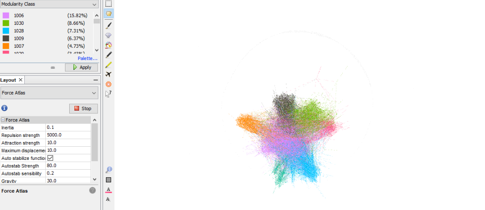
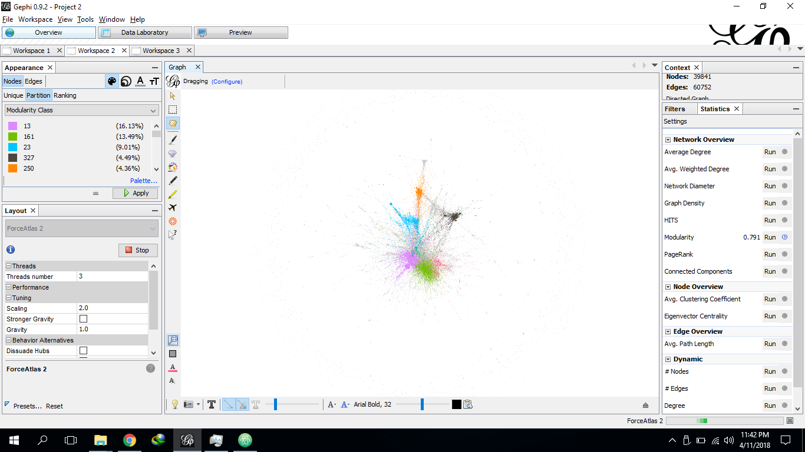

# Assignment 2: Detecting Communities

Mekre Abate

## Introduction

The first section of the assignment was focused on detecting communities from a large network, EU-Network.
Communities don't have a specific way of getting identified but there are several algorithms available we can use to detect them.
For example we have seen the Concor method in class which deals with adjacency matrix and comparing the rows of two nodes to determine if they are in the same community. Another algorithm and one that I have used, the Louvain algorithm deals with the weight of the links to classify nodes into separate communities.

## Part 1: Email-EU-core network

### Methods

Gephi was the tool that I used to do the partitioning and community detection in this assignment. Within this tool there is an already preconfigured algorithm called Louvain algorithm which separates a graph into communities based on the weight of their links. After this algorithm runs and figures out the different communities within the graph, Gephi will color the communities different colors, as shown in the figure, so as to add convenience while looking at the graph.

I chose this algorithm was because it was the only one available in Gephi. The data was provided for this assignment, I haven't prepared it. But I have added the columns to the Edges table spreadsheet as "Source" and "Target" since Gephi requires these two fields be explicitly specified when inserting the edges into the graph.

### Results

When it comes to community distribution in the ground-truth-algorithm, it seems to be a fairly distributed amount of nodes in most community. While in the Louvain Algorithm a few communities have high number of nodes while some are at an average compared to the first I mentioned and the rest don't even amount to 1 percent.

### Discussion

The two algorithms actually have different perspectives. Since what they consider to put a node into a community is different they show different statistics. And this is to be expected when dealing with data with different way of organizing the contents of the set it has.   

## Part 2: YouTube social network

This part of the assignment, I couldn't do because importing the data wasn't working properly. When I imported the data out of the total 1134890 nodes only 39841 were imported and mapped by the edges.

I have attached this image so that you can see that I have run the same algorithm as I did for the first section. But since the total amount of data couldn't be imported , I didn't do this section.
