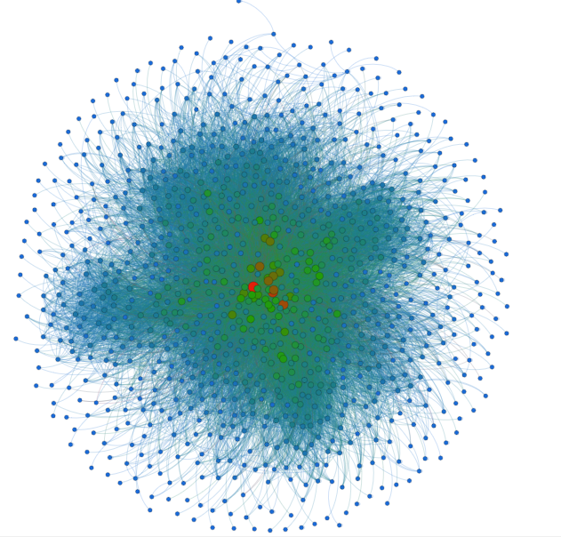

# Assignment 2: Detecting Communities
<b>Simon Asfaw</b>

## Introduction

This write-up describes the analysis made about the two data sets (E-mail  
correspondence and Employee-Department label) of the European research  
institute. I will be describing the different methods I used and the results  
that the various algorithms used yielded.

## Part 1: Email-EU-core network
### Methods
For the two graphs of the EU research institute (E-mail and Department) I  
used Gephi 0.9.2 for viewing and manipulating the data. I used this tool  
because it is familiar to me and it also doesn’t task my PC or use too much  
memory. It also has a lot of features and has a modular design where you  
can install different plugins and packages to enhance the software.

Using Gephi I have organized my data in a manner that is more revealing  
than a text of random pairs of numbers. I have used a combination of  
Expansion, Noverlap, Force Atlas2, and Furchterman Reingold from the  
layout tool to spread out and visualize my data. I have also used color and  
size filters provided by the Appearance tool to make it more insightful.

E-mail

Departement
To get more data from it however I calculated the average node degree and  
this gives me the in-degree and the out-degree which will show me who has sent/received the most emails.

I have also done another graph combining the two different spreadsheets. I  
have done this after discussing with my class mates (Mekre Abate and Fiker  
Awoke) and seeing that it will clearly show the different groups in one  
graph to better see the clusters formed by the department and the  
components.

Combined graph

### Results

The results yielded are from three different graphs. First is from the E-mail  
correspondence graph only, Second is from the department-Employee  
graph, and lastly from the combination of both graphs as suggested by  
(Mekre and Fiker).

> 1. In the first graph of the E-mail correspondence you can see the degree,  
in-degree, and out-degree which tells us the distribution of e-mails sent and received. I have also calculated modularity which uses Louvains' algorithm to find groupings of nodes.

Email Group modularity

The in degree shows us who has sent the most mails. You can also tell how  
much mail is sent on average and the distribution of emails sent through  
different people.

range 0-100

range 100-200

range 0-100

range 100-200

> 2. Second there is the Department graph.

Departement

Departement Moudularity Partitioned

> 3. And lastly there is the Mixed graph of the two Data sets.

ground-truth-communities vs. algorithm-communities

The first image is the graph partitioned by departement and the second is  
by modularity.

### Discussion
The community crated by the departement groups the nodes based on  
which departement they belong to. But the community created by the  
modularity algorithm (Louvian) comes to by the measure of the density of  
links between communities. This is done by creating a small communities  
then gathering them together to make a bigger community. This creates a  
difference in the communities formed as you can see in the previous  
pictures.

## Part 2: YouTube social network
### Methods
Same as before I used Gephi to partition the graphs. I used the Fruchterman  
Reingold Layout style. I didn't use a combination of many layouts because  
this data is very large and requires more memory, so it is only possible to  
use a single layout. I chose to use the Fruchterman Reingold Layout style  
because it spreads out the data evenly and shows almost all the nodes  
because it is round and tightly knit.

I have used the modularity and average node degree algorithm to analyze  
the data. Like I have stated above this is a very tasking data set to process  
for my laptop and therefore I do not want to make a lot of calculations. I  
just want to display the different communities and show how distributed  
the graph is.
### Results

### Discussion
Since the assignment was given over two weeks there was an ample amount  
of time to properly complete it. However the allocated time was during the  
holidays, basically meaning school was closed and also 3-5 days were spent  
at home. As I have stated my Laptop was unable to process either of the  
three provided data sets; Youtube, Amazon or DBLP. That said I am not  
using this as an excuse, just stating the circumstances that led to the  
incompletion of the assignment.

## Conclusion
This assignment was very challenging to do because it required us to look  
for the answers on our own. There were different possible ways to come to a 
conclusion. Also the data provided needed more tinkering for it to work  
properly. There was also the fact that the different graphs could be merged  
in different ways, which made it tricky to decide on which combination to  
work with.
