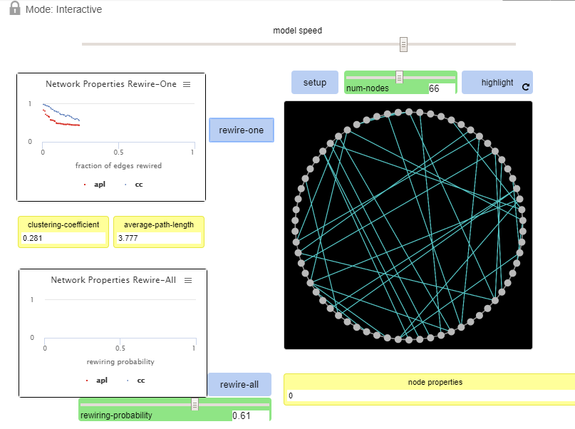
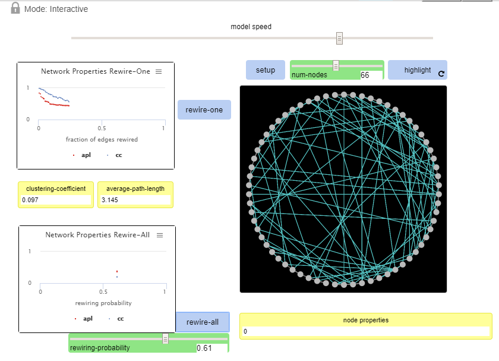
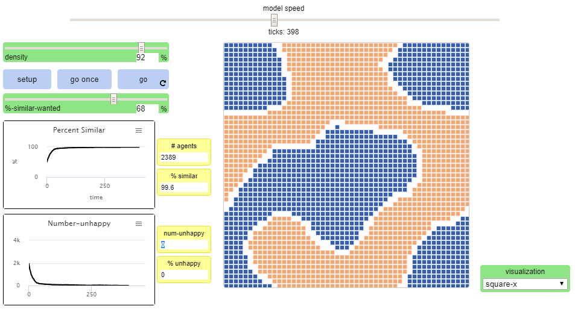
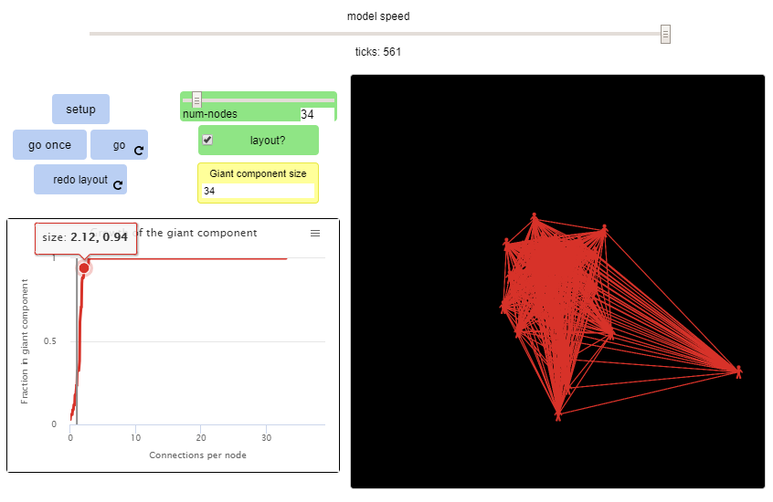

# Assignment 3: Detecting Communities
Tinsae Getachew

## Introduction
This submission contains three parts. The first shows watts-strogatz small world model. This is found in models library and we work with a network sample.

In this Assignment I did the main Three parts these are 
	1.  the Small Worlds
	2.  Segregation and the last one is 
	3.  is the Giant Commponets

## Part 1: Small Worlds
### Methods
In this Part I See The model speed slider which allow to controll the speed of the model motion. The Other things i See is setting button and other buttons to setup and used to rewire. this allow to adjust diffrent settings setup.
The first button which is used to rewire-one used to rewire each edge to other edge one by one in every click. The other button is rewire all button this button automatically rewire all the edges to other end of the edge.

### Results
During this investgation I found some results related to this. The first thing i see is the clusturing coefficent is varing every time I rewire each node also the avarage path length(APL) and the diameter vary according to our edges connection. Each changes happen because of the rewireng probability will be affected  by these factors.

The Clustering-coefficient is 0.281
And theAverage-path-length is 3.777

The Additional rewires show that
The Clustering coefficient is 0.097
And the average-path-length is 3.145

### Discussion
As a result There is a constant increase in the plot this means there is constant output. 

## Part 2: Segregation
 
### Methods

For this i Try to change the percentage to 92% then i setup the seggregation after that i change the similar wanted percent diffrent times and clicked go. the similar wanted percent diffrent when ever i incerased the percentage it eleminate the node which is diffrent from the group and takes longer time

### Results
These are the results which i Get 

Initial
#agents = 2383
%similar = 49.6
#unhappy = 1974
%unhappy = 82.8

the Final output is 
#agents = 2389
%similar = 99.6
num-unhappy = 0
%unhappy = 0

### Discussion
the final outcome shows that the similar wanted percent diffrent when ever I incerased the percentage it eleminate the node which is diffrent from the group and takes longer time

## Part 3: Giant Component
### Methods

In this part First I give each nodes numbers. then I Setup Each nodes by clicking the setup button  then an image appear of not connected peoples yet the goal is to create a connections between every node

### Results
Intiailly
Giant component size = 1
number of nodes = 34
connections per node = 0

last step 
giant component size = 34
fraction in giant component = 1
connections per node = 33

At last it take longer time to load the final output but the final image has appeared

### Discussion
In the last step I have learn every node is connected. THis Giant componet enables to describe how anyone can be easly connected through random network