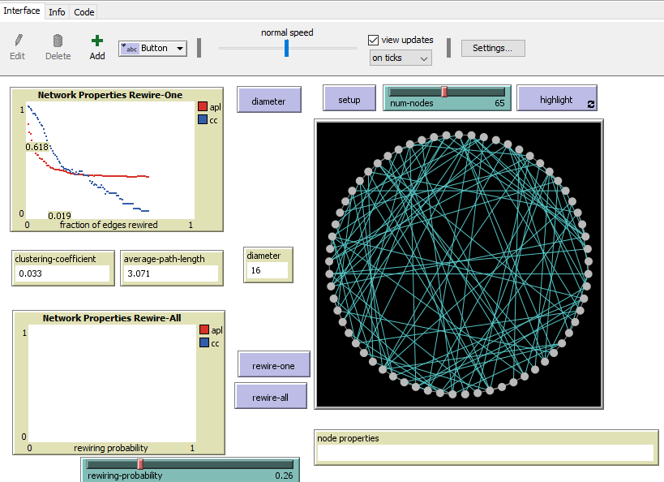
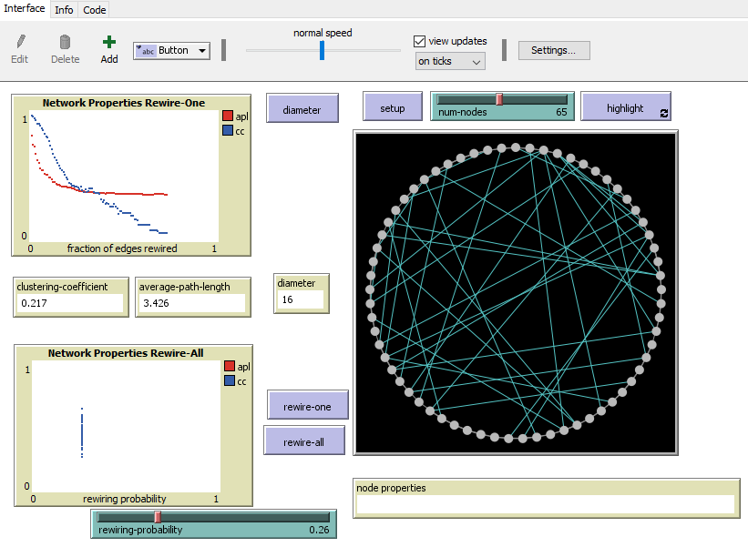
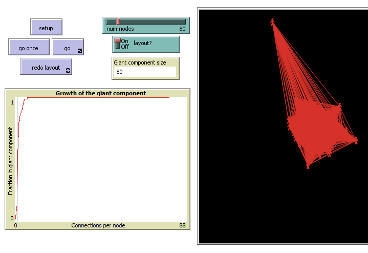

# Assignment 3: Detecting Communities
<Henok> <Solomon>

## Introduction
This lab mainly deals with understanding Random networks in detail and more about small world phenomenan as well as Segregation and Giant Component.

## Part 1: Small Worlds
### Methods
Firstly I open net log’s and goes to net log library from this library i choose small world.
In the global I define my dimeter "I gat my dimeter"
Value  
 To diameter
 Set my diameter max [max distance-from-other-turtles] of turtles
  End
 After this show wither the code is correct or not and check and if the code is correct my dimeter box will print in the interface   
 Rewire means making or forming edge among two random nodes and rewiring on network means making of new links from the previous forming wires in other word removing the one block

### Results
From the above methods we can get the following results:
Clustering coefficient: 0.5
Average path length: 6.633
Diameter: 13
Rewire-one 

On this part of the graph there is two Axis which is y-axis and x-axis 
On the y-axis there are two colored boxes the one with red color is 
Apl (Average path length) and the green one is cc (Clustering coefficient)
On the x-axis it describe the fraction of edges rewired b/n [0-1]Apl with red color on the graph when become more rewired the Average path length become constant and the Clustering coefficient become more and more smaller.

Rewire-all

On this graph also it have two axis the y-axis there is Apl (Average path length) and cc (Clustering coefficient) on small box and also on the x-axis describe  rewiring probability from this graph I use rewiring probability of 0.26 as the rewiring probability result always different because it is random.

### Discussion
Clustering coefficient change as nodes are rewired because clustering coefficient means how each and every nodes are known each other in other word it's the probability of the neighbor node know one another. Rewire-all version show a distribution of metrics when you run the model with the same settings, yes because of the rewiring probability and also it connect many other nodes. Sine I describe the plots shape on the above graph in detail the plots shaped the way they are.

## Part 2: Segregation
### Methods
I Use my on density and Segregation of 150x150 grid and 70% density, when you vary how tolerant an agent is of being in the minority, I observe the percentage of unhappy agents become increase when the agent is less tolerant.

### Results
When I finally run the graph I saw that the majority and the minority group are relatively tolerant
From the graph I use 70 % density we can get some result in the interface part 
The Number of agents=1878, %similar=50.7, number of unhappy=348, %unhappy=18.5 from this 
When I click the go once button:  number of agents=1878, %similar=60.8, number of unhappy=166, %unhappy=8.8 and when I click the go button: the number of agents=1878, %similar=74

### Discussion
On this segregation portions show how social agents that are the orange agents and blue agents are influences on the community and also in this simulation each and every induvial want to stay with the person nearby for example: the blue and the orange agents each want to live on their kind.

## Part 3: Giant Component
### Methods
Firstly I ran the giant component model from the library and I use the default setting that is the number of node is 80 we can change the number of node and the speed from this we can see different result Based on the number of node that you choose. 

### Results
On the this part the resulting information display on the interface when I click go once button the number of  node display on the graph is nearly one pair of nodes or make new edges between two random nodes. When I click go button the graph form many link and form bigger community until as it reach the number of nodes.

### Discussion
As we can see the diagram above the growth of the giant component growth as the number of nodes Increase and also the graph show brief description and also this giant component shows as how Grow a random network.
## Conclusion
Finally from this project I had learn so many thing on the part one on small world more on rewire using net log library. On the second and third part we can see on segregation and giant component in detail that I can get a lot of information and lot of understanding on this project.
