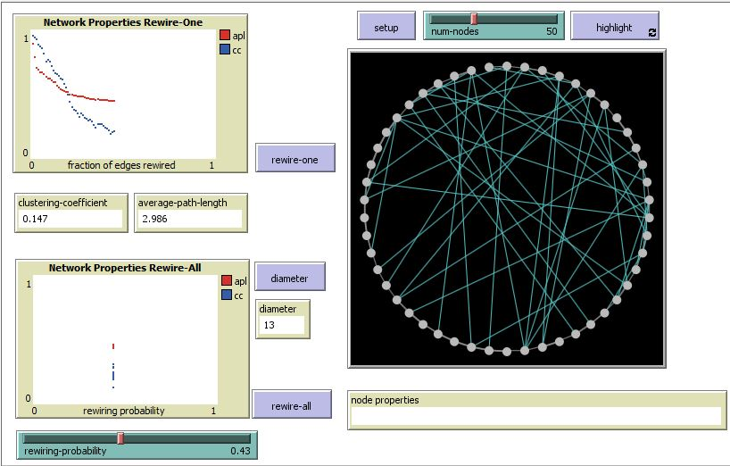
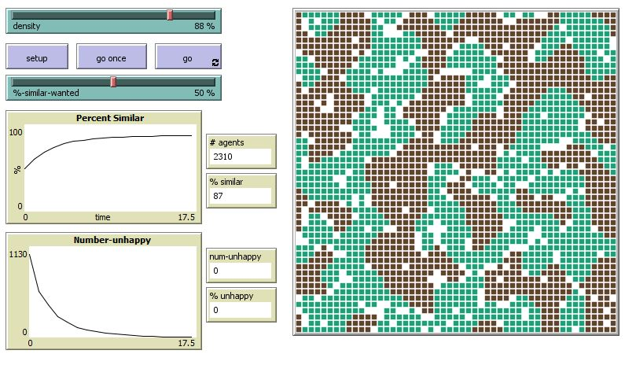
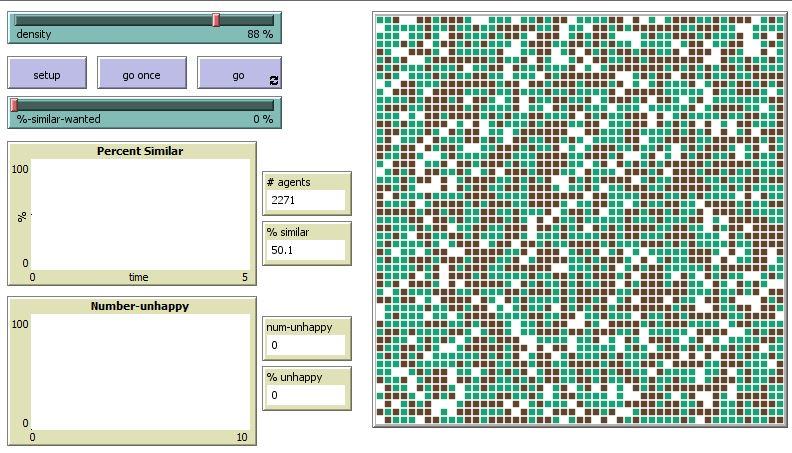

# Assignment 3: Detecting Communities
Alexander Teklemariam


## Introduction
For assignment three i solved the questions using netlogo. Netlogo is a simulation tool. I used netlogo to do small worlds, segregation, and giantcomponent.

## Part 1: Small Worlds
### Methods
The method for making the diameter is 
```
 to diameter
   set dm max [max distance-from-other-turtles] of turtles
 end
```

the diameter shows the maximum distance between nodes.
the simulation has number of nodes slider and rewiering probability slider which can be changed. it has desplays of clustering coefficient, diameter and average path length. there are two functions rewire-one and rewire-all.
rewire-one code chooses an edge to disconnect from and looks for a new node to attch to randomly and then dissconnects that edge to rewire it.
### Results
The results when the number of nodes is set to 50 the clustering coefficient is 0.5, the average path length is 6.633, and the diameter is 13.

The shape of the graph shows the average path length slowly decreases and stops to decrease. The clustering coefficient fastly decreases. the rewire all plot show only on a line.
### Discussion
The clustering coefficient depends on the number of neighbours who are neighbours of a node. so when the graph is rewired that number changes and becomes small.
The rewire all plot shows a distribution metrix because the x-coordinate is set by the rewireing probability slider. everytime it is rewired the shape of the graph chnanges, but with the same probability.This makes a different dot on the plot.
## Part 2: Segregation
### Methods
The segregation model has a density setter and %similar wanted setter that can be adjusted. you can see the %similar and number unhappy plot through time.
### Results
When i set up the segregation model on netlogo i used 88% density and 50% similar wanted. This gave me 2310 agents, 49% similar, 1031 number unhappy, and 44.6% unhappy.


When the %similar wanted is set to zero the number of agents is 2271, and the percentage similar is 50.1%.

### Discussion
When the density was at 88 and the %similar wanted 50 the system achieved 87% similarity after 17.5 seconds. The graph is sorted into different groups.
when the %similar wanted is zero the model won't run at all.
The %similar will stay at arround 50%. Every color stays mixed.
This is what i expected from the model. also if the similar neighbors wanted is zero then there is no need to sort it.

## Part 3: Giant Component
### Methods
for the giant component model there is a slider i can set for adjusting the number of nodes and a layout swithch to change the layout.
### Results
after pressing stetup with 500 people and turning off the layout i got a giant component size of 7.
### Discussion
having so many people will take time to connect them all into one giant component. but you can clearly see how a giant component is being formed. eventhough there are many connections there is only one with many interconnected people forming a giant component.

## Conclusion	
This assignment is slightly challenging and have made me think about the many possibilities of simulation in netlogo. i have also been able to see the things we learnt in class simulated.