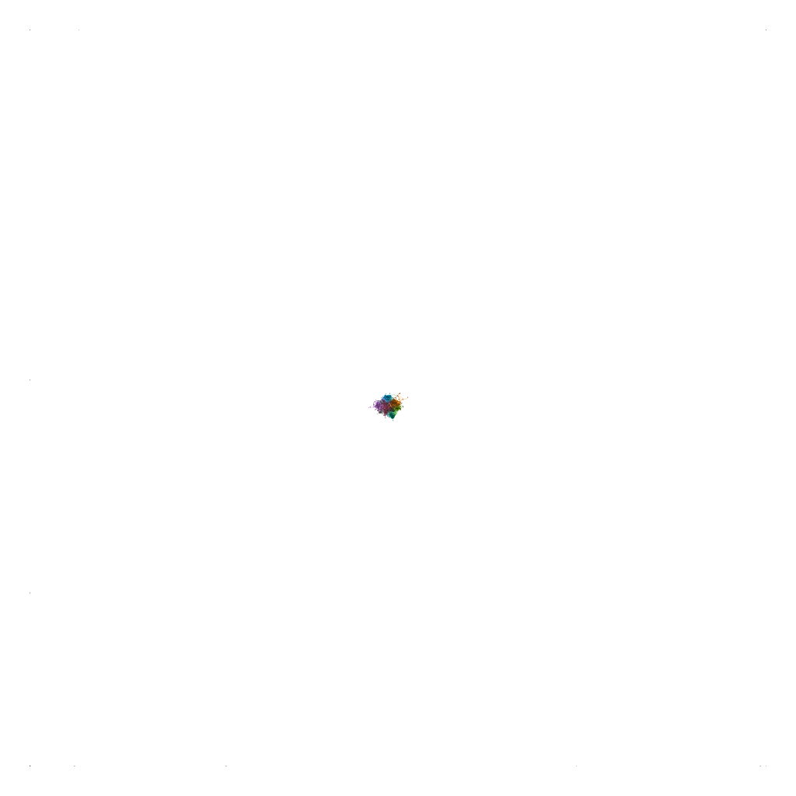

# Assignment 3: Detecting Communities
Alula Tsegaye

## Introduction
For this assignment I used netlogo for visualization. Also describe the properties of rewire one and rewire all functionalities based on the netlogo and proceed to segregation and then giant components in the end.

## Part 1: Small Worlds
### Methods
I followed the netlogo guidelines to start the visualization. Rewire one occurs when one end of the edge was disconnected from a node and reconnected with a randomly chosen node. Thus rewiring creates shortcuts accross the network and rapidly decreases the mean path length across the network as it can be seen at the plot. for rewire all  every node in the is rewired in the plot.  

### Results
number of nodes and pivotal simulation are considered whilst drawing out the following metrics.
before rewiring the graph have the following the metrics
Clustering coefficient = 0.05
Average path length = 6.633

After rewiring several times( three or four times) this metirc values are produced 
clustering coefficient = 0.33
avg path length = 3.29

Finally after rewiring all i found the following this metric results as i saw from the stats that by rewiring all the average path length has decreased  
Clustering coefficient = 0.02
average path length = 2.95
diameter = 11(from the web)

### Discussion
The clustering coefficient randomly changes because every time nodes are rewired there will change their neighbors and as a result in the flactuation of clustering coefficient value, the density of ties will be relative..

## Part 2: Segregation
### Methods

I used most options in the default configuration which are easy to visualize and analyze. Besides that I set 88% density and 30% wanted vlaue.
### Results
metircs collected after go once button->go button
similar(%) = 55.8
unhappy vlaue = 234
unhappy(%)= 11

metircs collected after go button only
similar(%) = 74
unhappy vlaue = 0
unhappy(%) = 0

### Discussion
The agents are more likely to move to another place unless where there is more neighbors correspondence. As a result they are more likely to become happier(based on the metrics) .

## Part 3: Giant Component
### Methods
At first there are nodes that are not connected to any other nodes.Then each possible edge connencting pairs of a given nodes is present independently of the other edges. Step by step, the nodes are all connected until giant component occurs. 
A giant component is a component where there is no separation and every node is somehow connected and it is reached from anywhere.

### Results
Number of nodes= 80
Number of people = 80

The result I got when giant component is created is 
The fraction of giant component is 1 and there are 88 connections per node. 
### Discussion
I tried to change the code.  
''' if ( (2 * count links ) >= ( (count turtles) * (count turtles - 1) ) ) [
    display
    user-message "Network is fully connected. No more edges can be added."
    stop
  ] 
    user-message "network is not connected"
  add-edge'''
  
 user message "network is not connected" will pop up every time when there is new link formation and its not giant component

From this I learn that in any network if connection occur between any node first and this continue until every node is connected a giant network will be formed. This means, at least one node has access to the other node.
## Conclusion
generally I learned many things from this assignment. How netlogo works and visualizing segregation especially predict values of segregation using data visualization and how many steps it takes to create any giant component with few nodes.