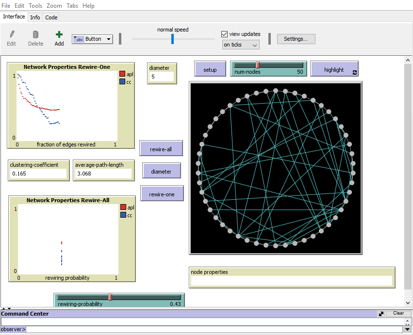
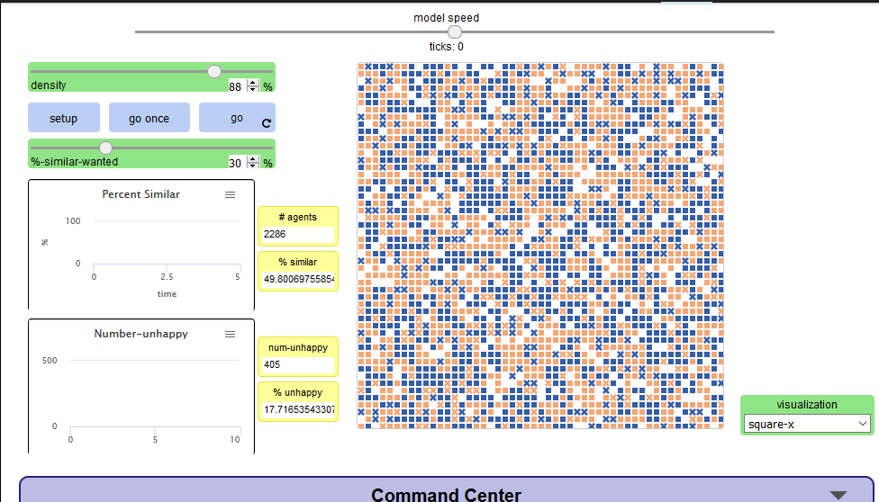

#Assignment 3: Detecting Communities

##Introduction

In this Assignment we will be dealing with the distribution of random networks.by doing this i have learned 
 how random graphs are described by probability distribution. by using netlogo which is a modeling tool which
 works on all major platform i used different techniques to get 
differnt outcomes


##Part 1: Small Worlds
###methods
let me start by defining Rewiring on network assum that we have nodes that are connected to one another by 
rewiring means altering the connection of nodes or the links among them and connecting that node to another 
random node.there are two options in rewiring the first one is rewire one and rewire all and if we click it until all are 
rewired we see a pop up message that all are rewired and cant be reired anymore. 
the other part we encounter is diameter we must define or set code to find the exact diameter in my case i 
used this:
```
 to diameter
  set getvalue max [max distance-from-other-turtles] of turtles
end
```
###Results
clustering-cofficent is 0.5,avarage path length is 6.63 and last diameter is 13
this results came by modfying th enumber of node to fifty.


### Discussion

In doing this assignment i have noticed that clustering cofficient varys each time when we rewire.
this is because each time we rewire it forms a new connection  from one node to another random node and forms a new 
links which changes the clustering cofficient.and because of this the shapes of the plots are seen in that way.
 when we see diiferent vlaues for  avarage path length,clustering coffiecent this is because of rewire all, it creats new 
links among all edges in a network
 

## Part 2: Segregation
### Methods
As in the instruction i changed the value of the gird to 150*150,88% density by implementing density we can control the neghibourhood density.and also 30% similarity.and after i run the model,we get a 74.4 similarity this is because we have zero percent unhappy agents.

### Results
The results i got by setting the density,grid and % similarity are as follows:
percentage similar = 49.80

number unhappy = 405

percentage unhappy = 17.1


After go it becomes:

percentage similar = 74.4

number unhappy = 0

percentage unhappy = 0
### Discussion


## Part 3: Giant Component
### Methods
I start by tweaking the number of nodes to 80. I set the speed to minimize.hence the giant compoenents will be effeced by the new forming links.

### Results
I changed the code by setting my own color. 


```
to color-giant-component
  ask turtles [ set explored? false ]
  ask giant-start-node [ explore yellow ]
end
```
and after all i seen the color is changed to yellow.

### Discussion
The color changed the cluster color from red to yellow.

## Conclusion

In this assignment the above three small world,segregation and giant components were new to me.
but in doing this assignments i have gained knowlege in interperting them


