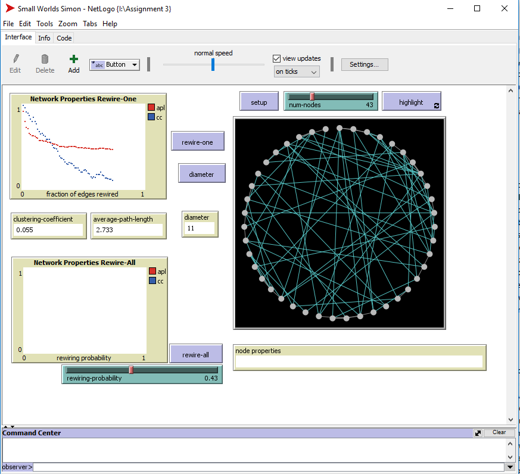

# Assignment 3: Detecting Communities
Simon Asfaw

## Introduction

In this assignment we are using NetLogo6.0.3, which is a very simple yet powerful simulation software. We will use this software to answer all the questions in part 1, 2, and 3. In the first part we will use the small worlds model to analyze the clustering coefficient, average path length, and diameter. In the second part we work with the segregation model to see what happens to different groups who want to cluster together. In the third one we see the giant component model which shows us how a giant component is formed over time.

## Part 1: Small Worlds

### Methods

1. To finish the project I referred to the user manual of netlogo to find the max function, to help me calculate the diameter. 

2. -> The rewire one function disconnects a random link from a node and then reconnects it to nodes other than the ones previously connected.
In the first few lines the code checks if the number of turtles and nodes is equal then re-sets it if it doesn’t match.
-> Then the next block of code checks which button is pressed rewire-one or all
-> Then in the part where it says (let potential-edges links with [not rewired?]) The rewired part keeps track of whether the link has been rewired or not. So this section of the code checks for potential edges with the criteria being that eligible edges are the ones that are not rewired.

3. The code I used to add the diameter is this:-
       to diameter
       set dia max [max distance-from-other-turtles] of turtles
       end

 And this is why. Because the value of distance-from-other-turtles is a matrix of a matrix we need to find the maximum valued matrix, and then find the maximum value from that matrix.

4. I first tried this code but it didn't work.:- <br />
*Doesn’t work* <br />
  ``` to diameter
      set dia max-one-of turtles [distance-from-other-turtles]
      end 
```

### Results

1. When the number of nodes is set to 50 the clustering coefficient is 0.5,
the average path length is 6.633,
and the diameter is 13.

2. On the x axis of the rewire one plot fraction of edges rewired, which is the number of edges rewired by 0-1 interval (100%). On the y axis we have the Apl and cc.  The plot in red is the average path length and the one in blue is clustering coefficient. Apl levels out and cc decreases.


On the rewire all graph we have the rewiring probability on the x axis and the apl and cc on the y axis. The reason you see a line instead of a plot is because unless you change the slider the value of the x axis is fixed and also every time you rewire all the outcome of the apl and cc will be different because it is random.


3. The shape of the plot of the rewire-one graph is a constant tail like graph with the apl sloping down in a curve and then leveling out. The shape of the cc plot is a steadily falling one. It starts off higher than the apl then its value falls below the apl.

### Discussion

1. Clustering coefficient is the probability that two randomly selected neighbors of a node are themselves neighbors. So the reason that the cc changes is because the links that form the neighbors change and therefore changing the cc values
2.  Because the x-axis is the rewiring probability set by the slider, the plot of the graph when you press “rewire-all” multiple times will be in one line set by the rewiring-probability. And also since it is a random rewiring the outcome will not be the same all the time
3. The plots are shaped in different ways because the Metrix they are dependent on is different and rewiring the graph has different effects on them. The apl levels out because the number of links doesn’t change rather it’s their arrangement, so after a while the value of the apl becomes constant. But the cc sharply decreases because its Metrix depends on the links of the neighbors of the individual nodes, which changes from being a constant fixed number to a randomly linked probability. The probability of the neighbors of a node V themselves being neighbors is low.


## Part 2: Segregation
### Methods

The segregation model from net logo easily demonstrates the effects of homophily. The density slider determines the initial number of groups there will be. To see the effect of the similar wanted you just need to change the value of the slider, which will set the criteria on whether the turtle can be tolerant of how many different colored neighbors are around it.


### Results

With an initial number of agents of 2471 and a 50.2% similarity. The number of unhappy was 2174 and the % of unhappy was 88. The sliders of density was at 95% and similar wanted 75%. After running it for approximately 184 ticks, the similarity was 87%, the number that were unhappy was 549, and the percentage of unhappy was 22.2%.


With the sliders of density set at 53% and similar wanted to 100%. The system had 1371 agents and 50.4% similar elements. The number of unhappy turtles was 1255 and the percentage of unhappy was 91.5%. After running it for around 110 ticks the values of % similar and %unhappy barely changed. The values for similar and unhappy turned into 51.3% and 90.2% respectively.


### Discussion

The tolerance affects how fast the system resolves itself. When you set the similar-wanted slider on a low setting the segregation happens quickly but there will be many patches and groups formed. When the slider is put on high though it takes time for the groups to form but we will end up with a neat looking group having one or two groups each.
Also if you have a small density and a high similarity preference the system will be in a constant state of turtles scrambling around. This is because having a high similarity preference means that the turtle will stay in place if it has many similar neighbors next to it and this is impossible to achieve with such a sparse layout.

## Part 3: Giant Component

### Methods

1. Before you setup you have to options the layout on/off switch and the number of nodes. Switching the layout on will display the interaction with animations where the individual turtles cluster together kind of like the nodes on Gephy when you use a layout. The number of nodes slider sets the number of nodes. 
### Results
1. When you run it in default mode the individual turtles will start linking up randomly. When more and more people start to connect you see different clusters forming. The giant component is shown in red with all its members connected. The different components also start to connect with each other, during the giant component changes from time to time, highlighting which group has the most connections. Eventually all components combine and form one giant component at this stage the simulation stops and notifies that there are no more links to be made.


### Discussion
But I changed one variable in the code.
``` ;; this variable is updated each time we explore an
    ;; unexplored node.
    set component-size 2```


The set component-size value was initially 0. Changing this means that the number of turtles explored so far in the current component will increase and this means that when it counts for the turtles in the component it will have two more and this is the effect it had. The number of links increased by a lot.

## Conclusion

Overall this project was a very entertaining one. I have seen that net logo is a powerful tool and I’ve also seen that simulation is a very interesting part of network analysis which easily allows us to demonstrate many scenarios. 

