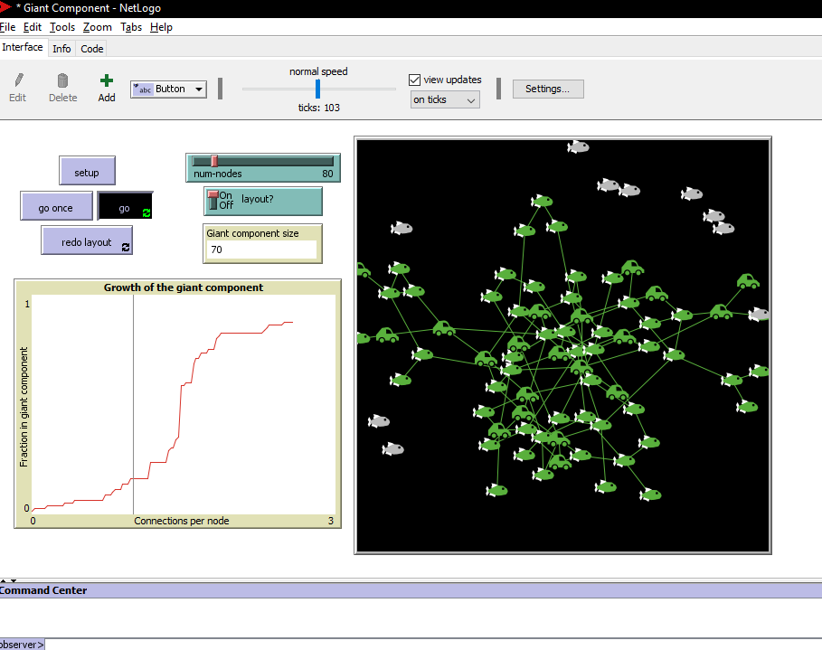

# Assignment 3: Random Networks with NetLogo
Natnael Getachew


## Introduction
In Assignment 3 we will be introduced to netLogo a software which is used for simulating different models and also used for creating different models and enviroments programaticaly.by using this software we will be analysing different aspects of random networks.we will look at the small world phenomina geographic segrigation and giant components phenomenon.

## Part 1: Small Worlds
### Methods
for the part one of this assignment i started getting around with net logo it took me few tries to figure out that the rewire one changes a link between randomly selected nodes with another different eadge.

the rewire one comand will get the array of potential eadges which are not rewired before and cheack if one of the potential eadges if it is not the node its self and also if it is not link neighbour. if those conditions are met the then it will create a link with that node and redo the calculation for the graph clusturing cofficent and avarage path lengh

next is implementing diameter and this was complex as i was just introduced to netlogo programing language after many attempts i asked my teacher on how to get the diameter and again after many attempts of finding the diameter by modifing the find path length function i was not able to achive the diameter and a friend (nahom) sudusted to me that i can get the diameter from nested list which is populated when the find path length is calculated

so i was able to get the diameter by initializing the variable in globals and then getting max value of the list

```
globals
[
  diameter
  .
  .
  .
  ]

to setup
  .
  .
  .
  set diameter max [max distance-from-other-turtles] of turtles
end

```


### Results
After setting up the diameter the results were -

|||
| --- | --- | -------- |
| clustering coefficient | 0.5 |
| average path length | 6.633 |
| diameter | 13 |

#### plot of rewite-one after many times


#### plot of rewite-all after many times


generally the graph shows the avg. path length and clusturing coeficent in respect to the rewired eadge fraction and rewiring probability for the rewire-one and rewire-all graph respectivly.


### Discussion
as clusturing cofficent measures how nodes are clustured together as we rewire the nodes we will be affecting the cluster since we will change the node links.

the rewire all shows distribution when we run it with the same setting is that the rewire all depends on the rewiring probability and the eadges are rewired randomly based onthe probability

on the rewire-one graph the shape of the graph shows the avarage path length with clusturing cofficent ploat with respect to number of rewired nodes on x axis decreasing to a constant variable

for the rewire-all graph it is vertical line for both avarage path length and clusturing cofficent with the rewiring probability on the x axis and the graph will always be a vertical line at the x axis of the rewiring probability facter we set it to


## Part 2: Segregation
### Methods
on net logo the agents that were available was around 2500 - 2600 randome agents at a density of 99% and i am unable to set the the no of agents and even the book used 10,000 agents tried to simulate the segregation example by 2581 agents now the book set the treshhold of 3 neighbours out of all posible 8 negighbours so that would be 37.5 % similarity wanted in netlogo simulation and i set the density to 99% since there are no empty slots in the book as well.

some of the interesting things i found on this model was whenever i set up the enviroment what ever the % similarity-wanted was set it seem to start with avarage of 50% similarity and also i discoverd the visualization tab allows us to change square grid to arrows and vice versa for representation 

### Results
using the above parameter

| # of moves | similarity % | num of unhappy | % unhappy |
| ---------- | ------------ | -------------- | --------- |
| 1 | 59.8 | 535 | 20.7 |
| 2 | 67.2 | 326 | 12.6 |
| 3 | 71.8 | 240 | 9.3 |

	.
	. 
	. 

	after 3 moves at a time i started the simulation by the go button and the simulation stoped at 85.5 % similar and 0 % unhappy with the time laps of 28.8

### Discussion
in this model i have seen that as the %-similarity-wanted increase number of moves will increase to satisfy the need that is if it is even posible.and if the agent is tolerant of being minority fewer moves will happen in the settlement and if the agent is not tolerant seatlement will happen very often and never settle and the results shown by the model was as i expected that the 38% tolerance finished in about 28 steps the 70% tolerance didnt finish in 4700 steps

## Part 3: Giant Component
### Methods
as i was exploring in the code section of the Giant world i realized there was comments on each task and after reading and trying to understand the comments i started changing codes and discovered the following

	change the size of the turtle
	change the color of the turtle
	change the shape of the turtle


```
//to change size of the turtle
create-turtles num-nodes [ set size 5 ]

//change the color and shape of giant component
to color-giant-component
  ask turtles [ set explored? false ]
  ask giant-start-node [ explore green ]
  ask giant-start-node [ set shape "car" ] 
end
``` 

### Results
modified code result


### Discussion
As our task is making meaning full change my change to this giant world affects the result in which it changes the node that contributed to form giant component to a picture of a car from a fish shape. so we can identify which contributed for formation of giant component in addition the default shape of the turtle is changed to fish and color of the gient component is changed to green

## Conclusion
Finnaly this asignment helped me understand netlogo in a deeper insigt and what is under the hood of the netlogo and more over it helped me understand randomnetworks and giant components in a simulation which is good as it will be clear and unforgetable.