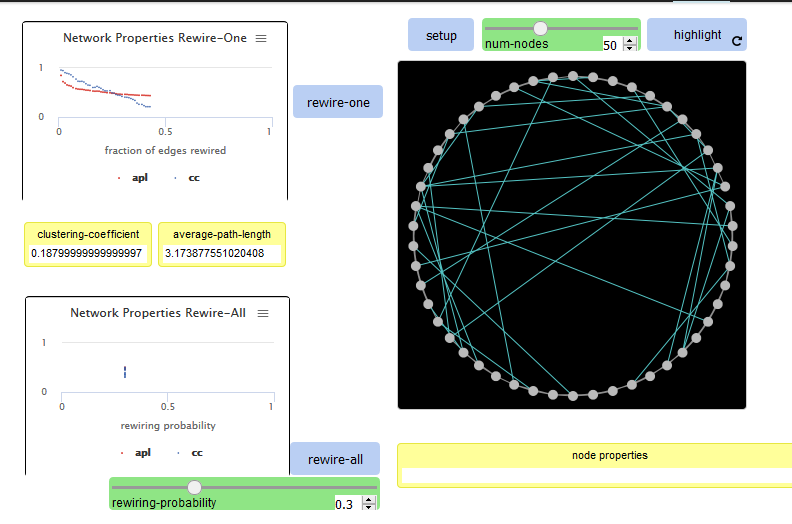
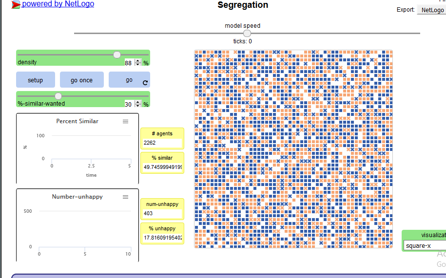
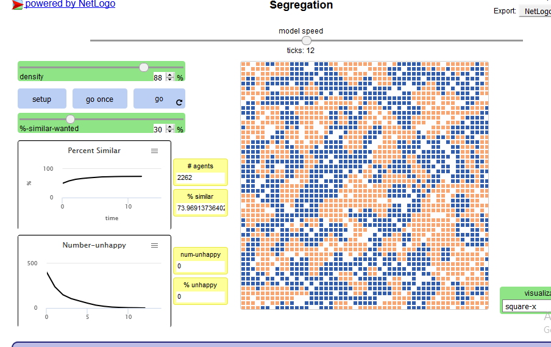
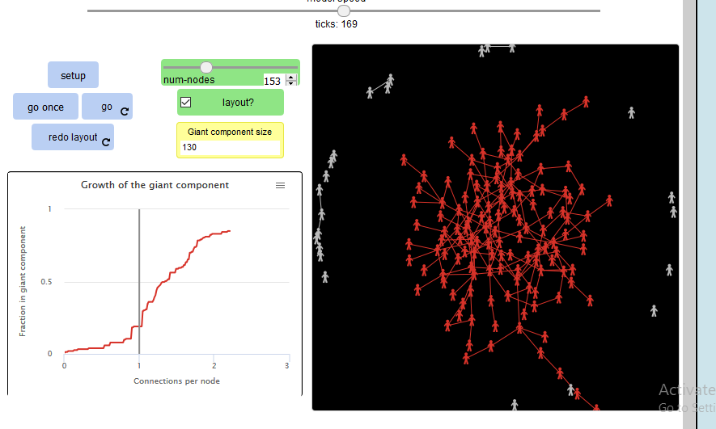
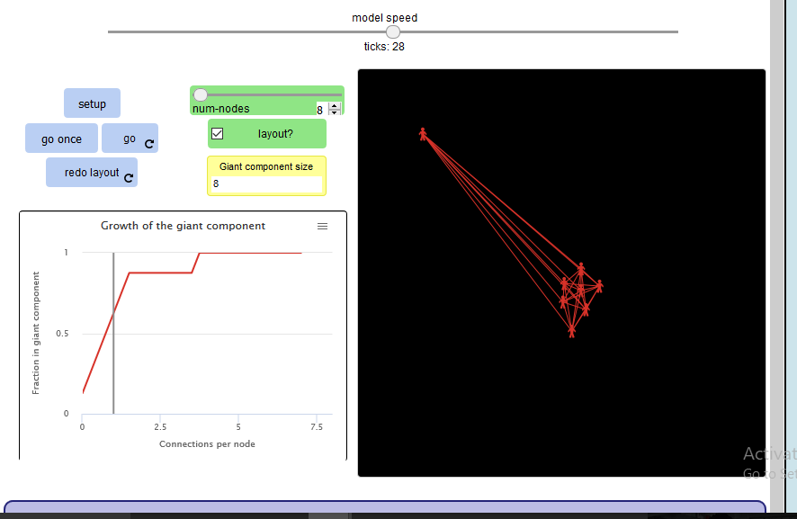
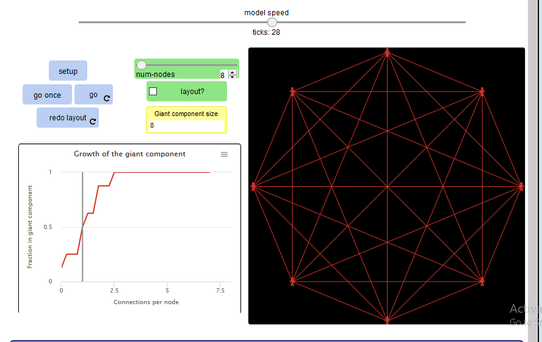

# Assignment 3: Detecting Communities
Yidnekachew wendemneh


## Introduction
We did random networks on this assignment. we saw the differetn types of random networks like small world, giant component, and segregation.

## Part 1: Small Worlds
### Methods
To do the small worlds part i used degree and also rewire-one and rewire-all. for the degree i used the code for diameter as.
```
to diameter
  set d max [distance-from-other-turtles] of turtles
  set diamet max d
end
``` 
To explain how the rewire-one works. first the code decides which edge to choose randomly. then it chooses a node to re-connect it to. then it disconencts the edge it chose from it's current node and attaches it to the chosen node.
### Results
when the model is started with 50 nodes.
average path length= 6.63
clustering coefficient= 0.5
diameter= 13



you can see from the picture the clustering coefficient has changed to 0.18 and the average pathlength is 3.17.

### Discussion
the clustering coefficient changes because it depends on the neighbour of the node to be neighbours too. when rewired that changes the value.
rewire-all is distributed because the x-axis is rewiering probability.

## Part 2: Segregation
### Methods
we have two options the density and the percent similar wanted. the density sets how many dots there is. the similar makes the tolerance of the squares arround individual squares. 
### Results



After seting up i have:-
Number of agents= 2262
%similar= 49.74
number unhappy= 403
%unhappy= 17.81


### Discussion



the system comes to a stop and the number of unhappy squares is zero so is % unhappy. and the number of agents stays the same.
when the similar wanted slider is set higher the blue squares and the orange squares become two separate groups. and they will not be broken and messy. This is what i expected.

## Part 3: Giant Component
### Methods
the giant component model demonstrates how a giant component is formed in a dynamic network when new connections are formed. there are two variables that can be set the number of nodes and the layout. the number of nodes sets how many people there are. the layout sets the apperance.
### Results
with the number of people set to 153 it takes time to assemble all the people into one group.


### Discussion
there is a difference when the number of people is reduced.


there is a difference when the layout is changed.


## Conclusion
this assignment was very knowledgabel and i have learnt a lot. the new tool we used( NetLogo) is a good tool for observing this things we learnt in class.
