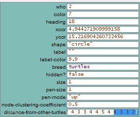
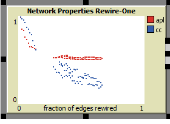
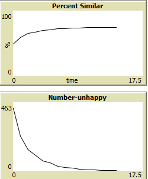

# Assignment 3: Detecting Communities
Nathan Tibebe

## Introduction
Before I work for this assignment I did not have a clear concept of small worlds and segregation. After what I read on the book about segregation, step by step practice gave me to practically see how this is done. Now I know properly what it means by small world, segregation and giant components.

## Part 1: Small Worlds

### Methods

To open small worlds in net logo I follow the steps according to assignment 3 guideline.
There is no tool which says diameter monitor but there are global monitor, turtle monitor and link monitor.
From this turtle monitor, I find the distance between turtles. To find this distance from one node to another turtle insert the number of node you want to see
and then this shows array for distance between turtle. Then I consider that is same as diameter because it measures the half circle between each turtles.
I include the image in results.
To see rewire one and rewire all, I click setup and click the two options one by one to get feel for what its doing.

### Results

According to rewire one, new edge is formed all the time one by one. In rewire all, all edges are formed in one step. 
I know that the edges change their location when you click rewire all because some edges are not in their previous location after I try it.
After clicking rewire one seven times.

This is what happens after I click rewire all.

First the graph was vertical then it is horizontal after many times rewiring. This show that fraction of rewired nodes increased to 1.

### Discussion

1. Why does the clustering coefficient change as nodes are rewired?
Clustering coefficient change because the more nodes are rewired the edges that are connected to them are decreasing or increasing. If new edges are being formed still the values of adjacent edges change all the time.
2. Why does the `rewire-all` version show a distribution of metrics when you run the model with the same settings?
no matter what the setting. Rewire all change the direction of every edge. so the metric distribution also changes.
3. Why are the plots shaped the way they are?
Here we have 3 plot. The first is for rewire all. secondly for rewire one. and for our diagram.
Our plots for rewire all will change according to rewiring probality.

## Part 2: Segregation

### Methods

I reviewed by clicking go once and go many times to see the change in graph. 

### Results
The first time I click go once it gave me horizontal plot. When percent similar increased number unhappy decreased because the unhappy is what become similar.

Something interesting is at the end of the segregation mostly there is few or no unhappy and this show long tail graph.

### Discussion
in the end all unhappy becomes close to similar nature and when the possiblity for similar environment take place they are all happy.

## Part 3: Giant Component

### Methods

First I observe the default setup and by clicking go once and go I review what is interesting. 

### Results

The rewiring is very slow in giant component. It is different from small world because only new edges form all the time and they dont disconnect always.
I increase the speed to maximum.

### Discussion

To change the code I enter in 'to layout' function and change 

repeat 10 [
    do-layout
    display  ;; so we get smooth animation
  ]
  
  into 
  
  repeat 0 [
    do-layout
    display 
  ]

and there will be no smooth animation. 
so I can see why it count 10 times before drawing or display a layout. this makes smooth animation to 

## Conclusion

I have seen and noticed many things from doing this part. From giant component I learned that the process of giant component require every node to change location. Also at the end of giant component we get that every node is interloced.
