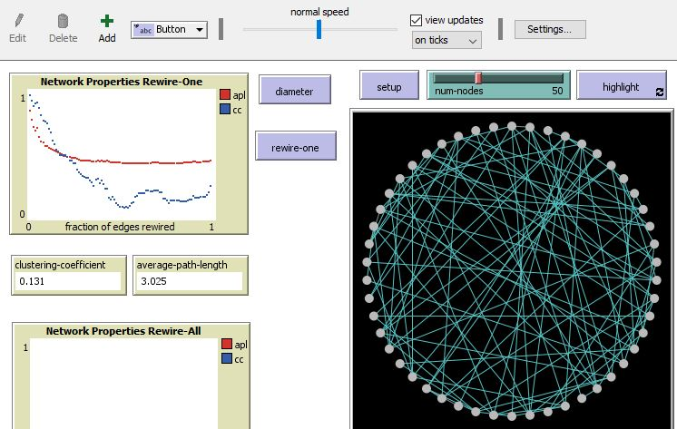
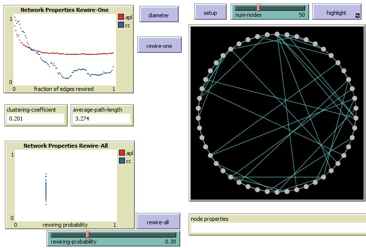
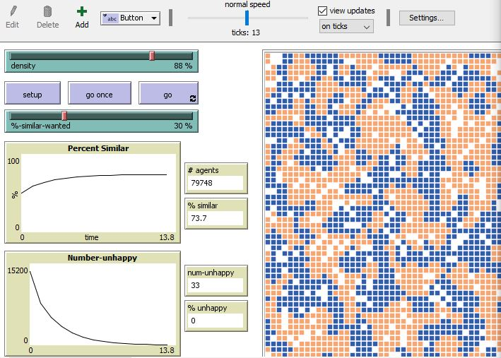
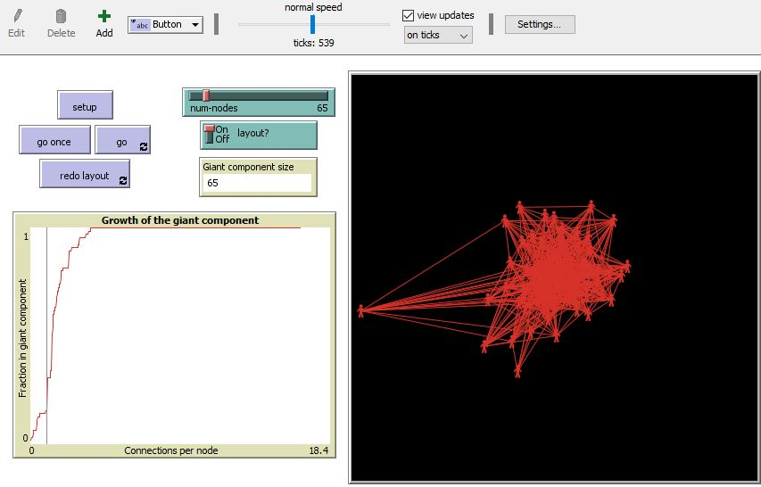

# Assignment 3: Detecting Communities
<Misle> <Amha>


## Introduction

The main point of this assignment is to show us the distribution of random networks. Through out this assignment i have learned how random networks work in small world phenomenon, segregation and Giant component.

## Part 1: Small Worlds
### Methods
Rewire-one in the small world phenomenon creates a new connection among two nodes, this is done by selecting a single random connection or an edge from the small world network and then shift one end of the edge to a different node in that particular network and let the other node to remain in its place. So after a rewiring process using rewire-one we will get a new link between nodes from the old link.
Generally from the above explanations, rewiring in a network means producing new links on a network from previous wirings.  

I have used the following code to calculating the diameter:

``` Extensions [nw]
    to diameter
  	show max [max[NW:distance-to myself] of other turtles ] of turtles 
    end```
  
### Results
At the beginning of a Watts-Strogatz model with 50 number of nodes i have got the following results:
1. Clustering-coefficient = 0.5

2. Average-path-length = 6.633

3. Diameter = 13
 
Rewire-one





As demonstrated in the above image both the apl and cc shows the same kind of distribution as the fraction of edges increase and starting from the middle the apl remains constant and cc varies as the fraction of edges rewired increase. 

Rewire-all





As shown in the figure we find the apl and cc having a differing vertical shape with a constant rewiring probability. 
### Discussion
In Netlogo clustering coefficient value will change as node is rewired. The reason for the change in the clustering coefficient is as nodes are rewired the triangles or triadic clousure in the small world will alter so this will made the cc to vary. The shapes of the plots are in that way because they show the apl and cc when edges rewire. Rewire-all visits all edges in the network and rewire them. Different rewire probabilities will made metrics clustering coefficient and average path lenght to vary.

## Part 2: Segregation
### Methods
The purpose here is to the blue and orange agents to get near to a similar agent of there color. The density slider determines total number of agents. %-similar-wanted slider determines the percent of similar color agent each agent wants to have as its neighbor. % similar monitor defines average percent of each agent with a similar color neighbor. 
### Results
By applying 150*150 grid, 88% density and %-similar-wanted equal to 30% at the first setup i have got the following results.

num-unhappy = 13805 and % unhappy = 17.3

% similar = 50

where # agents are equal to 79748

After a "go once" the values of unhappy decreased to:

num-unhappy = 7787 and % unhappy = 9.8

% similar = 58.7

After a "go" for some time the unhappy values decreased to the following values:

num-unhappy = 33 and % unhappy = 0

% similar = 73.7




### Discussion
An interesting thing about the model is that it run towards getting the agents to have the number of same color agent they want to have as their neighbor. And finally, it will get to the have a num-unhappy agents that equals to zero. 

## Part 3: Giant Component
### Methods
In this Giant component model it shows an individually standing nodes with no edge between them. From this nodes we will get a giant component that is when random pairs of two nodes create an edge connecting them and form a component. After a few steps ahead an edge will appear between nodes from different components so then those components will join into a single component. This connections will grow in to being a Giant component where every node in the network can be reachable from every other one.
### Results
With 65 number of nodes we have got a Giant component size of 65 and the following Growth of the giant component:



### Discussion
The above graph shows a growth in the fraction in giant component with an increase in the connections per node. Generally the plot shows us how the giant component size varies through time. 

## Conclusion
During this assignment i have learned about small worlds and segregation. And how Giant components rise from random networks.