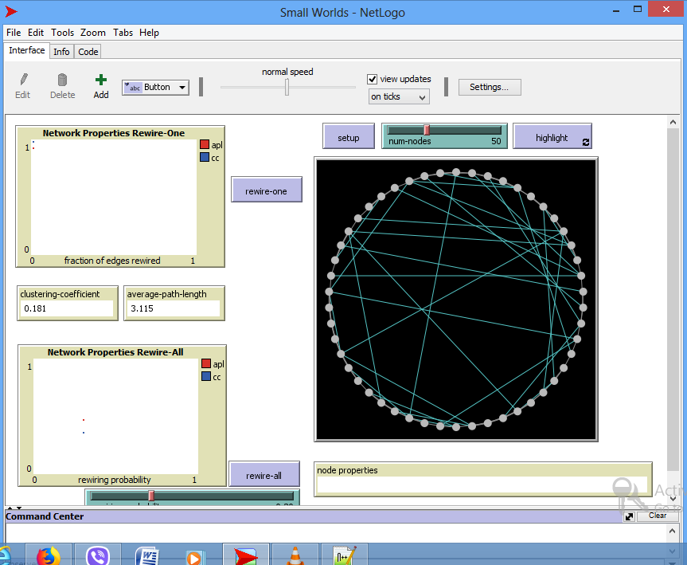
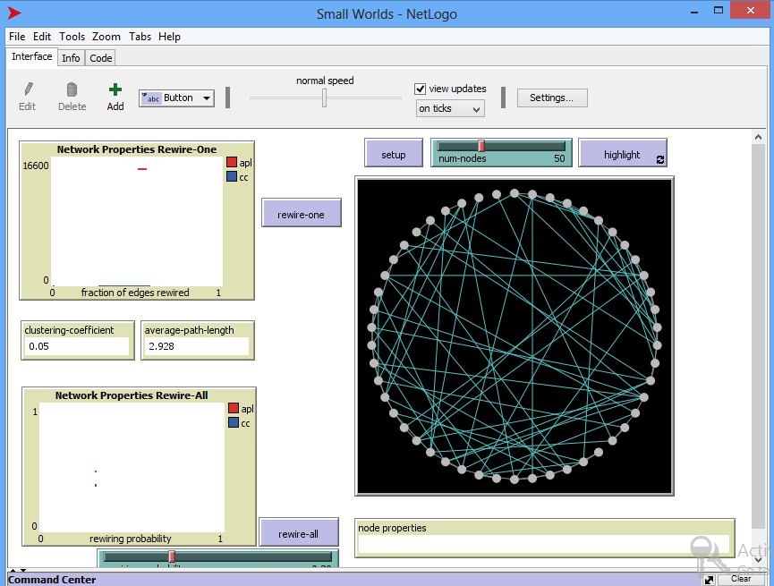

# Assignment 3: Detecting Communities
Biruk Gebrekidan

## Introduction
This submission contains three parts. The first shows watts-strogatz small world model. This is found in models library and we work with a network sample.

## Part 1: Small Worlds
### Methods
While experiment with it I see speed slider allows controlling the speed for models and turtles motion and their colors change speed. There are switches to adjust different setting. 
Rewire-one shows randomization for one edge at a time for every single click by changing the edge connections and reconnect to another.

### Results
To answer the question which says what are the clustering coefficient, average path length and diameter will vary according to our edges connection. This is because the rewiring probablity will change these factors.

Clustering-coefficient 0.181
Average-path-length 3.115

Additional rewires show that
Clustering coefficient 0.05
average-path-length 2.928

I clicked rewire-one until both average path length and clustering coefficient become horizontal.
These values will obviously change if I make another rewire so I did not include another data. But I believe the clustering coefficient is calculated again with the new number of edges.

### Discussion
There is constant horizontal increase in the plot this means there is constant output they keep adding edges with the same value of vertical because the rate at which tend to cluster is uniform by using rewire one. 

## Part 2: Segregation
Normally it is 30% similar wanted but I changed the density to 88%. 
This shows that agents want to live close to their own similarities. Intolerant agents are those who are in the minority.

### Methods
While clicking go the plot starts from whererever its current location is to 88% where it is configured. The time curve shows there is also a calculated time projection. 
The unhappy increase from around 400 to 0 in 13.8 seconds when I click go. 
When I click on go once it takes the same route (same steps) and after many steps it reaches where there is no longer need to create segregation because no unhappy agents. This produces same results as go on its last step.

### Results
Here are the results

Initial
#agents = 2291
%similar = 50.8
#unhappy = 404
%unhappy = 17.6

After go once
#agents = 2291
%similar = 59.6
num-unhappy = 220
%unhappy = 9.6

Last step
%similar = 74.9
num-unhappy = 0
%unhappy = 0

### Discussion
The outcome shows the maximum similarity is 74.9 that is the best arrangement that is made here because this is the most configuration with less number of unhappy agents.
Agents keep displacing until this happens this shows the agents tendency towards their own homogeneous pattern.

## Part 3: Giant Component
### Methods
The first step in this giant component is assigning number of nodes. After I assign that that appears in the diagram with different images of people that are not yet connected. 

Since the goal is to create a giant component from these nodes we need to create connections between every node. finally we get giant component that has a path to every other person in the plot.

### Results
Intiailly
Giant component size = 1
number of nodes = 80
layout = on
connections per node = 0

After a few steps when giant component size is 23
Giant component 23 
fraction in giant component = 0.287
connections per node = 1.3

last step 
giant component size = 80
fraction in giant component = 1
connections per node = 88

this is reached totally on 3160 ticks and all nodes are fully connected.
From the graph I noted that the fraction in giant connection will change if a new connection is formed with a new node and it remain constant if there is no node that has no connection.

### Discussion
After the last step here every node is reachable from any other node. Giant component enables to describe how everyone can be interconnected through random networks.
