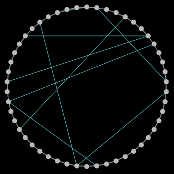
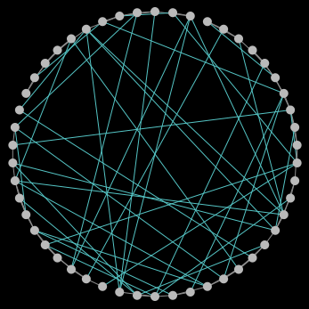
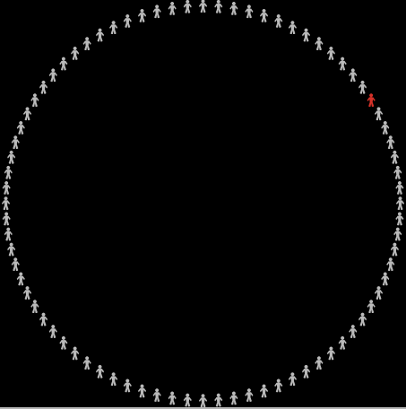
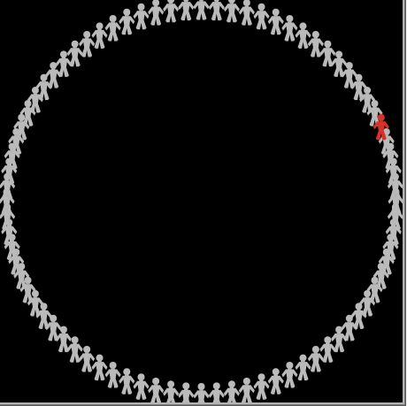
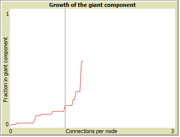

# Assignment 3: Detecting Communities
Mintesnot Melesse


## Introduction
The main objective of this assignment is to make us understand how random graph works and their distribution.

## Part 1: Small Worlds
### Methods
I wasn't able to do the code for the diameter. What the rewire-one does is creating a new edge between two random nodes. And generally rewiring means connecting random nodes by creating new edges.
### Results
After I setup the graph with 50 nodes the clustering coefficient becomes 0.5, average-path length is 6.633.

 after rewire-one many times the image is:

 

after rewire-all the image is:



### Discussion
The cause of changes in clustering coefficient is because of the forming of random ties between different nodes/neighbors.The reiwre-all shows a distribution of metrics because it connects many nodes at once.

## Part 2: Segregation
### Methods
To make the grid 150x150 I changes the values of max-pxcor and max-pycor.
### Results
When I set the density to 88% and the grid to 150x150 the number of agents become 19984, the percentage of similarity becomes 49.8%, the amount of unhappy 3490 and the percentage of unhappy is 17.5%.
### Discussion
The interesting things about the above segregation is how to precentage of unhappy increases and decreases by the change of communities.

## Part 3: Giant Component
### Methods
I used 'go-once' to form a single edge between two people/nodes and I used 'go' to form many edges between  many communities are created by the process.
### Results
I changed the following lines in the code.

```
to make-turtles
  create-turtles num-nodes [ set size 6 ]
  layout-circle turtles max-pxcor - 1
end
```

The above code changes the side of the nodes as shown in the picture below.

#### Before



#### After



### Discussion
As more communities are formed the change in giant component changes exponentialy as I have shown in the graph below. And as we see from the graph it depends on 'Fraction in giant component' and 'Connections per node'.



## Conclusion
I understand how communities are formed and works in Small worlds and also now I have a better understanding of Segergation and Giant components.