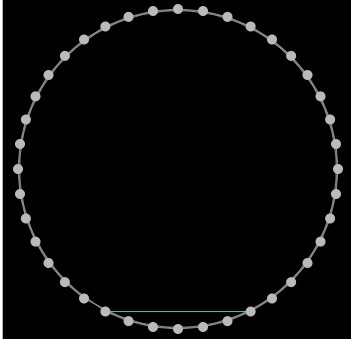
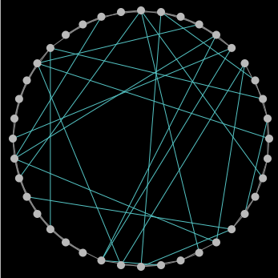
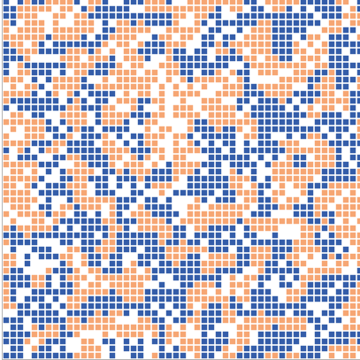

# Assignment 3: Detecting Communities
Habteab Yohannes

## Introduction
Netlogo is a tool that is used to study a network and community distribution model.
Small world phenomenon on netlogo is an example of how the world is connected.

## Part 1: Small Worlds
### Methods
By the beginning rewiring probability is 0.30 and num-nodes is 40 on slider. I do the tasks based on rewire-one and rewire-all properties. And after that I report the result.
Rewire one is a method that shows what happens if one edge is disconnected from one part and it is connected to another node. If there are no nodes remaining the rewire one adds another node and create connection with it.

When we make these changes the clustering coefficient change all the time.

### Results
After rewire one

clustering-coefficient = 0.474

average-path-length = 5.092

After rewire-all I have the following

clustering-coefficient = 0.262

average-path-length = 2.84

### Discussion
For rewire all there is very slow change in the graph unlike rewire one. When I click rewire one property the graph increases fastly and the apl and cc is horizontal.

In rewire all only edges keep being formed and the graph keep vertically growing because the rewiring probablity is constatnt.
When I change the rewiring probablity the graph will also change horizontally a little bit.
All triplets keep the graph constant by having relatively equal number to triangles.

## Part 2: Segregation
### Methods
Segregation is easy to describe. It is a best way of calculating density of components and to knowing how the agents there are tolerant for each other. More tolerant people will be those who live closely to similar color paterns in the graph.
When I opened it first the density is 95 percent but I change it to 80% and percentage is 30$. 
We initialize from 0 and first there is no agent in our graph. After I click setup 2470 agents are created.

### Results
by the beginning

% similar = 49.4 

number of unhappy = 426

% unhappy = 17.2

After adding one more configuration by clicking go

% similar = 57.7

number of unhappy = 224 and
% unhappy = 17.2

The last time  I click go
%similar = 71.4 

no unhappy  and
%unhappy = 0

### Discussion
So in 3 steps I finished every unhappy agents and removed them from the location where they were unhappy.
This shows that every unhappy agent goes closer to where they can be happy by finding homogeneous paterns. 

## Part 3: Giant Component
Giant component is an experiment of creating connection between 80 nodes such that there is a direction to every node from one random node.

### Methods
When I clicked setup I see that giant component size is 1. On second step it become two but on the third step it did not become three.
This show a nature of giant component. Giant component size means the largest number of vertices in the most connected part.

### Results
Giant component size = 8
3 connections per node

In this step I increased the normal speed to the highes speed in the slider because it takes time 
to finish.

Final results
88 connections per node.
component size = 80
 
### Discussion
From this exercise I gain much experience and i understand that giant component takes a lot of connections and time to be fully formed and how giant componen works.

Based on the code it is possible to slow the speed by editing to layout function
repeat 10 [
    do-layout
    display  ;; so we get smooth animation
  ]
 to repeat 100
 after this code it keeps repeating the layout and takes more time.
Generally i find this lab interesting and i learned most about giant components and segregation.