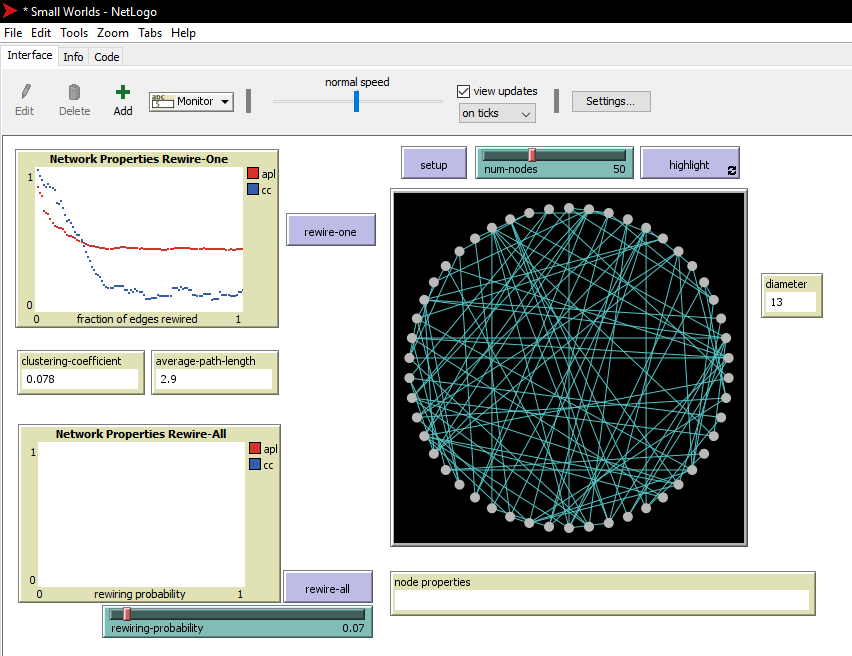

## Introduction

In this assignment I have seen the different factors that could contribute to the different type of visualization of a graph. This factors produce results such as different clustering coefficient and average path length. Other discoveries made on this assignment was the application "netlogo", this application introduces different models and makes us look at network graphs in ways we haven't before in "gephi".

## Part 1: Small Worlds

### Methods

Rewire one means that one end of a randomly selected edge will be disconnected and connected to another node in that network.
This affects the clustering coefficient and the average path length. So from the network's perspective this means affecting the shortest paths between nodes, decreasing or increasing the clustering coefficient and generally changing the structure.

### Results

The clustering coefficient is 0.5 and the average path length is 5.385

The above image shows multiple ways of the rewire-one function trials. It shows that the clustering coefficient has decreased as neighbor nodes have been disconnected and attached to other nodes.

When rewiring all, an edge could have the possibility of getting attached to the same position. So there could be a possibility where nothing changes and there could also be multiple probabilities where everything is different.

The overall shapes of the plots at the beginning shows a graph with a cluster of 0.5, this is because each node has half of its neighbors connected to each other. But as we rewire, we get different values because nodes could be forming other types of links which don't relate to the neighbors it has.

### Discussion

This is because as we rewire the nodes , we are disconnecting the existing links and creating new ones with nodes our neighbors might not have connection with. Therefore decreasing the clustering coefficient of the graph.

The shape of the plot comes from the probability we set in the probability controller. With this we can control the rewiring probability when the rewire-one and rewire-all functions are called.

## Part 2 : Segregation

### Methods

There are two functions to see how this plays out, Go once and go, These two functions give the change the user to view the networks at whatever level he or she wants. Go shows how the whole thing plays out at once, we can affect the it plays out by  changing the parameters like similar-wanted and density. Go once shows how the whole thing would play out but with one step at a time. Therefore it would require the user to tap the button again and again to see the full picture.

### Results

Agents are not tolerant when it comes to a density of 88%. But how fast the converge also depends on the parameter 'similar-wanted'. Eventually there is not question that it will come to a conclusion of the agent joining the denser group. But if the above mentioned parameter is high then it will increase the time in which it will join.

The graph has a density of 88% and a little over 10,000 nodes. Close to the book's implementation.

### Discussion

So in conclusion we have seen how agents can be manipulated by the different factors that are present of the netlogo simulation of the segregation model. These parameter can be used to better detail our study.

## Part 3: Giant Component

### Methods

To get a feel how things are running here, I looked around and found two buttons, Go and Go once. These methods two functions are similar as the once we looked at in part 2. So "Go" plays the graph and shows every move until we stop it, while go once only makes one move. By clicking on 'Code' tab in the netlogo we can look at the code that doesn't all the messy work behind the scenes.
The portion of the code I have altered is the color of the nodes. By default the color is red, I changed that to yellow and when the giant component is done building , the color will be green. I did this by creating another function and calling that function before the program stops. The program stops after no more edges could be formed, therefore right before the program stops, I call my custom function which changes the color to green.

### Results

So after Go once has been touched only one connection will be created at a time between two random nodes and as we click this button more and more connections will be created which will eventually amount to one big giant component. We can also tweak the amount of nodes that can be present in the graph. The image below depicts the "go once" function button clicked a few times.

The next image below depicts the "go" function button clicked and after waiting for a few minutes the component has formed and no more links could be created.

The next images below shows when the color of the individual links turn yellow at forming and turn green when the component has fully been developed.

The next images below shows when the code that changes the color of the individual links turn yellow at forming and turn green when the component has fully been developed.

The first image shows the custom function "color-giant-component-after-finish" being declared and the image below that shows the function being called right before the program finishes executing.

### Discussion

In conclusion we have seen how we can alter the code to give us our own custom implementation and we have seen the functions that make this model run and produce the giant component in the way that it does. Having some options like controlling the amount of nodes on the graph and changing the tick speed adds a usability point to netlogo.
