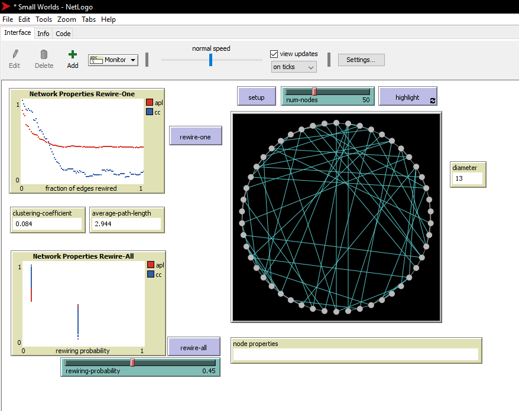

# Assignment 3: Detecting Communities
Yared Abebayehu


## Introduction
The main point of this lab is to help understanding the random graph, how random graphs are described by probability distribution and the random process which genreates the random graphs.  

## Part 1: Small Worlds
### Methods
Firstly I needed to open NetLogo's built-in libraries and on of them is Small Worlds. rewire-one simply forms an edge between two randomly selected  vertices and make connections between those random nodes. So according to the above explanation, rewiring means forming an edge between two random nodes.
Code snippet for the diameter implemenation
```
diameter = max(distance-from-other-turtles);

```

### Results
Clustering coefficient : 0.5

Average path length : 6.633

Diameter : The above command returns "Error"

Image for ```rewire-one```


Image for ```rewire-all```

### Discussion
The clustering coefficient changes as nodes are rewired because it is characterised by a relative density of ties and what ```rewire-one``` and ```rewire-all``` does are forming more ties.The ```rewire-all``` show a distribution metrics because it connects multiple nodes.

## Part 2: Segregation
### Methods
Firstly I changed the grid by altering the values of both ```pxcor``` and ```pycor``` to 75 then the grid becomes ```150x150```.
I observed that the percentage of unhappiness increases as an agent becomes a minority or it becomes less tolerant.
### Results
When I run my graph after setting the density and grid, I got the following results.
```# agents``` : 20035
```% similar``` : 50.2
```num-unhappy``` : 3478
```% unhappy``` : 17.4

I learned from the above results that the more percentage of the similarity the less precentage of unhappiness and vice versa.
### Discussion
I found interesting that when agents are minority they become unhappy and I think it is similar to our social life for some people, not all. And they tend to be more happy when they find themselves in the majority of their similar agents.

## Part 3: Giant Component
### Methods
At the default setup there are 80 nodes and there are two monitors called ```go-once``` and ```go```.
What ```go-once``` does is form many community by forming new edges between two random nodes, one at a time.
What ```go``` does is form many community by forming new edges between two random nodes, continuosly.
### Results
Giant component size increase as more nodes are connected. Initially the Giant component size is 1 and when I run ```go-once``` once it becomes 2 and when I run it 10 times Giant component size becomes 4.
### Discussion
The difference between ```go-once``` and ```go``` monitors is, on the ```go``` monitor the 'Forever' check-box is checked so thats why it runs continuosly.
I changed the following code.``` ```
Original code
```
to color-giant-component
  ask turtles [ set explored? false ]
  ask giant-start-node [ explore red ]
end
```
My version
```
to color-giant-component
  ask turtles [ set explored? false ]
  ask giant-start-node [ explore blue ]
end
```
When I run my code the color of the start-turtle becomes blue.
## Conclusion
After doing the above Methods, Results and Discussions, I have learned a lot about Small worlds, Segregation and Giant Components in more interactive and interesting ways and that helps a lot.