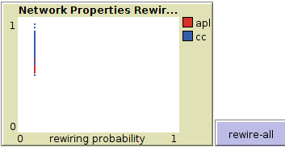

# Assignment 3: Detecting Communities
## sophonias Bekele ATR/9365/07


## Introduction

In this Assignment i have work with NetLogo and it is a programmable modeling environment for simulating natural and social phenomena and i have programmed with in challenge to calculate diameter in small world and i better visualize small world in more interactive world than other tools.


## Part 1: Small Worlds
### Methods

I have installed netlogo and from files tab opened model library and choose Network then small world option and start experimenting on this first i have set num-node to medium and rewire-one until it displays "all edges have already have been rewired once" through this i have seen each time i rewire-once it changes the plot.

In rewire-once procedure first it will checks if turtles setup correctly then record which button have been pushed rewire-once or rewire-all if rewire-one is true it will do rewire-one after that it will link two nodes that did not link and create edge between them until each and every edge is created it will be active after that it will be inactive

Rewiring means connecting edges that did not link before.

	to diameter
	  set ds max [max distance-from-other-turtles] of turtles
	end


### Results

clustering-coefficient at initial = 0.5
average-path-length = 6.633
diameter = 13

In rewiring-once it is rewiring not connected nodes
.
 


In rewiring-all it is rewiring all randomly at single button push.


In the above plot the red line describes average-path-length(apl) and blue line describe clustering coefficient(cc) so the plot show how rewiring change clustering coefficient and average path length.  
### Discussion
clustering coefficient changes because when nodes are more connected (rewired) it decreases clustering coefficient of the graph and neighbors of our neighbors are more linked.

rewiring all does is it rewire all randomly through given rewiring probability value when we see the plot the x-axis represents the rewiring probability.

In the rewiring-once plot the x-axis is fraction of edges rewired this is because when we from 0 to 1 every possible edges will form in case of Rewire-all runs all one time randomly with the given probability.

## Part 2: Segregation
### Methods
I have installed NetLogo and from files tab opened model library and choose Social Science then segregation option and start experimenting on this first set density value to 88% and setup it and watch it go and if i wanted to every change happen in time i do go once button and i can see it's change.

### Results
Inital point

After segregation

### Discussion

when we see the above screen shots the first one is initial point and when we finish it shows us the second screen shot in the process the agents change through time and find their own agent at least time and decrease number of unhappy agents.  


## Part 3: Giant Component
color from red to blue
### Methods
I have installed NetLogo and from files tab opened model library and choose Network then Giant component option and start experimenting on this first set number of nodes value to 80 and setup it and watch it go and if i wanted to every change happen in time i do go once button and i can see it's change.

### Results
the color of the node that is creating the giant component
```ask giant-start-node [ explore red ] to
ask giant-start-node [ explore green ]
```
### Discussion
In time every nodes convert to the crowd and start following them.

## Conclusion

In conclusion small-world,segregation and giant components in all of them time have a great value in shaping the communities changes.