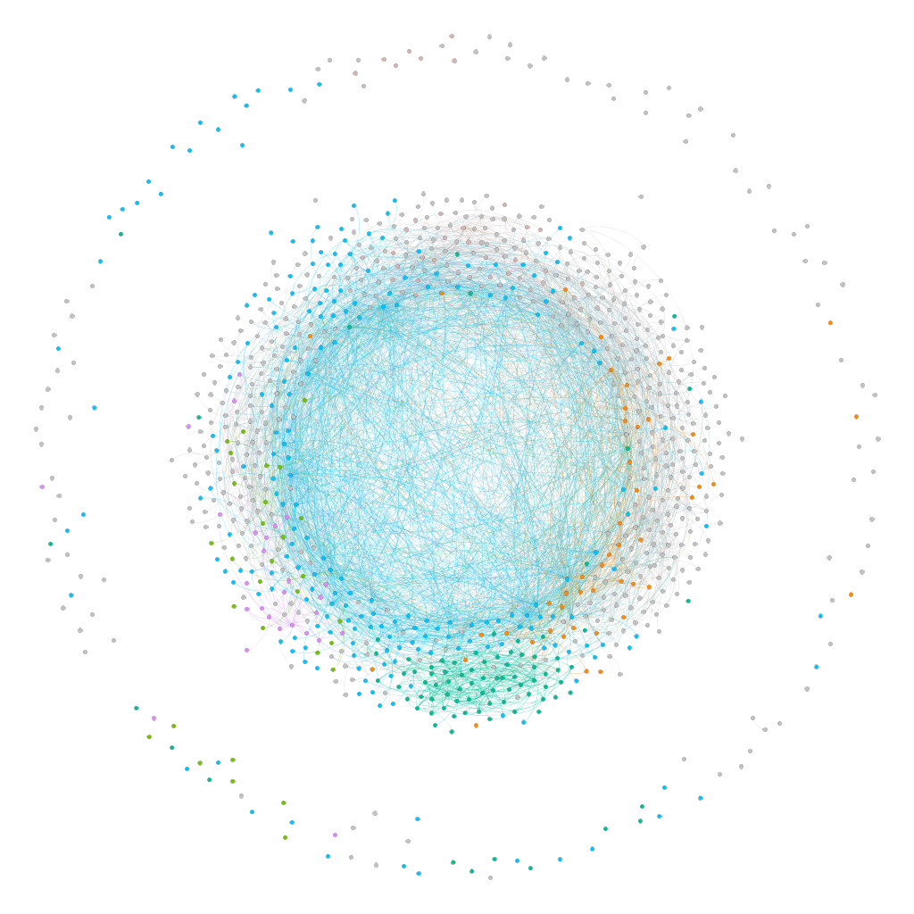
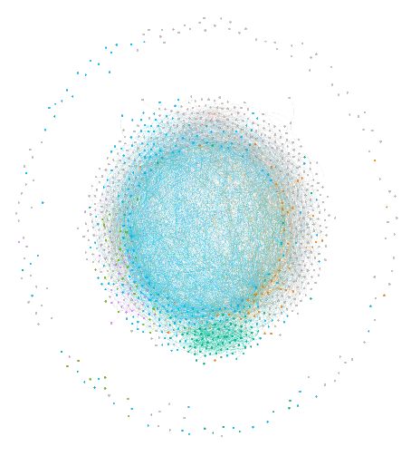
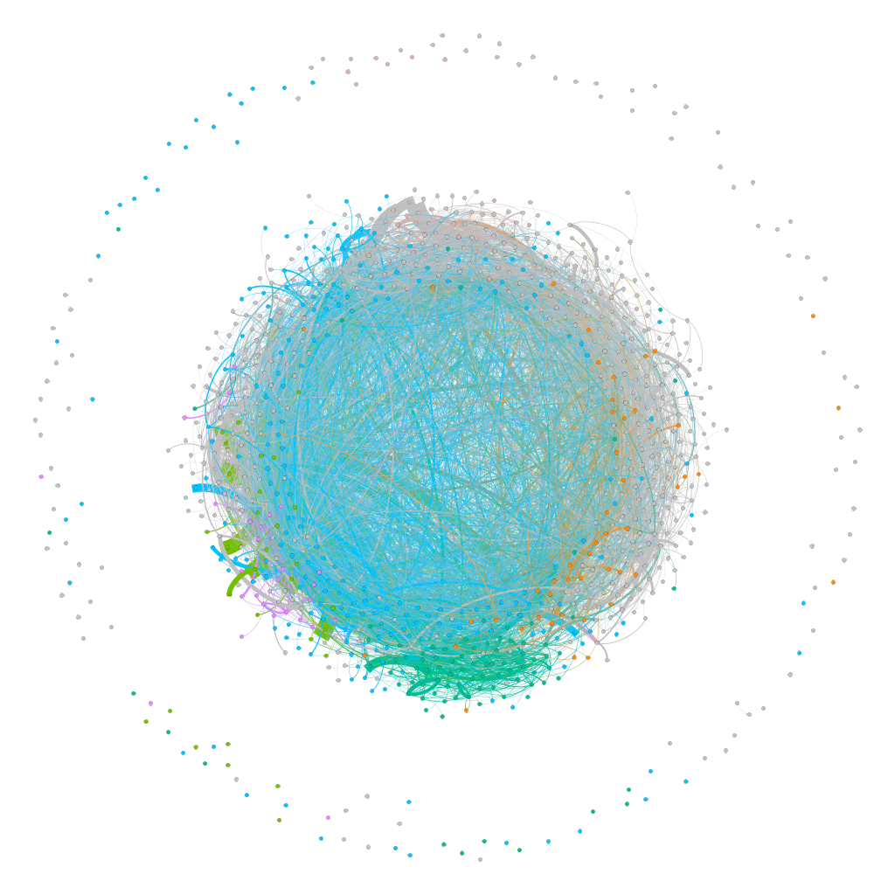

# Assignment 4: Networks over time
Nahom Asnake

## Introduction
This network given for the assignment is a dynamic network. The network has a time column which can be uploaded on gephi to show you the graph through a time span. We used the EU email correspondence graph we used last time. This time though it is dynamic and changes over time.

## Methods
I used Excel and Gephi to view and analyses the data. But first I needed to change the .txt file into .csv by adding Source Target and Time headers. I then imported the file on gephi and merged the time column into time intervals to use as timelines. I calculated clustering coefficient and the average path length. I also partitioned the graph into 20 weeks, 30 weeks and 40 weeks.

## Results
The average path length of the whole network is 2.653 and it has 986 nodes plus 3101 edges. It has 15 components. The clustering coefficient for the different components are.
component 1 =0.2959266667
component 2 =0.3464085164
component 3 =0.4152174167
component 4 =0.5968465511
component 5 =0.4459266667
component 6 =0.6464085164
component 7 =0.5522465511
component 8 =0.3278565421
component 9 =0.7413245654
component 10 =0.2156462165
component 11 =0.6543151354
component 12 =0.1564899465
component 13 =0.3546848466
component 14 =0.4465487992

For 20 weeks the number of components is 456 and the apl is 4.1

For 30 weeks the number of components is 366 and the apl is 3.5

For 40 weeks the number of components is 325 and the apl is 3.2

## Discussion
A bridge person is someone who connects different groups making them one. As you can see from the numbers the number of components has decreased from 456 to 325. The average path length is a number that shows you the shortest path. apl decreases to 3.2 which means it is quicker to transfer data. so a bridge person is more efficient to make email email communications.
## Conclusion
Networks through time are also called temporal networks. They change thorough time and have different properties overtime. This assignment was very insightful and I was able to apply what I learnt.