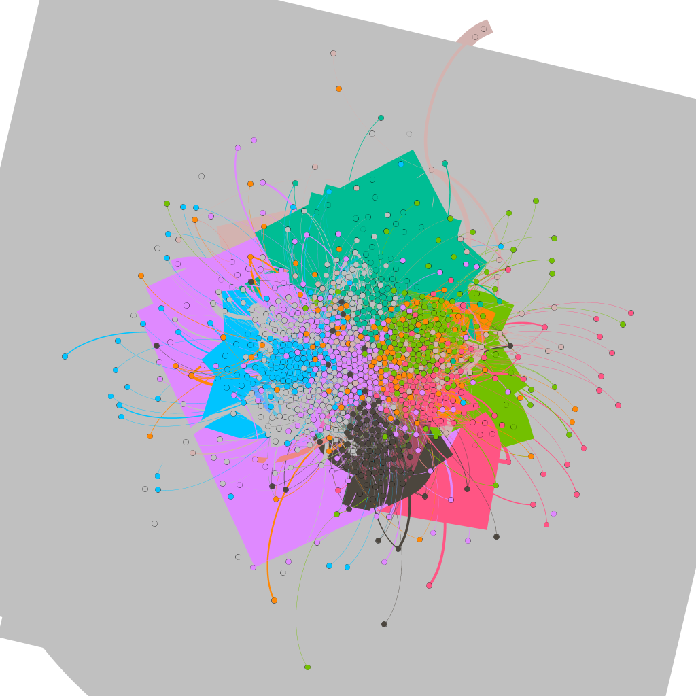
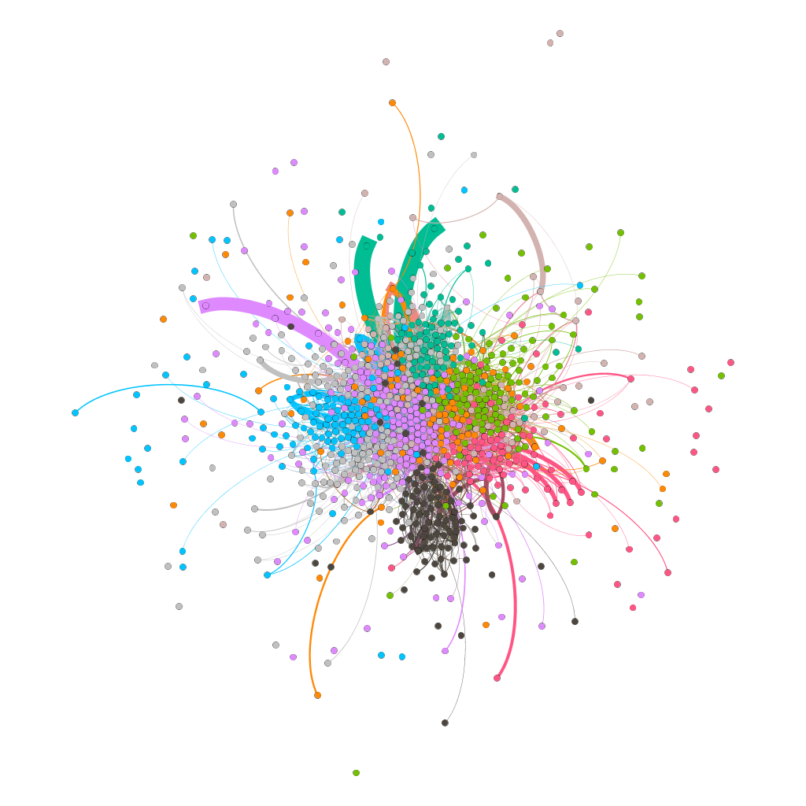
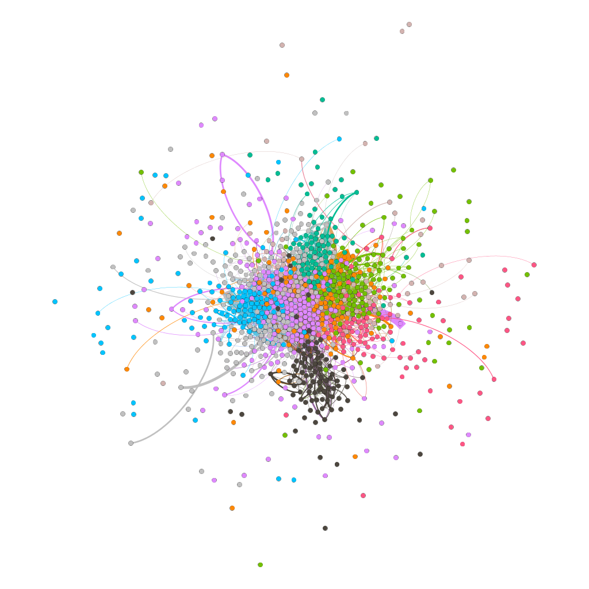
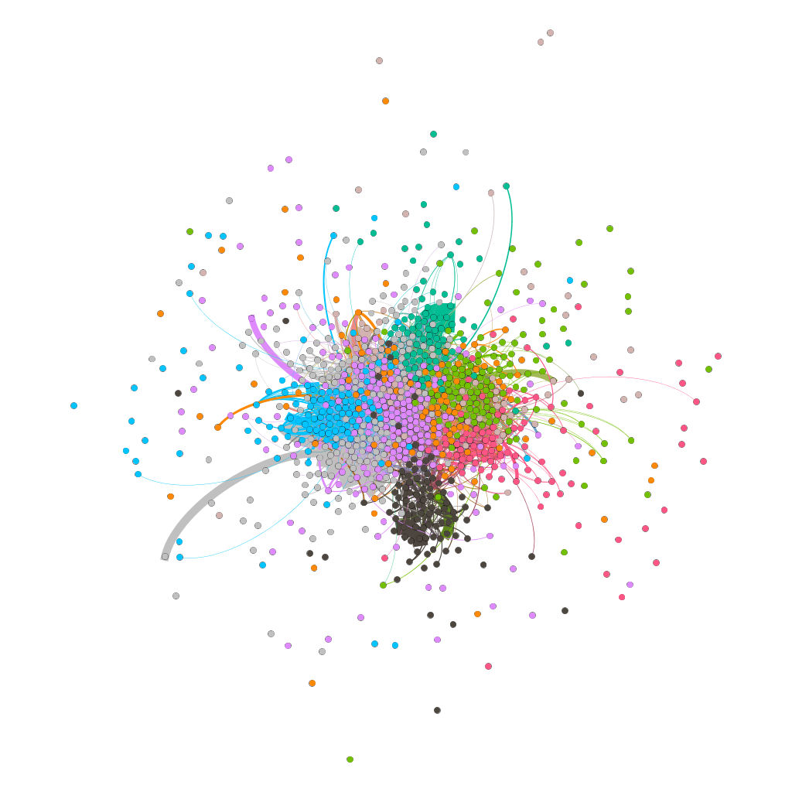

# Assignment 4: Networks over time
<Henok> <Solomon>

## Introduction
From the previous  done Assignment this lab different because it manly focused on  bridge people at email communication and it's deals  with network over time which is manly describe how our network becoming bigger and bigger within the increasing of time. 
## Methods
On this part first I import the file on gephi by dividing the target  time and sources in order to get network over time since we have done 3 Assignments before which doesn't have the three source, target  and time and also I use time interval 20 week,30 week and 40 week it will describe them in detail on the resulting portion.
## Results
	Total Number of nodes= 986
	Total Number of Edges= 332334
	Average path length=2.653
	Modularity=0.662
	Network Diameter =7
	Graphi density =0.026
	Average node degree=25.283
	Average clustering coefficient=0.352
Connected Components Report:-
	
	The number of weakly connnected components = 1
	The number of strongly connected components =186

snapshots of temporal analysis 

snapshots of 20 week

snapshots of30 week

snapshots of 40 week
 

## Discussion
According to the question that the bridge" people more 
efficient or less efficient at email communication?
I observe that the bridge person are more efficient it connect groups 
of people but the efficiency is ether increase or decreases with in time we 
can see the above resulting image as the time (the week) increase and the reverse. 
## Conclusion
from the last tree assignment I get more information on this assignment about bridge people at email communication in organization, The nodes that are connected with in time, how edges are created and about networks over time Thank you!!!.
