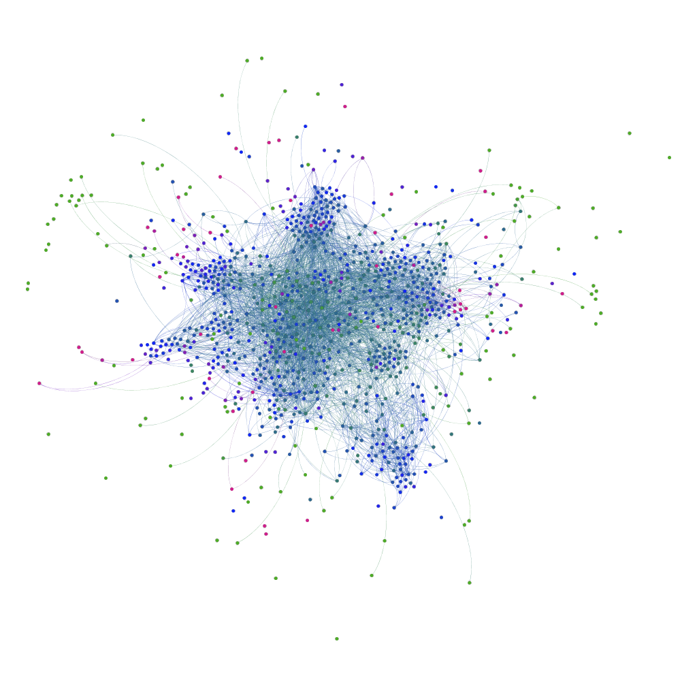
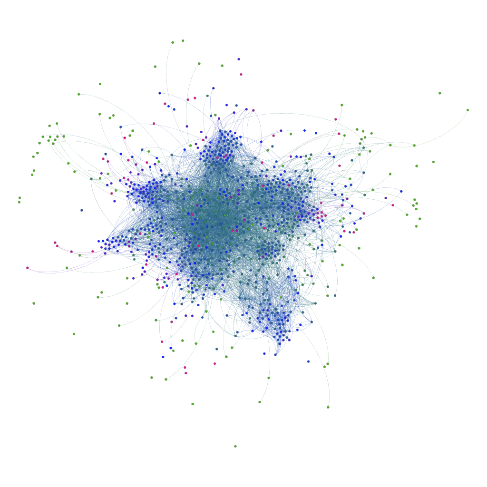
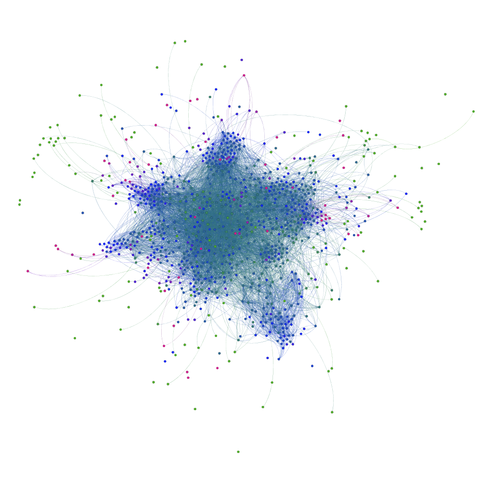

# Assignment 4: Networks over time
Alexander Teklemariam

## Introduction
This assignment is about dynamic network over time. Temporal network analysis is what we use for seeing what is in these types of graphs. This dynamic network is a version of the eu E-mail graph from the previous assignment but this has time column in it. 

## Methods
The txt file we were given need to have headers Source Target and Time. I used gephi but gephi needs to have a csv file so i changed the txt into csv. I used gephi to calculate the necessary values of diameter, clustering coefficient, modularity, components, average path length, and diameter.

## Results
Modularity: 0.662
Modularity with resolution: 0.662
Number of Communities: 14
Number of Weakly Connected Components: 1
Number of Strongly Connected Components: 184
Diameter: 7

Clustering coefficient of the different communities is as follows. The clustering coefficient for community0=0.354, community1=0.464, community2=0.731, community3=0.548, community4=0.419, community5=0.163, community6=0.824, community7=0.224, community8=0.811, community9=0.364, community10=0.441, community11=0.524, community12=0.154, community13=0.774

The different week partitions 20 30 and 40. After 20 weeks the number of components is 255 and the average path length 2.699. After 30 weeks the number of components is 236 and the average path length 2.671. After 40 weeks the number of components is 214 and the average path length 2.650.

## Discussion
Bridge people are those who connect two components in the organization.  And since the number of components is dropping as time goes by the number of bridges also decreases. Also the more components are connected the less there is a need for bridge people. when there are more connections information can pass freely. But since the information still passes through the people between two components. Yes, they are more efficient in E-mail communication.
## Conclusion
Thank you for teaching this semester i have learnt a lot of good stuff. Starting from Facebook and YouTube and other networks that can be analyzed i have seen that there is valuable data in them. This assignment was another example of real life models.
