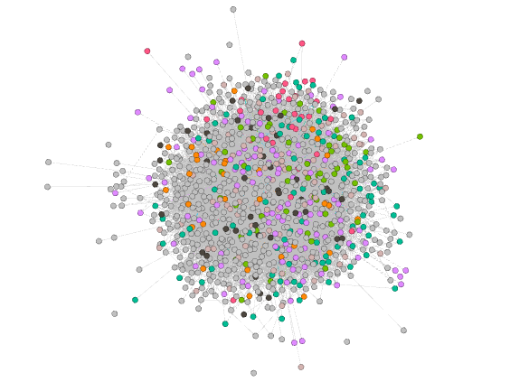
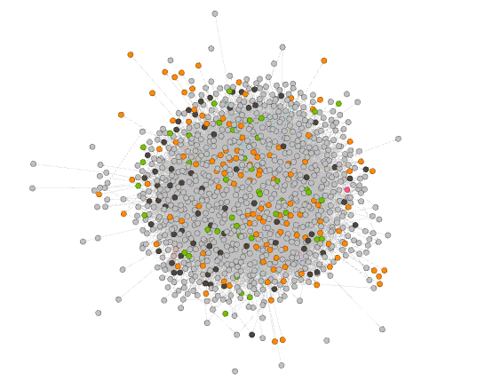
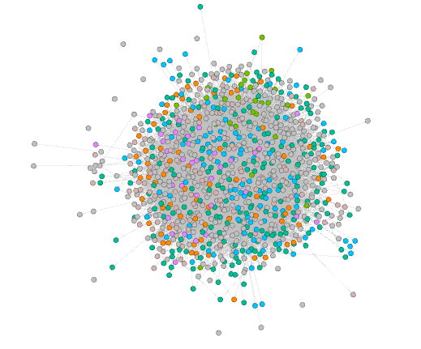
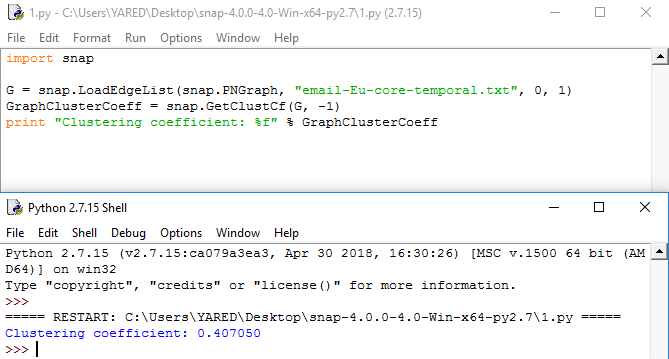

# Assignment 4: Networks over time
Yared Abebayehu

## Introduction
This lab helped me to understand how a networks over time works and how it evolves through time. and even though I did most of the work using gephi I got the chance to do graph analysis with other tools like the SNAP python library ```snap.py (snappy)```. I switched between those tools to get the best out of community detection mechanisms for Networks over time. 

## Methods
I divided the time bounds in three parts.
The first one is from 0 to 45000000
The second one is from 46000000 to 68000000
The third one is from 68000000 to 68890156
To get the mean value, Firstly I sorted the time from smallest to largest on Excel and substacted the two consecutive numbers for each of them, then I added all the results and divided with the number of rows. 

## Results
As I mentioned above I divided the time bounds in three parts because to notice the differences in change of the statistics shown below.

### From 0 to 45000000
	
Edges between 45,000,000 and 0 = 23157(92.89% visibility).

The number of weakly connnected components is 1

The number of strongly connected components is 186 

The average degree is 23.486 

Average weighted degree = 221.571

Network diameter = 7

Average path length = 2.6804


### From 46000000 to 68000000

Edges between 46,000,000 and 68,000,000 = 0

The number of connnected components are 986

The average degree is 0 as the all the nodes are not connected to any other nodes.

Average weighted degree = 0

Network diameter = 0

Average path length = NaN

Between the seconds (68890003) and (45405138) there are no email transactions so there are no edges formed.


### From 68000000 to 68890156

Edges between 68,000,000 and 68890156 = 267(1.07% visibility)

The number of weakly connnected components is 800

The number of strongly connected components is 939 

The average degree is 0.271 

Average weighted degree = 1.971

Network diameter = 13

Average path length = 4.8476

The plot at 12,096,000 (20 weeks)




The plot at 18,144,000 (30 weeks)




The plot at 24,192,000 (40 weeks)




The mean time of a new edge to be formed is is 209.005 seconds, the mechanism which I got this result from is mentioned on the ```methods``` section.

The clustering coefficient is 0.407050 and the python code which I got this result from is shown below.



## Discussion
Let me give my answer to the question :
A "bridge" person in an organization connects many different people. Are "bridge" people more efficient or less efficient at email communication?
According to my analysis of the data bridge people are more efficient bacause it connects two communities/group of people that doesn't know each other and that forms a lot of edges between them which as a result increases the node degrees of the nodes. But their effiency increases or decresses from time to time, and that can be seen by changing the margin of the time.

## Conclusion
After doing all the above statistics and I have learned a lot about networks over time and now I have a better understanding of how efficient a 'bridge' person is at email communications in an oorganization. and I have realized how graph statistics can be changed with in change of time.