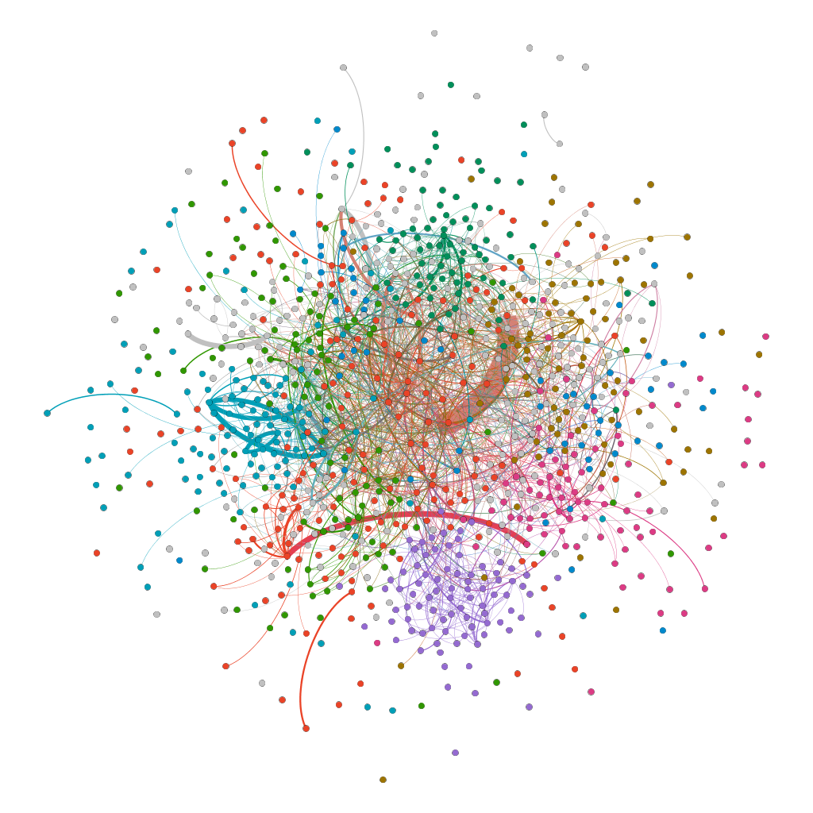

# Assignment 4: Networks over time
Yidnekachew Wendemneh

## Introduction
In this assignment we do dynamic networks or networks over time. The network has a time variable which changes and this helps you see the network overtime. We will do average path length, clustering coefficient and determine bridges on the EU e-mail correspondence graph.

## Methods
What i used is Gephi because i used it before and it is easy. i changed the text to csv and added source, target and time at the top.

## Results
I divided the graph into tree by 20 weeks, 30 weeks and 40 weeks. I used the time slider as a filter to adjust and see the graphs at different times. Here are some of the clustering coefficient values and average path length.
20 weeks path length and coefficient 4.546 & 429

30 weeks average path length and coefficient 3.937 & 354

40 weeks average path lengt and coefficient 2.165 & 309

The different values of the different matrices for the whole graph.
* Modularity: 0.666
* Modularity with resolution: 0.666
* Number of Communities: 14
* Diameter: 7
* Radius: 0
* Average Path length: 2.6528193693062723
* Number of Weakly Connected Components: 1
* Number of Strongly Connected Components: 184

Clustering Coefficient of the different communities 1 = 0.8462, 2 = 0.2084, 3 = 0.4222, 4 = 0.2208, 5 = 0.2194, 6 = 0.4135, 7 = 0.5462, 8 = 0.7621, 9 = 0.3542, 10 = 0.7545, 11 = 0.6486, 12 = 0.5454, 13 = 0.3216, 14 = 0.2164, 15 = 0.1648.

## Discussion
The graph is dynamic and changes over time. There will be different components overtime. the final graph which has lasted for more than 40 weeks has 184 components. The question is will a bridge person be efficient in communication and the answer depends on components. The number of components decreases which means bridges increase and also the average path length decreases. Low average path length means better efficiency.

## Conclusion
This assignment was good but it was hard. I have learnt temporal networks are used to see edges evolve though time. This is new from the previous static graphs we were used to. It was very good to see how bridges work in real life.