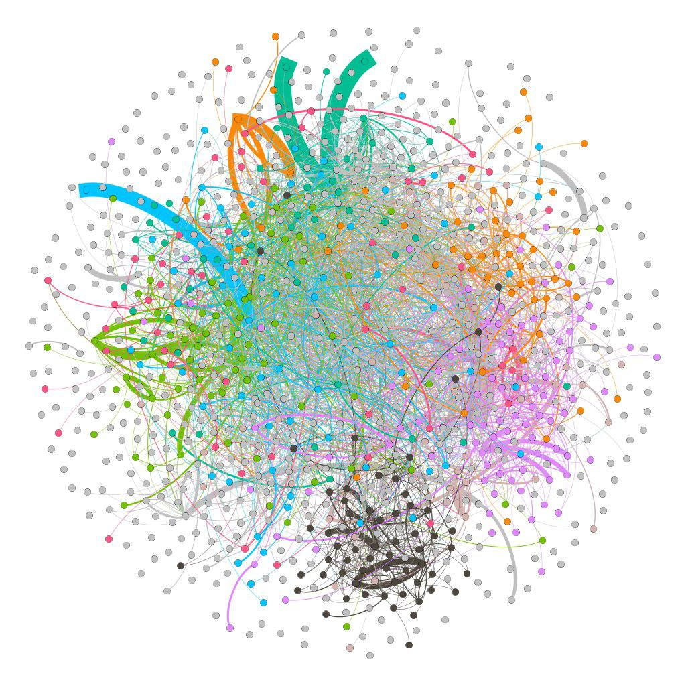
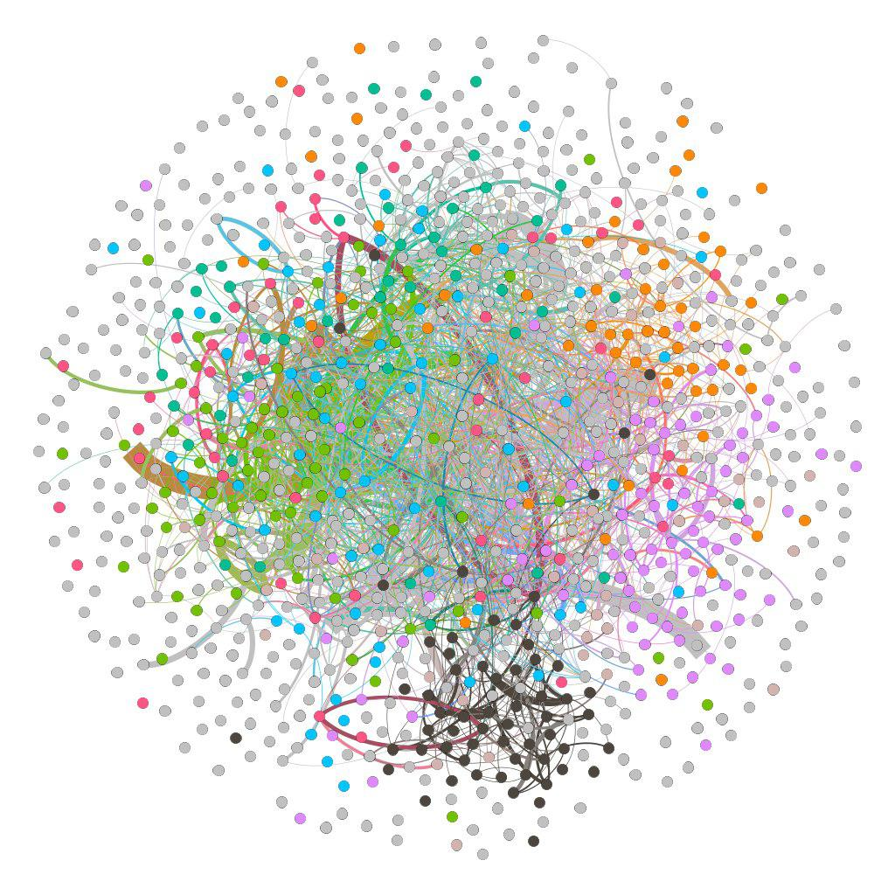
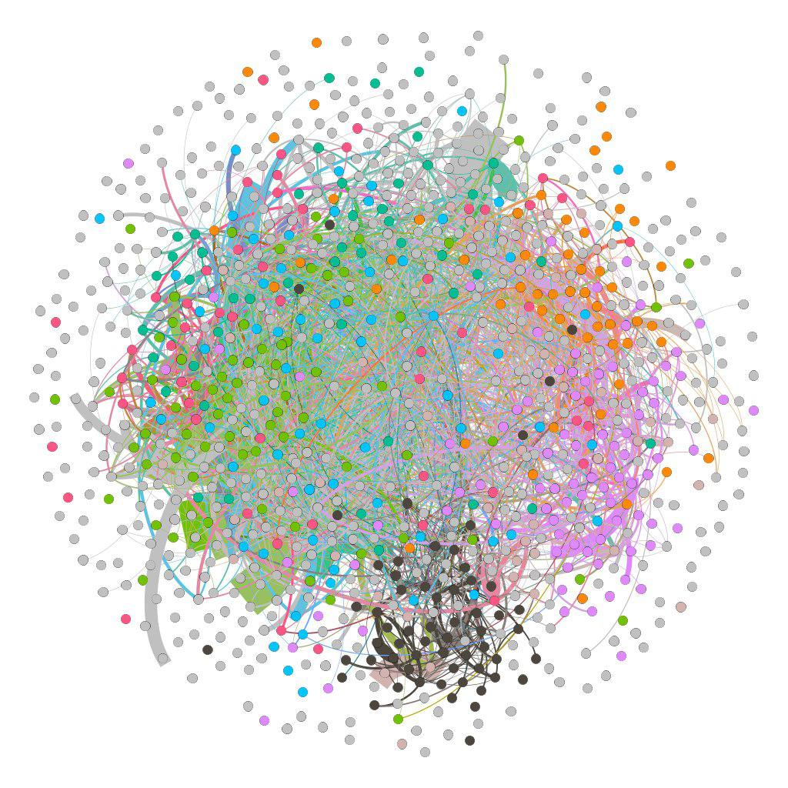

# Assignment 4: Networks over time
 <Leul> <Solomon>

## Introduction

This is the last assignment of our course social network analysis. This lab assignment is about growing network, which network works over time, 
and also concerns the use of local bridge in networks over time(email communication). 
Here i used the gephi tool as usual for calculating and work on graphs, but i also get new concept and know how to work on SNAP(python library) for graph analysis.

## Methods 

In this assignment, i used more than one tool to get what the results below.
I used :
Excel to get the mean value and also standard deviation.
Gephi instead of the python library SNAP.py(i had difficulties while opening the files), to get the result of email temporal analysis by using the statistics table.
and also used the concept of average path length and clustering coefficient to know how local bridge play essential role in growing network.

## Results

The following images are the result graph for 20 weeks, 30 weeks and 40 weeks. 

 For 20 weeks:
Average Clustering coefficient is 0.021
Average path length is 4.739
Connected components is 343
Modularity 0.498
Network Diameter 12

 For 30 weeks
Average Clustering coefficient is 0.04
Average path length is 4.34
Connected components is 315
Modularity 0.53
Network Diameter 10

 For 30 weeks
Average Clustering coefficient is 0.034
Average path length is 4.137
Connected components is 251
Modularity 0.415
Network Diameter 10

## Discussion

As we can see the average path length result decrease in the result above when time increases (Avg. Path length decreases as timestamp increases), 
so this indicates that the bridge person is adequately efficient in connecting different peoples, the role he has on email communication gets high. So the answer for the question
 A "bridge" person in an organization connects many different people. Are "bridge" people more efficient or less efficient at email communication? is more efficient because of the above stated reason.
but this answer is for only this specific result, as we change the time...the role of the bridge person might be less essential. But here it is more efficient because it connects to other communities that can lead to form a number of edges
And on the other hand as time increase value of average clustering coefficient increases, this implies that the nodes are well connected(edge connectancy is high) and the role of the bridge person might alter too.

## Conclusion

In this assignment i have learned and gained a good understanding on Networks over time, how time alters affect the graph statistics and the role of bridge person.
In general, as this is the last assignment, i have learned many concepts regarding the graph, the tool you recommend us to use and how the social network works.
I personally want to give a gratitude for our lecturer Dr.Stephen Wu for all the hard work you did in teaching us this course, make us busy in doing all the assignments for the sake of our own good and to grasp a solid knowledge on Social network analysis.
