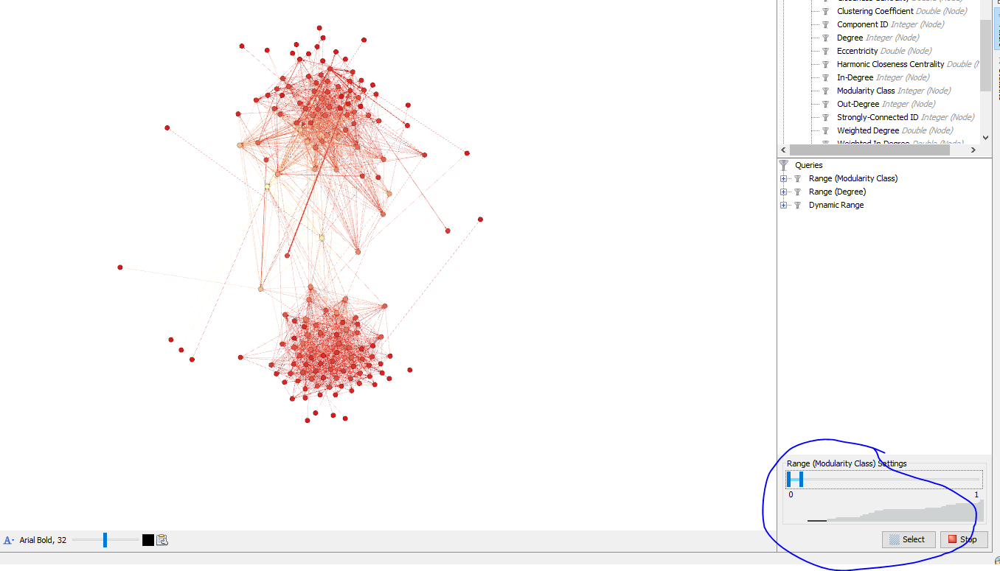
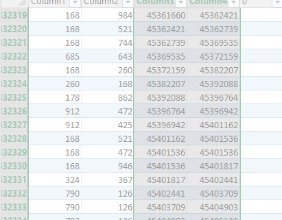
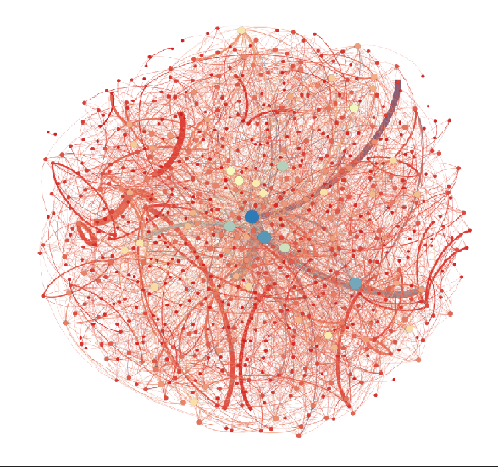
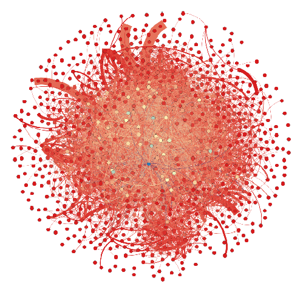
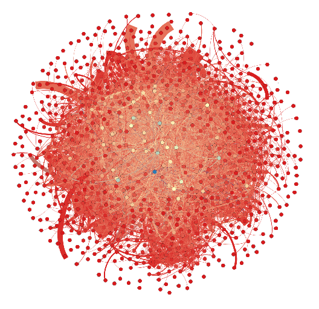

# Assignment 4: Networks over time
Simon Asfaw


## Introduction
This assignment required more effort and resource than the previous ones. It was challenging but not overwhelming. The network I used in this assignment is the EU mail correspondence we did in assignment two but this time we can see it grow though time. I will do community detection, find out components, and basically study the network as it grows.

## Methods
First I edited the .txt file that I downloaded by adding Source, Target, and Time on the first line. Then I used gephy to import the .csv file and used the merge columns button in the data laboratory tab to use the Time column as an interval. Then, as suggested, I divided the network into groups. I partitioned the network using time into: - the first 20 weeks, then 30 weeks and 40 weeks.

## Results
First I ran a community detection algorithm on the whole graph. The results are as follows:-
* Number of Communities: 15
* Number of Weakly Connected Components: 1
* Number of Strongly Connected Components: 184
* Average Clustering Coefficient: 0.352
```
The algorithm used for this is Simple and slow brute force. I filtered out each community using the modularity class.



* Average Clustering Coefficient: 0.402 for component 0
* Average Clustering Coefficient: 0.548 for component 1
* Average Clustering Coefficient: 0.707 for component 2
* Average Clustering Coefficient: 0.513 for component 3
* Average Clustering Coefficient: 0.521 for component 4
* Average Clustering Coefficient: 0.727 for component 5
* Average Clustering Coefficient: 0.643 for component 6
* Average Clustering Coefficient: 0.496 for component 7
* Average Clustering Coefficient: 0.350 for component 8
* Average Clustering Coefficient: 0.494 for component 9
* Average Clustering Coefficient: 0.686 for component 10
* Average Clustering Coefficient: 0.533 for component 11
* Average Clustering Coefficient: 0.449 for component 12
* Average Clustering Coefficient: 0.137 for component 13
* Average Clustering Coefficient: 0.660 for component 14
```
 I couldn't compute the numbers using excell because it kept crashing 

from seeing the numbers i think The average time between each event is arround 600 and the plot of the graph is.

 The mean and standard deviation are >>> >>> !!!excell!!!!


The graph as a whole has 986 nodes and 24929 edges. I then divided the graphs (as suggested) into three parts ran multiple tests on the different partitions.
First in the 20 weeks graph. The blue dot in the center is the node with the highest degree. Number of Weakly Connected Components: 251, Number of Strongly Connected Components: 456, Average Path length: 4.136902195116943:-


Second the graph after 30 weeks. Number of Weakly Connected Components: 194, Number of Strongly Connected Components: 366, Average Path length: 3.5656738987776198


Lastly there is the graph after 40 weeks. Number of Weakly Connected Components: 153, Number of Strongly Connected Components: 325, Average Path length: 3.2146470263769453



## Discussion
For the main answer of whether "bridge" people are more efficient or less efficient at email communication. I think YES, bridge people are efficient. Here is why:-
- First an edge e is a bridge in a graph G if G-e (G without e) has more components than G.
- The number of components (week & strong) decreases as we go from 20weeks to 30 to 40.
- This means there are more bridges as time goes by.
- At the same time the Average path length (average shortest path) also decreases. But this means there are less hops for nodes to reach each other, which is good for information relay.
- Therefor having more bridges leads to less APL which leads to better information communication.

## Conclusion
This assignment was challenging because we had to use new tools or more functionalities from the previous tools we used. And it required us to use most of what we learnt to deduce an answer. And the fact that we had many other assignments from other courses used up the given time we had. But I have learnt a great deal from it and I am glad I have taken away something relevant and useful from this course. Thank You.
