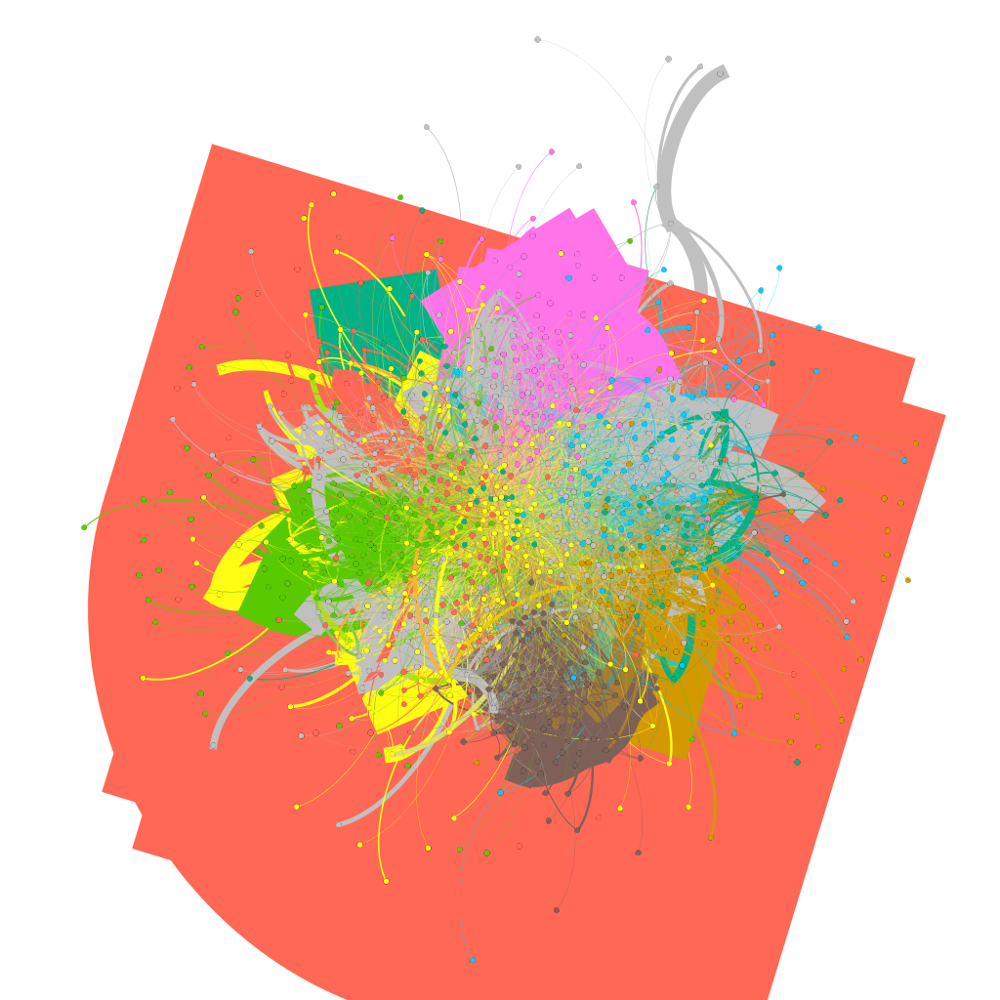
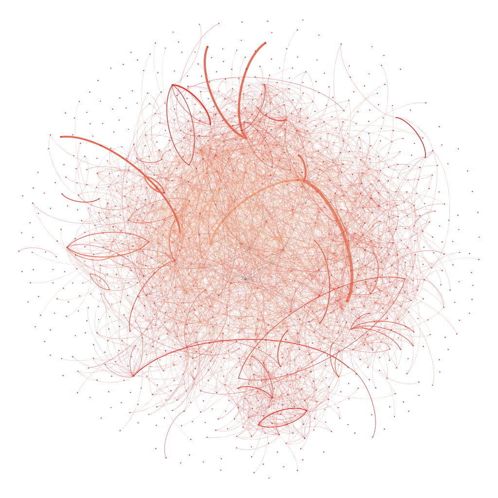
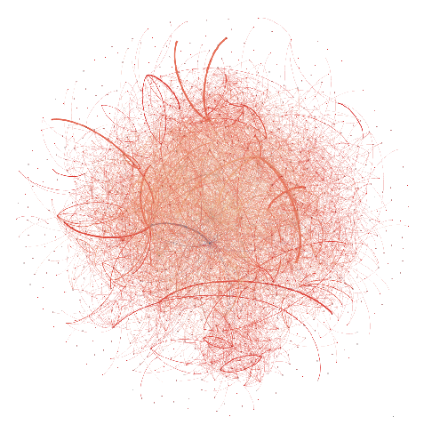
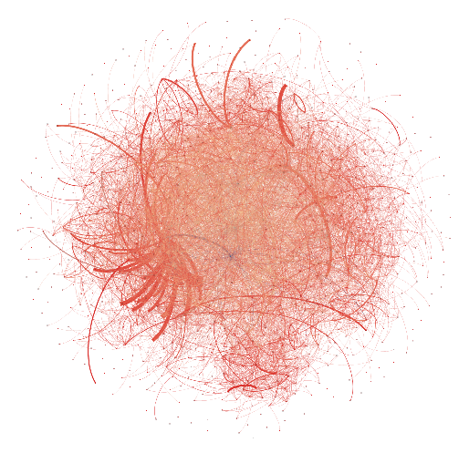

# Assignment 4: Networks over time
Feysel Meftuh

## Introduction
This semester we have learnt social network analysis and we have looked at many ideas on how to work with networks. We saw communities, groups and clusters. We have also recently seen growing networks where the network evolve over time. That is what we will see in this assignment.
## Methods
For this assignment I couldn’t' use snap because it wouldn't work on my pc and i couldn't open files with it. I used gephi instead i have used it before so it is easy for me. The eu mail file could not be imported unless it is converted to .csv. as asked i calculated different statistics.

## Results
Average degree: 25.283
Diameter: 7
Graph Density: 0.026
Modularity: 0.662
Number of Weakly Connected Components: 1
Number of Strongly Connected Components: 184
Average clustering coefficient: 0.352
Average pathlengt: 2.653

Then for the graph at different times. 
1. 20 week; clustering coefficient(cc) = 0.341 & average path length(apl) = 2.823. 

2. 30 week; cc = 0.334 & apl = 2.801

3. 40 week; cc = 0.375 & apl = 2.699

Finally the 15 different communities clustering coefficient.
1. Community 0 is 0.324 
2. Community 1 is 0.246 
3. Community 2 is 0.489 
4. Community 3 is 0.781 
5. Community 4 is 0.954 
6. community 5 is 0.264 
7. Community 6 is 0.446 
8. Comunity 7 is 0.313 
9. Community 8 is 0.654 
10. Community 9 is 0.761 
11. Community 10 is 0.541 
12. Community 11 is 0.139 
13. Community 12 is 0.764 
14. Community 13 is 0.555 
15. Community 04 is 0.322 

## Discussion
The main answer is yes they are efficient because a bridge is what connects two components into one. And from week 20 to 40 the number of components steadily decreases, so this means more bridges. If you notice at the same time the average path length slowly drops meaning a better communication (short distance between nodes).

## Conclusion
Working on this assignment has enabled me to see the possibility of gephi and i have also made practical what i learnt in class. Dynamic growing graphs are very realistic. This course was very nice thank you for teaching us.