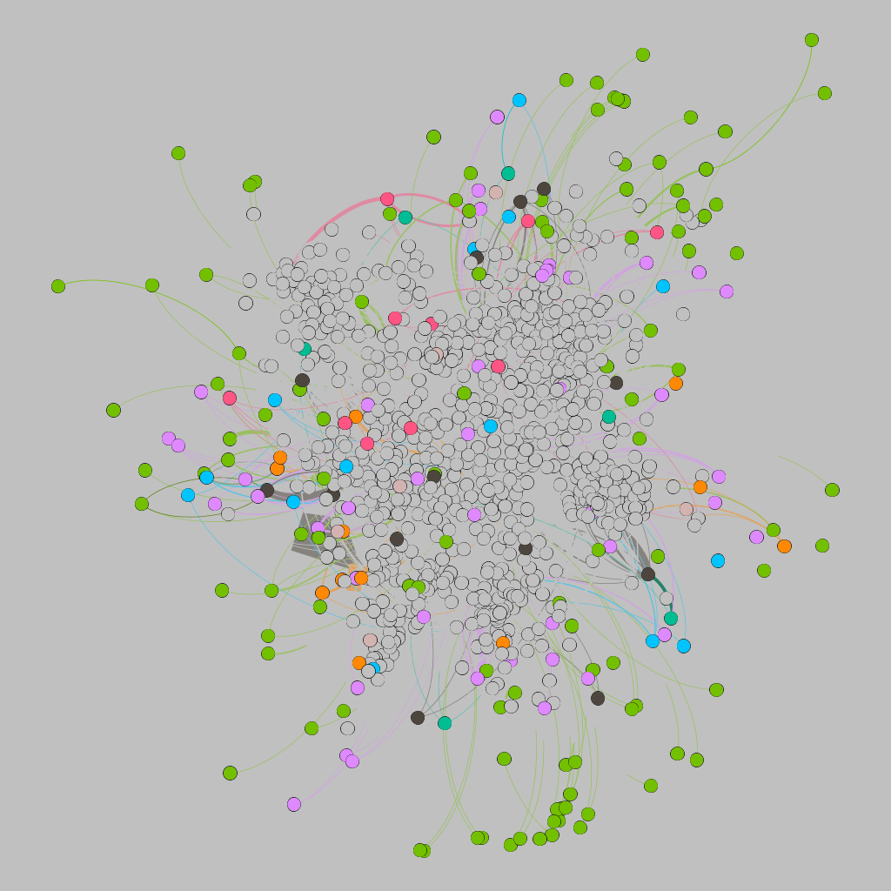
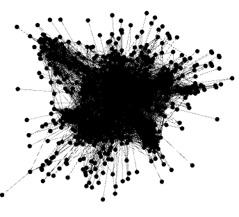
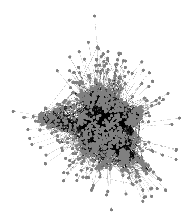

# Assignment 4: Networks over time
Biruk Gebrekidan

## Introduction
In this assignment about networks over time I get to know more about temporal network analysis from a new perspective. This temporal network contains two nodes that are connected at certain timestamp. 

## Methods
Gephi is the tool I will use for this lab.
In the first step I converted the data to gephi format excel file. After that I assigned node1,node2 and timestamp on top of the spreadsheets.
Secondly I imported the graph and produce the outputs like clustering coefficient, edges etc.
To take screenshot from the specified timestamps, I removed the remaining timestamps from the list on my dataset and import to gephi again, I did this for 3 times.

## Results
Weakly connected = 1
Strongly connected components = 184
Clustering coefficient = 0.352
Average degree = 1.122
Graph Density = 0.026
#Edges = 24929
#nodes = 986

starting at time 12,096,000 (20 weeks), 
Nodes = 808
Edges = 11245
Average Degree = 13.917
Diameter = 7
Clustering coefficient = 0.3
Average path length = 2.98

Then at time 18,144,000 (30 weeks),
Avg degree = 16.74
Diameter = 8
Clustering coefficient =  0.306
Average path length = 2.872
Graph density = 0.02
Modularity = 0.669

Then at time 24,192,000 (40 weeks)
Nodes 867
Edges 16750
Average degree 19.319
Network diameter = 7
Modularity 0.66
clustering coefficient 0.323
average path length 2.771

## Discussion
Birdge people are less efficient for email communication because when bridge people are connected to other cluster area they can not introduce new information easily and receive information. If more people are connected like the bridge person there will not be bridge any more and it will be easy to information cascading. Also this graph is strongly connected component. According to our data we require bridge to communicate with weakly connected components.
