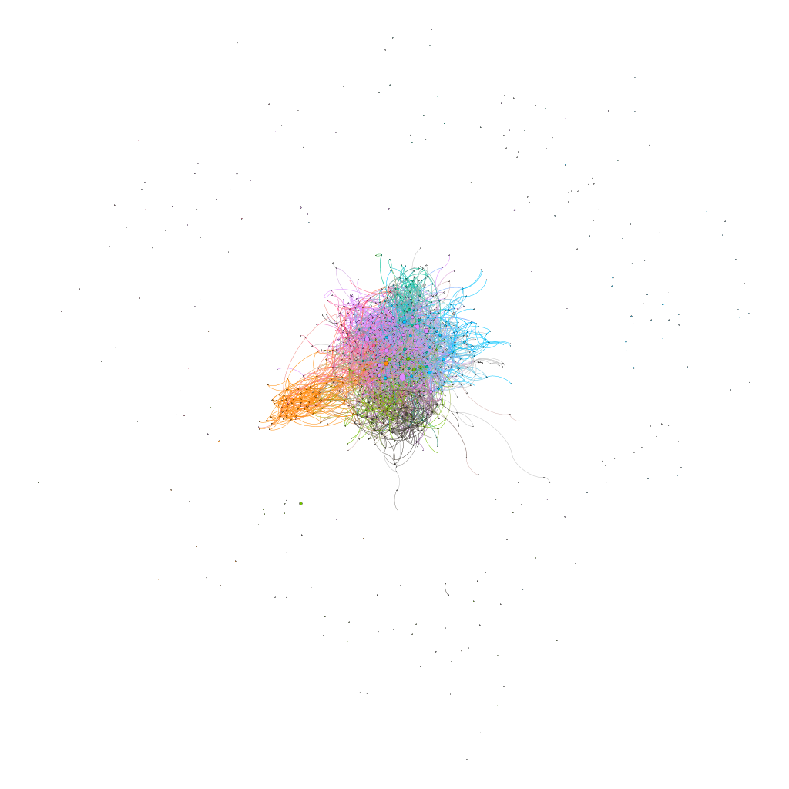

# Assignment 4: Networks over time
## sophonias Bekele

## Introduction

This Temporal Network Assignment help me see it's data from a new angle and analysis it better than ever because it's data is given in the timeline fashion where node1,node 2 is node in the network  Time is timestamp(temporal Edges) of each Edges and in data anlysis can also compute dynamic data trough given time line and it represents real life dataset which also help me see its Application in the actual world networks.

## Methods
	I have used gephi network analysis tool and Excel like mentioned in option 3.

	step 1: convert the dataset to approprate gephi data.
	step 2: use gephi to change (Src,Dist,time) time data to time intervals and Enable timeline option.
	step 3: use gephi to compute cluster coeffient, conneted components, modularity,...etc.
	step 4: use Excel to calculate cluster coeffient ,Mean and Standard Deviation. 
			->I have calculated cluster coeffient to each communities in the dataset.
	step 5: use gephi to screenshot the graph in 12,096,000 (20 weeks),18,144,000 (30 weeks)
	and 24,192,000 (40 weeks). 

## Results

0-20,000,000 seconds

	Number of Weakly Connected Components: 184
	Number of Strongly Connected Components: 346

20,000,000-40,000,000 seconds

	Number of Weakly Connected Components: 103
	Number of Strongly Connected Components: 288

40,000,000-60,000,000 seconds

	Number of Weakly Connected Components: 175
	Number of Strongly Connected Components: 343

60,000,000-68,000,000 seconds

	Number of Weakly Connected Components: 800
	Number of Strongly Connected Components: 939

0-68,000,000 seconds

	Number of Weakly Connected Components: 1
	Number of Strongly Connected Components: 184

	Average Clustering Coefficient: 0.352

### Clustering Coefficient for the Each community
	Average Clustering Coefficient for the community 1 = 0.3422208415
	Average Clustering Coefficient for the community 2 = 0.415467974
	Average Clustering Coefficient for the community 3 = 0.4682779167
	Average Clustering Coefficient for the community 4 = 0.3173851569
	Average Clustering Coefficient for the community 5 = 0.2957266667
	Average Clustering Coefficient for the community 6 = 0.4223321935
	Average Clustering Coefficient for the community 7 = 0.0866666
	Average Clustering Coefficient for the community 8 = 0.3469085164
	Average Clustering Coefficient for the community 9 = 0.3749982541
	Average Clustering Coefficient for the community 10 = 0.4370941667
	Average Clustering Coefficient for the community 11 = 0.4155174167
	Average Clustering Coefficient for the community 12 = 0.2664537595
	Average Clustering Coefficient for the community 13 = 0.3252718333
	Average Clustering Coefficient for the community 14 = 0.3328328621
	Average Clustering Coefficient for the community 15 = 0.4543954815

### mean and standard deviation of time for a new edge to form?

	mean 209.0049859629
	standard deviation 40756.8685091016

Screenshot one

Screenshot two

Screenshot three

## Discussion
Bridge person is less efficient at email communication because once they know the node they want to communicate to they can commnicate independently of that bride person. and also if we see connected Components for the whole timeline weakly connected component is 1 this shows as through time node become more connected and does not need much of bride person.

## Conclusion
Finally Temporal network is used to know how Edges are created through time and which node is connected to which in specfic time

