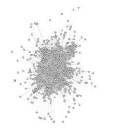

# Assignment 4: Networks over time
Nathan Tibebe

## Introduction
Networks over time are networks that have different birth order that create new links. For example, information cascade, viral video.

## Methods

In this process I used gephi tool for visualization. When I used gephi to open the data I used three headers on the spreadsheet.
Source Target and time then open the file in gephi.
To take 3 snapshots of the network I use filters for interval. The filters are located in toolbar menu > windows > filters then in filters attribute > range > time.
To run the layout I used force atlas 2 and applied the default appearance.

## Results

Diameter 7

Clustering coefficient 0.352

Average path length 2.653

Average degree 25.83

Graph density 0.026

Weakly connected components 1 

Strongly connected components 186

On 20 week

Network diameter 6

Weakly connected components 38

Strongly connected components 213

Average degree 22.138

Average path length 2.682

on 30 week

Network diameter 6

Weakly connected components 60

Strongly connected components 237

Average degree 20.249

Average path length 2.703

finally for  40 week

Network diameter 6

Weakly connected components 75

Strongly connected components 252

Average degree 17.879

Average path length 2.767

## Discussion

Q. A "bridge" person in an organization connects many different people. Are "bridge" people more efficient or less efficient at email communication?
Answer. From my review I can see that when more days come the weakly connected components are increasing more rapidly than the strongly connected components.
The network diameter, average path length or average degree did not change significantly. So in conclusion, from this network we learn that email communication has more bridge people. So bridge people are more efficient for email.

## Conclusion

I took more days to finish this assignment because I took a lot of time to refer to different materials and check my work. Now my knowledge about network has improved greatly.
At last I want to give appriciation to my classmates like Geleta and Mintesnot for helping me explain the concept of bridge people and filter usage on gephi.